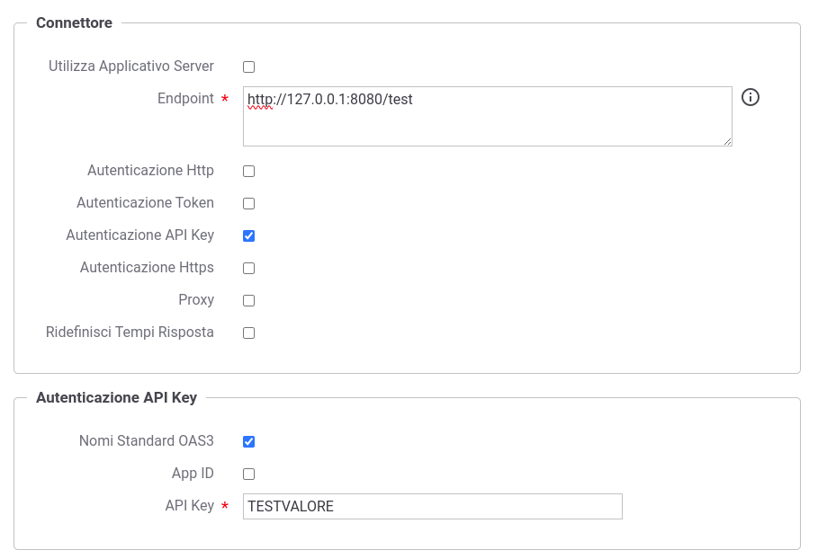
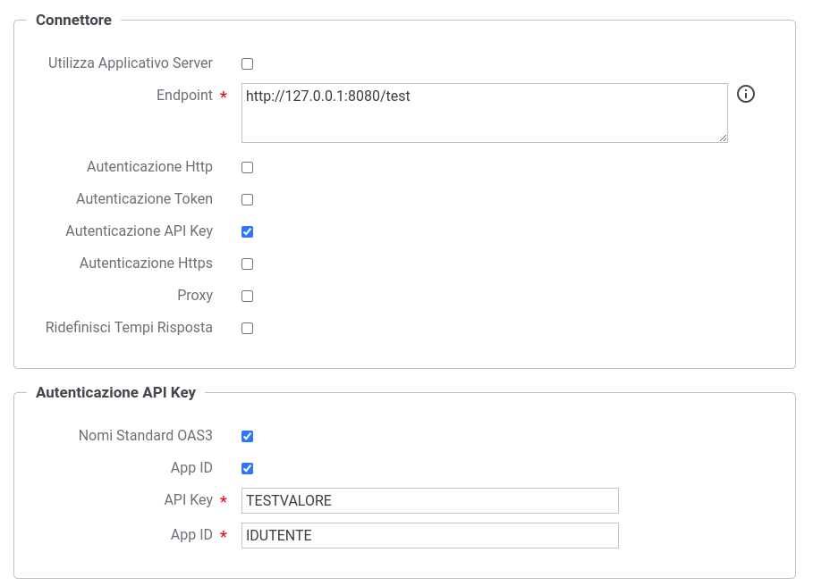
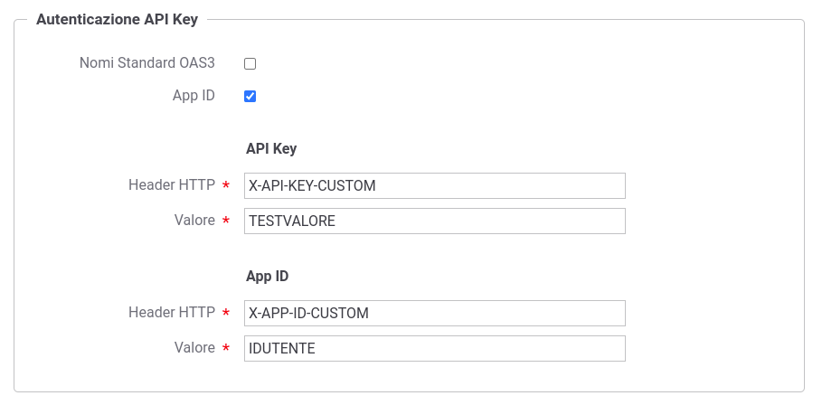

.. _avanzate_connettori_apikey:

Autenticazione API Key
~~~~~~~~~~~~~~~~~~~~~~~

Quando si configura l'autenticazione per un connettore è possibile
scegliere la modalità di autenticazione API Key che consente di inoltrare al backend una chiave di identificazione 'Api Key' veicolata all'interno di un header http 'X-API-KEY' (https://swagger.io/docs/specification/authentication/api-keys/). 

    Dati di configurazione di un'autenticazione API Key

La configurazione consente inoltre di abilitare la modalità 'App ID' che prevede oltre all'ApiKey un identificatore dell'applicazione veicolato nell'header http 'X-APP-ID'; modalità denominata 'Multiple API Keys' nella specifica 'OAS3 API Keys'. 

    Dati di configurazione di un'autenticazione API Key + App ID

Infine è possibile ridefinire i nomi degli header http utilizzati non selezionando l'opzione 'Nomi Standard OAS3'.

    Dati di configurazione di un'autenticazione API Key + App ID con personalizzazione dei nomi degli header HTTP

