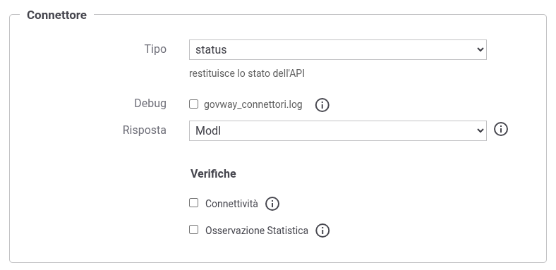

.. _avanzate_connettori_status:

Connettore Status
~~~~~~~~~~~~~~~~~

Il connettore consente di simulare l'implementazione di una risorsa che permette di verificare lo stato di un servizio, nel caso in cui tale risorsa non sia nativamente disponibile tra quelle esposte dal backend dell'API.

La riposta restituita dal connettore segue le indicazioni presenti nell’allegato `Raccomandazioni di implementazione <https://www.agid.gov.it/sites/agid/files/2024-07/Linee_guida_interoperabilit%C3%A0PA_All4_Raccomandazioni-di_implementazione.pdf/>`_ delle Linee Guida di Interoperabilità di AGID: 

   -  **4.2.11 [RAC_REST_NAME_011]** Esporre lo stato del servizio

       - L’API **DEVE** esporre lo stato del servizio al path `/status` e ritornare un oggetto con media-type `application/problem+json` (RFC 7807). Se il servizio funziona correttamente, l’API ritorna HTTP status 200 OK altrimenti 500, sempre con un problem details al suo interno.

   -  **5.1.4 [RAC_SOAP_004]** Esporre lo stato del servizio

       - L’API **DEVE** includere un metodo `echo` per restituire lo stato della stessa.

Oltre alle funzionalità descritte nel documento citato, GovWay offre ulteriori formati di risposta configurabili direttamente dalla console, che saranno descritti di seguito nella sezione.

.. note::

        Senza alcuna verifica abilitata (:numref:`ConnettoreSTATUSFig`), il connettore restituirà sempre un risultato positivo. È consigliabile abilitare almeno uno dei criteri di verifica per garantire una risposta quanto più realistica possibile.

    Dati di configurazione di un connettore Status

Facendo riferimento alla schermata raffigurata in :numref:`ConnettoreSTATUSFig`, di seguito viene descritto il significato dei parametri:

   -  **Risposta**: campo modificabile solo per i servizi di tipo REST; nel caso di servizi SOAP, è utilizzabile esclusivamente la modalità **ModI**. Per i servizi REST è possibile selezionare:

	- `ModI`: il connettore restituirà il formato descritto nel documento dell'AGID;
	- `Personalizzata`:  consente di impostare, attraverso una seconda selezione, un formato di risposta diverso da ModI nel caso in cui il servizio risulti correttamente attivo:

	      -  *Empty HTTP Payload*: viene restituito un payload HTTP vuoto con return code 200;
	      -  *Text*: viene restituito un messaggio testuale con HTTP Content-Type `text/plain`;
	      -  *JSON*: viene restituita una risposta JSON con Content-Type 'application/json';
	      -  *XML*: viene restituita una risposta XML con Content-Type 'application/xml'.

   -  **Verifica connettività**: consente di abilitare la verifica della connettività verso ciascun connettore HTTP(S) configurato. Un esito positivo sarà restituito solo se tutti i connettori configurati risultano raggiungibili.

   -  **Verifica statistica**: consente di abilitare una verifica basata sulle statistiche di GovWay. Il connettore verifica se almeno una transazione diretta verso il servizio è andata a buon fine nell'intervallo temporale impostato nella sezione apposita (:numref:`ConnettoreSTATUSStatFig`).  Un esito positivo verrà restituito anche se non sono state rilevate transazioni nell'intervallo temporale indicato.

	   -  **Frequenza**: indica l'unità di misura per l'intervallo temporale di ricerca.

	   -  **Intervallo Osservazione**: consente di definire la durata dell'intervallo temporale durante il quale verificare le statistiche prodotte da GovWay.

	   -  **Cache lifetime (Opzionale)**: consente di specificare, in secondi, la durata della permanenza in cache delle statistiche controllate dal connettore.

      .. figure:: ../../_figure_console/ConnettoreSTATUSStatFig.jpg
          :scale: 100%
          :align: center
          :name: ConnettoreSTATUSStatFig

          Dati di configurazione di un connettore Status con verifica delle informazioni statistiche

