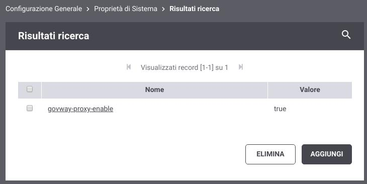
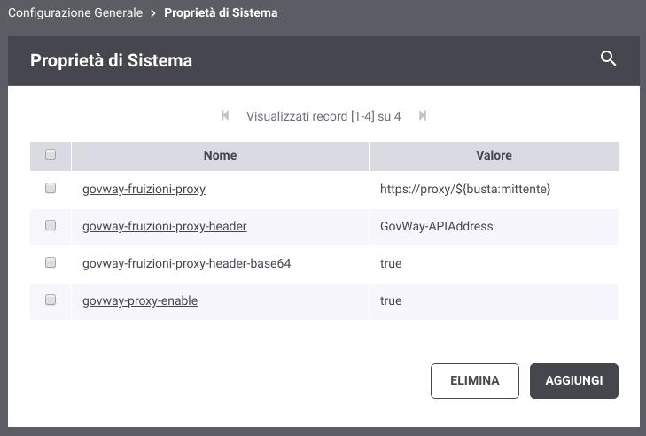
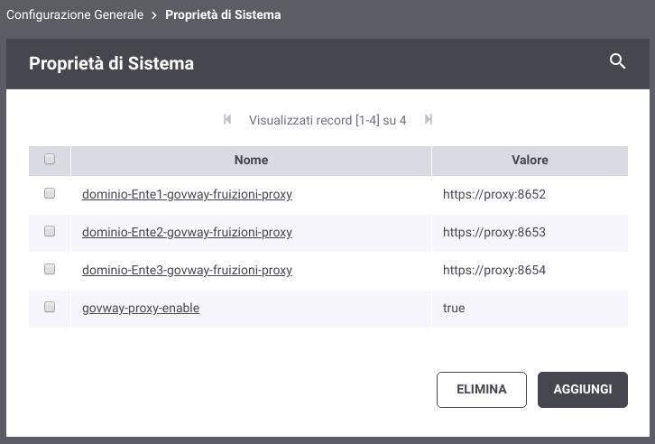

.. _avanzate_govway_proxy:

GovWay Proxy
------------

I connettori descritti nella sezione :ref:`avanzate_connettori` rappresentano le entità di configurazione che consentono a
GovWay di indirizzare le comunicazioni verso gli attori dei flussi di
erogazione/fruizione gestiti. Come già descritto in tale sezione possiamo distinguere
due tipologie di comunicazioni:

-  *GovWay ---> Applicativo Esterno*, nel caso di fruizioni

-  *GovWay ---> Applicativo Interno*, nel caso di erogazioni

In alcune architetture potrebbe essere presente tra GovWay e l'applicativo da contattare un proxy che media le comunicazioni.

- *Proxy HTTP*, se la comunicazione è mediata da un proxy http l'indirizzo remoto dell'applicativo viene censito su GovWay e la mediazione tramite il proxy sarà trasparente seguendo le indicazioni di configurazione descritte nella sezione :ref:`avanzate_connettori_proxy`.

- *Proxy Applicativo*, in altri scenari si possono avere proxy con funzioni applicative più evolute, quali ad esempio la gestione di una connessione TLS personalizzata per contesti applicativi dove si utilizzano certificati client e/o trustStore differenti. Normalmente in queste situazioni l'endpoint indicato nella configurazione del connettore non è l'indirizzo remoto dell'applicativo ma bensì l'indirizzo del proxy il quale a sua volta si occuperà di inoltrare la richiesta attraverso la consultazione di un suo registro.

La funzionalità descritta in questa sezione consente di avere un'architettura con la presenza di un *Proxy Applicativo* che però non necessita di un proprio registro. L'indirizzo remoto dell'applicativo viene censito su GovWay e viene inoltrato al proxy tramite un header HTTP o un parametro della url.

Per abilitare e configurare la funzionalità 'govway-proxy' si deve agire a livello di proprietà java, configurabili accedendo alla sezione 'Configurazione Generale -> Proprietà di Sistema', aggiungendo una proprietà 'govway-proxy-enable' con valore 'true' (Figura :numref:`ConfigurazioneProprietaSistema`).

    Configurazione delle Proprietà di Sistema

Una volta abilitata la funzionalità la configurazione è attuabile tramite le seguenti proprietà:

- govway-proxy: endpoint a cui verranno inoltrate le richieste. L'endpoint può contenere parti dinamiche che verranno risolte dal Gateway (per ulteriori dettagli fare riferimento alla sezione :ref:`valoriDinamici`).
- govway-proxy-header: se configurato verrà utilizzato un header http, con il nome indicato, per inoltrare al proxy l'indirizzo remoto.
- govway-proxy-header-base64: nel caso sia stato configurato un header http, l'indirizzo remoto sarà codificato in base64 se viene abilitata la seguente proprietà.
- govway-proxy-query: se configurato verrà utilizzato un parametro della url, con il nome indicato, per inoltrare al proxy l'indirizzo remoto.
- govway-proxy-query-base64: nel caso sia stato configurato un parametro della url, l'indirizzo remoto sarà codificato in base64 se viene abilitata la seguente proprietà.

.. note::
      La configurazione dei parametri che riguardano l'header http o il parametro della url non sono obbligatori e se non presenti viene presa la configurazione di default definita nel file di configurazione locale '/etc/govway/govway_local.properties' (assumendo sia /etc/govway la directory di configurazione indicata in fase di installazione) tramite le proprietà org.openspcoop2.pdd.connettori.govwayProxy.header.* e org.openspcoop2.pdd.connettori.govwayProxy.urlParameter.*. Anche l'abilitazione stessa della funzionalità 'govway-proxy' può essere effettuata nel file di configurazione locale tramite la proprietà 'org.openspcoop2.pdd.connettori.govwayProxy.enable' ed in questo caso non è necessario registrare la proprietà di sistema 'govway-proxy-enable'

L'endpoint utilizzato per il proxy, indicato nella proprietà 'govway-proxy', può essere ridefinito tramite le seguenti proprietà dalla più generica fino alla più specifica:

- govway-<ruolo>-proxy: l'endpoint indicato verrà utilizzato solamente se govway agisce nel ruolo indicato; '<ruolo>' può assumere i valori 'fruizioni' o 'erogazioni'.
- profilo-<profilo>-govway-proxy o profilo-<profilo>-govway-<ruolo>-proxy: rispetto alla precedente proprietà è possibile restringere l'utilizzo dell'endpoint ad un determinato Profilo di Interoperabilità; '<profilo>' può assumere i valori 'trasparente' (Profilo API Gateway), 'modipa' (Profilo ModI PA), 'spcoop' (Profilo SPCoop), 'as4' (Profilo eDelivery), 'sdi' (Profilo Fatturazione Elettronica).
- dominio-<nomeSoggetto>-govway-proxy o dominio-<nomeSoggetto>-govway-<ruolo>-proxy: l'endpoint indicato verrà utilizzato solamente per il soggetto interno indicato in '<nomeSoggetto>'.
- dominio-<profilo>-<nomeSoggetto>-govway-proxy o dominio-<profilo>-<nomeSoggetto>-govway-<ruolo>-proxy: rispetto alla precedente proprietà è possibile restringere l'utilizzo dell'endpoint per il soggetto interno indicato in '<nomeSoggetto>' relativamente al solo Profilo di Interoperabilità indicato in '<profilo>'.
- dominio-<tipoSoggetto>-<nomeSoggetto>-govway-proxy o dominio-<tipoSoggetto>-<nomeSoggetto>-govway-<ruolo>-proxy: rispetto alle precedenti due proprietà è possibile restringere l'utilizzo dell'endpoint per il soggetto interno indicato in '<nomeSoggetto>' relativamente al solo tipo indicato in '<tipoSoggetto>'. Questa opzione è utile nei profili di interoperabilità dove ai soggetti è possibile associare più tipi, come ad es. in SPCoop dove sono utilizzabili i tipi 'spc', 'aoo', 'test'.
- tag-<nomeTag>-govway-proxy o tag-<nomeTag>-govway-<ruolo>-proxy: l'endpoint indicato verrà utilizzato solamente se l'API appartiene al tag indicato in '<nomeTag>'.

Anche i parametri di configurazione relativamente all'utilizzo dell'header e del parametro della url possono essere ridefiniti, quando viene ridefinito un endpoint, con lo stesso criterio.

Nella figura :numref:`GovWayProxyEsempio1` viene fornito un esempio di configurazione di un proxy relativamente alle sole fruizioni. L'endpoint del proxy è lo stesso per tutti i soggetti interni gestiti (dove è stato abilitato il multi-tenant) con la sola differenza che nel contesto della url è presente il nome del soggetto interno. In questo esempio l'endpoint remoto viene inserito nell'header HTTP GovWay-APIAddress codificato in base64.

    GovWay Proxy per le fruizioni con endpoint dinamico

Nella figura :numref:`GovWayProxyEsempio2` viene fornito un esempio di configurazione di un proxy relativamente alle sole fruizioni dove l'endpoint del proxy differisce sulla porta a seconda del soggetto interno.

    GovWay Proxy per le fruizioni con endpoint differente per Soggetto Interno

