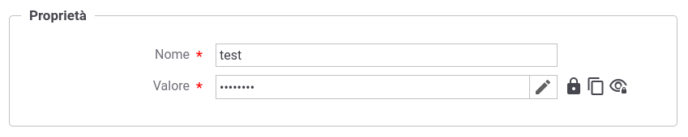
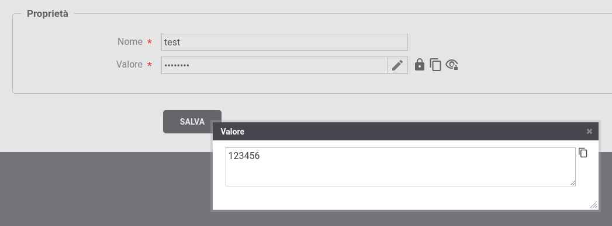

.. _configAvanzataInfoConfidenziali:

Visualizzazione delle Informazioni Confidenziali Cifrate
~~~~~~~~~~~~~~~~~~~~~~~~~~~~~~~~~~~~~~~~~~~~~~~~~~~~~~~~~

Le informazioni confidenziali descritte nella sezione :ref:`console_informazioni_confidenziali_info` e i valori delle proprietà descritte nella sezione :ref:`console_informazioni_confidenziali_proprieta`, in presenza di :ref:`byokInstall`, verranno salvate cifrate sulla base dati e non sarà più possibile visualizzarle in chiaro tramite la console.

Per consentire all'utente di effettuare la decifratura su richiesta delle informazioni cifrate tramite la console, è possibile aggiungere la seguente proprietà agendo sul file *<directory-lavoro>/console_local.properties*:

       ::

          # Consentire all'utente di visualizzare in chiaro le informazioni cifrate.
          console.visualizzaInformazioniCifrate.enabled=true

Consentendo la decifratura su richiesta, nella maschera di visualizzazione di un'informazione confidenziale, accanto al lucchetto chiuso saranno visualizzate due ulteriori icone (:numref:`infoConfidenzialiCifrataDecifratura`) che consentono le seguenti azioni:

- 'Copia': il valore decifrato sarà disponibile per l'azione 'incolla';

- 'Visualizza': il valore decifrato verrà visualizzato all'utente (:numref:`infoConfidenzialiCifrataDecifraturaVisualizza`).

 Decifratura su richiesta delle informazioni confidenziali.
    

 Decifratura su richiesta delle informazioni confidenziali: visualizzazione informazione
	
