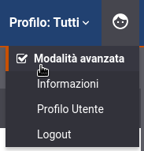

.. _modalitaAvanzata:

Modalità Avanzata
-----------------

L'interfaccia della govwayConsole, fin qui descritta, fa riferimento
all'operatività nella *modalità standard*. La modalità standard prevede
varie semplificazioni, sulle opzioni visualizzate nelle schermate,
mirate al compimento delle operazioni di uso comune.

Nel caso si avesse la necessità di ricorrere a configurazioni più
specifiche, non contemplate nella modalità standard, è possibile passare
alla visualizzazione dell'interfaccia nella *Modalità Avanzata*
utilizzando la voce omonima del menu a discesa che compare selezionando
l'icona in alto a destra (nella testata della govwayConsole) come mostrato nella figura :numref:`MenuSceltaModalitaAvanzata`.

    Selezione Modalità Avanzata

Operando in modalità avanzata, in ciascuno dei contesti di
configurazione già descritti in questo manuale, compariranno opzioni
aggiuntive per le quali sono previsti valori di default nel caso della
modalità standard.

Nella modalità avanzata sarà disponibile la funzionalità aggiuntiva
*Elimina*, presente nel menu di Configurazione, che consente di
utilizzare package di esportazione per l'eliminazione selettiva di
entità dal registro.

.. note::
    Non tutte le funzionalità disponibili in modalità avanzata sono
    descritte nel presente manuale.

