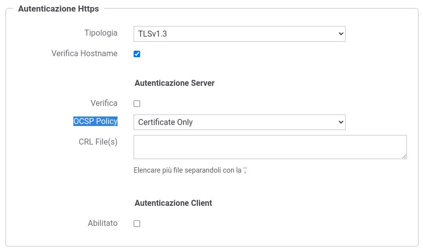

.. _ocsp:

Online Certificate Status Protocol (OCSP)
------------------------------------------

Nella sezione :ref:`ocspInstall` del manuale di installazione è documentato come configurare GovWay per poter utilizzare policy OCSP.

Una volta registrate, le policy saranno selezionabili (es. :numref:`ocspConnettoreHTTPS`) per tutte le funzionalità che richiedono una validazione di un certificato X.509.

  
    Esempio di configurazione di una policy OCSP su connettore https

