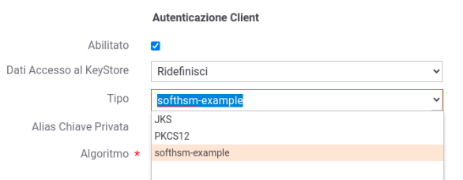

.. _pkcs11:

Device PKCS11
--------------

Nella sezione :ref:`pkcs11Install` del manuale di installazione è documentato come configurare GovWay per poter utilizzare token PKCS11.

Una volta registrati, i token saranno selezionabili tra i tipi di keystore disponibili (es. :numref:`pkcs11ConnettoreHTTPS`) per tutte le funzionalità che richiedono l'utilizzo di una chiave X.509.

  
    Esempio di configurazione di un token PKCS11 su connettore https

.. note::

	Le funzionalità che richiedono l'utilizzo della parte pubblica di un certificato X.509 non consentiranno di selezionare i keystore PKCS11 registrati, a meno che durante la registrazione non siano state abilitate le opzioni 'usableAsTrustStore' e 'usableAsSecretKeyStore'. Per maggiori dettagli si rimanda alla sezione :ref:`pkcs11Install`.

