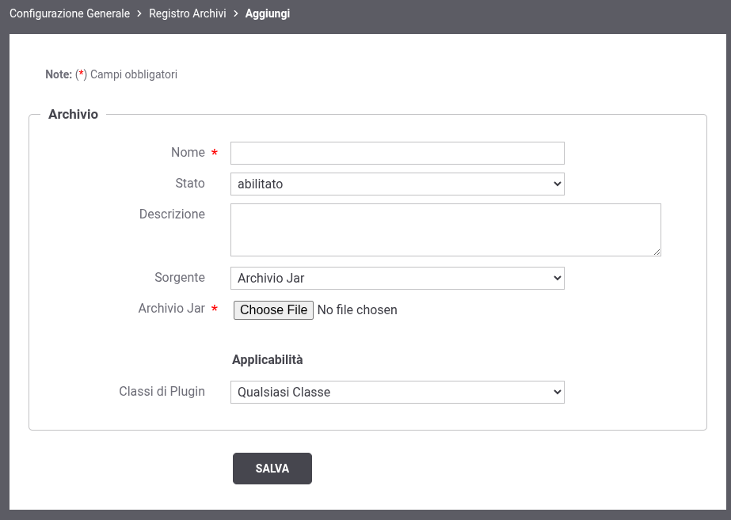

.. _configAvanzataPluginsArchivi:

Archivio contenente l'implementazione dei plugin
---------------------------------------------------------------------

.. note::
    Per utilizzare la funzionalità deve essere utilizzata la console in modalità avanzata (sezione :ref:`modalitaAvanzata`),

Come descritto nella sezione :ref:`configAvanzataPlugins` è possibile implementare classi che consentono di personalizzare alcune funzionalità built-in del prodotto.

Le classi java che realizzano l'implementazione, una volta inserite in un archivio jar, possono essere registrate all'interno del classloader di GovWay accendendo al menù 'Configurazione -> Generale', utilizzando la console in modalità avanzata (sezione :ref:`modalitaAvanzata`), accedendo all'interno della sezione 'Plugins - Registro Archivi' (:numref:`AvanzatoPlugins2`).

.. figure:: ../../_figure_console/AvanzatoPlugins.png
    :scale: 70%
    :align: center
    :name: AvanzatoPlugins2

    Registrazione degli archivi

La registrazione di un archivio richiede:

- Nome: nome descrittivo associato all'archivio.
- Stato: consente di abiliare o disabilitare l'archivio.
- Descrizione: consente di fornire una descrizione generica del plugins presenti all'interno dell'archivio.
- Sorgente: consente di fornire l'archivio jar direttamente tramite browser; l'archivio verrà salvato su database. Sono presenti altre modalità deprecate differenti da 'Archivio Jar' ma se ne sconsiglia l'utilizzo e in futuro saranno rimosse.
- Applicabilità: consente di indicare quali tipi di plugin sono presenti all'interno dell'archivio.

    Registrazione di un archivio
