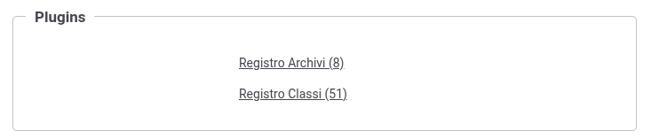

.. _configAvanzataPlugins:

Plugins
---------------------------------------------------------------------

Molte funzionalità di GovWay possono essere personalizzate attraverso l'implementazioni di classi java. Di seguito viene descritto sia come caricare eventuali archivi jar che realizzano l'implementazione sia come registrare i plugins in modo che possano essere utilizzati nelle maschere di configurazione. Entrambi i casi vengono gestiti accendendo al menù 'Configurazione -> Generale' utilizzando la console in modalità avanzata (sezione :ref:`modalitaAvanzata`) all'interno della sezione Plugins (:numref:`AvanzatoPlugins`).

    Configurazione dei plugins

I plugin supportati riguardano:

- **Autenticazione**: processo di autenticazione trasporto personalizzato (:ref:`apiGwAutenticazione`) attraverso l'implementazione dell'interfaccia *org.openspcoop2.pdd.core.autenticazione.pa.IAutenticazionePortaApplicativa* per un'erogazione o dell'interfaccia *org.openspcoop2.pdd.core.autenticazione.pd.IAutenticazionePortaDelegata* per una fruizione. 
- **Autorizzazione**: processo di autorizzazione personalizzato (:ref:`apiGwAutorizzazione`) attraverso l'implementazione dell'interfaccia *org.openspcoop2.pdd.core.autorizzazione.pa.IAutorizzazionePortaApplicativa* per un'erogazione o dell'interfaccia *org.openspcoop2.pdd.core.autorizzazione.pd.IAutorizzazionePortaDelegata* per una fruizione. 
- **Autorizzazione dei Contenuti**: processo di autorizzazione dei contenuti personalizzato (:ref:`apiGwAutorizzazioneContenuti`) attraverso l'implementazione dell'interfaccia *org.openspcoop2.pdd.core.autorizzazione.pa.IAutorizzazioneContenutoPortaApplicativa* per un'erogazione o dell'interfaccia *org.openspcoop2.pdd.core.autorizzazione.pd.IAutorizzazioneContenutoPortaDelegata* per una fruizione.  
- **RateLimiting**: consente di personalizzare sia il tipo di raggrupamento utilizzato nel conteggio dei valori di soglia sia il criterio di filtro per l'applicazione della policy (:ref:`configurazioneRateLimiting_filtriRaggruppamentiPersonalizzati`) attraverso l'implementazione dell'interfaccia *org.openspcoop2.pdd.core.controllo_traffico.plugins.IRateLimiting*.
- **Header di Integrazione**: consente di personalizzare i metadati scambiati con il client e/o con il server  (:ref:`headerIntegrazione_other`) attraverso l'implementazione di una delle seguenti interfacce:
  
  - *org.openspcoop2.pdd.core.integrazione.IGestoreIntegrazionePA*: per un'erogazione di API REST.
  - *org.openspcoop2.pdd.core.integrazione.IGestoreIntegrazionePASoap*: per un'erogazione di API SOAP.
  - *org.openspcoop2.pdd.core.integrazione.IGestoreIntegrazionePD*: per una fruizione di API REST.
  - *org.openspcoop2.pdd.core.integrazione.IGestoreIntegrazionePDSoap*: per una fruizione di API SOAP.
  
- **Connettore**: consente di implementare un connettore personalizzato (:ref:`avanzate_connettori`) attraverso l'implementazione dell'interfaccia *org.openspcoop2.pdd.core.connettori.IConnettore* .
- **Connettore multiplo**: consente di implementare una logica di consegna rispetto alla definizione di più connettori in maniera simile a quanto descritto in :ref:`loadBalancerConnettore` e in :ref:`consegnaCondizionaleConnettore`. La modalità di consenga selezionata dovrà essere configurata con il plugin personalizzato attraverso l'implementazione dell'interfaccia *org.openspcoop2.pdd.core.behaviour.IBehaviour* .
- **Token Dynamic Discovery**: consente di implementare una logica di parser personalizzato della risposta ottenuta invocando il servizio di discovery (:ref:`tokenValidazionePolicy`) attraverso l'implementazione dell'interfaccia *org.openspcoop2.pdd.core.token.parser.IDynamicDiscoveryParser*.
- **Token Validazione**: consente di implementare una logica di parser personalizzato del token JWT (:ref:`tokenPolicy_validazioneJWT`, :ref:`tokenPolicy_introspection`) attraverso l'implementazione dell'interfaccia *org.openspcoop2.pdd.core.token.parser.ITokenParser*.
- **Token Negoziazione**: consente di implementare una logica di parser personalizzato della risposta ottenuta durante la negoziazione (:ref:`tokenNegoziazionePolicy_custom`) attraverso l'implementazione dell'interfaccia *org.openspcoop2.pdd.core.token.parser.INegoziazioneTokenParser*.
- **Attribute Authority**: consente di implementare una logica di parser personalizzato della risposta ottenuta dall'attribute authority (:ref:`aaRisposta`) attraverso l'implementazione dell'interfaccia *org.openspcoop2.pdd.core.token.attribute_authority.IRetrieveAttributeAuthorityResponseParser*.
- **Message Handler**: handler che consentono di personalizzare la gestione del messaggi attraverso le varie fasi di processamento. L'attivazione di un handler può avvenire sia a livello di singola erogazione/fruizione (:ref:`configOpzioniAvanzate`) sia a livello globale accendendo al menù 'Configurazione -> Generale' e selezionando gli handler all'interno della sezione Handlers (:numref:`AvanzatoConfigGeneraleHandlers`). Uno specifico message handler deve implementare una delle seguenti interfacce a seconda della fase di processamento:

  - *org.openspcoop2.pdd.core.handlers.PreInRequestHandler*: precede l'inizio di accoglienza della richiesta.
  - *org.openspcoop2.pdd.core.handlers.InRequestHandler*: fase successivo alla comprensione dei dati della richiesta.
  - *org.openspcoop2.pdd.core.handlers.InRequestProtocolHandler*: fase successivo all'identificazione dell'API e dei soggetti coinvolti.
  - *org.openspcoop2.pdd.core.handlers.OutRequestHandler*: precede l'inoltro dei dati della richiesta al backend.
  - *org.openspcoop2.pdd.core.handlers.PostOutRequestHandler*: fase immediatamente successiva all'inoltro dei dati della richiesta al backend.
  - *org.openspcoop2.pdd.core.handlers.PreInResponseHandler*: precede l'inizio di accoglienza della risposta.
  - *org.openspcoop2.pdd.core.handlers.InResponseHandlerr*: fase successivo alla comprensione dei dati della risposta.
  - *org.openspcoop2.pdd.core.handlers.OutResponseHandler*: precede l'inoltro dei dati della risposta al mittente.
  - *org.openspcoop2.pdd.core.handlers.PostOutResponseHandler*: fase immediatamente successiva all'inoltro dei dati della risposta al mittente.

- **Service Handler**: handler che consentono di gestire fasi di avvio o shutdown di GovWay. L'attivazione di un handler può avvenire accendendo al menù 'Configurazione -> Generale' e selezionando gli handler all'interno della sezione Handlers (:numref:`AvanzatoConfigGeneraleHandlers`). Uno specifico service handler deve implementare una delle seguenti interfacce a seconda della fase di processamento:

  - *org.openspcoop2.pdd.core.handlers.InitHandler*: fase di startup di GovWay.
  - *org.openspcoop2.pdd.core.handlers.ExitHandler*: fase di shutdown di GovWay.
  
 .. figure:: ../../_figure_console/AvanzatoConfigGeneraleHandlers.png
    :scale: 70%
    :align: center
    :name: AvanzatoConfigGeneraleHandlers

    Configurazione Generale: registrazione di message o service handler

.. toctree::
        :maxdepth: 2
        
	archivi
	plugin
