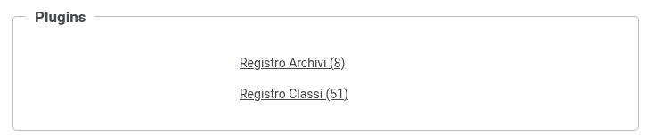

.. _configAvanzataPluginsPlugin:

Registrazione di un Plugin
---------------------------------------------------------------------

.. note::
    Per utilizzare la funzionalità deve essere utilizzata la console in modalità avanzata (sezione :ref:`modalitaAvanzata`),

Come descritto nella sezione :ref:`configAvanzataPlugins` è possibile implementare classi che consentono di personalizzare alcune funzionalità built-in del prodotto.

Ogni implementazione deve essere registrata come plugin di una specifica funzionalità, al fine di renderla selezionabile all'interno dell’interfaccia di configurazione della funzionalità stessa.

È possibile registrare un plugin accendendo al menù 'Configurazione -> Generale', utilizzando la console in modalità avanzata (sezione :ref:`modalitaAvanzata`), accedendo all'interno della sezione 'Plugins - Registro Classi' (:numref:`AvanzatoPlugins3`).

    Registrazione dei plugins

La registrazione di un plugin richiede:

- Tipo Plugin: deve essere selezionata una delle funzionalità per cui è consentito fornire un'implementazione personalizzata. L'elenco completo delle funzionalità disponibili viene descritto nella sezione :ref:`configAvanzataPlugins`.
- Tipologia API: presente solamente per alcuni tipi di plugin, consente di indicare se il plugin è adatto ad un'erogazione o ad una fruizione di API.
- Tipo: consente di associare un'identificativo al plugin che dovrà essere univoco.
- ClassName: nome completo della classe java comprensivo di package.
- Label: etichetta identificativa del plugin che verrà utilizzata nelle maschere di configurazione della funzionalità implementata.
- Stato: consente di abiliare o disabilitare il plugin.
- Descrizione: consente di fornire una descrizione generica.

    Registrazione di un plugin
