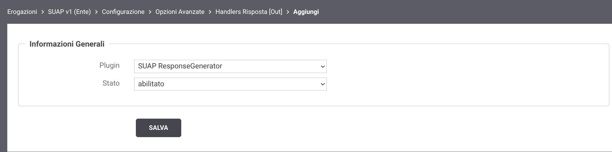

.. _configAvanzataSua:

Adeguamento al formato di errori previsto dai servizi del SUAP
--------------------------------------------------------------------------

Le Linee Guida di Interoperabilità prevedono l’adozione del formato *Problem Details* , come definito nella specifica *RFC 7807* (https://tools.ietf.org/html/rfc7807), per la rappresentazione strutturata delle informazioni di errore.

Tutti gli errori generati da GovWay (ad esempio, errori di autenticazione o indisponibilità del backend) rispettano tale specifica e risultano conformi alle Linee Guida, come descritto nella sezione :ref:`rfc7807`.

Al contrario, il formato degli errori previsto dalla specifica SUAP non risulta conforme, in quanto prevede la trasmissione degli errori attraverso oggetti JSON con una struttura differente, di cui si riporta di seguito un esempio:

   ::

      { "code": "ERROR_401_001", "message": "PDND token not found"}

Utilizzando GovWay per la gestione dell’interoperabilità ModI, non è possibile delegare direttamente a livello di backend SUAP tutti i casi di errore previsti dalla `Specifica Tecnica DPR-160 <https://github.com/AgID/specifiche-tecniche-DPR-160-2010/blob/approved02/specifiche_navigabili/08_e-service%20del%20SSU/08_06/08_06.md/>`_.
Ciò è dovuto al fatto che alcune comunicazioni vengono gestite direttamente da GovWay stesso, in presenza di errori di interoperabilità (ad esempio, token PDND non valido) o di problematiche di connettività verso il backend (ad esempio, connection refused o timeout).

Per garantire la conformità con i formati di errore attesi è possibile attivare un plugin di tipo 'message handler' (:ref:`configOpzioniAvanzate`) all’interno dell’erogazione SUAP.

Questo plugin consente di gestire i casi di errore e di trasformarli nella struttura JSON attesa, secondo quanto descritto nella `Specifica Tecnica DPR-160 <https://github.com/AgID/specifiche-tecniche-DPR-160-2010/blob/approved02/specifiche_navigabili/08_e-service%20del%20SSU/08_06/08_06.md/>`_. 

Gli errori gestiti da GovWay sono i seguenti:

- *ERROR_400_001 - incorrect request input*: uno o più parametri e/o la forma del body dell'operation non rispettano la sintassi definita nell'IDL OpenAPI.
- *ERROR_401_001 - PDND token not found*: token di autorizzazione della PDND non presente nella richiesta.
- *ERROR_401_002 - Invalid PDND token*: token di autorizzazione della PDND non valido.
- *ERROR_401_003 - AgID-JWT-Signature* token not found: la richiesta non contiene l'header AgID-JWT-Signature.
- *ERROR_401_004 - invalid AgID-JWT-Signature token*: token nell'header AgID-JWT-Signature non valido.
- *ERROR_404_001 - resource not found*: risorsa richiesta non esistente.
- *ERROR_428_001* - hash not found: gestisce esclusivamente il caso in cui il parametro obbligatorio 'If-Match' non sia presente nella richiesta.
- *ERROR_500_007 - response processing error*: copre solamente i due casi seguenti:

    - backend non disponibile: rappresenta la casistica in cui il backend non è raggiungibile per vari motivi (es. connection refused, connection timeout, read timeout).  
    - backend torna una risposta 5xx senza content-type o con un un content-type differente da application/json. 

.. note::
    Rimangono a carico dell'implementazione del backend SUAP gli altri codici di errore.

Per attivare il plugin agire come segue:

- Utilizzando la console in modalità avanzata (sezione :ref:`modalitaAvanzata`) accedere al dettaglio dell’erogazione per cui si intende abilitare la gestione personalizzata dell’errore. Entrare quindi nella sezione ‘Configura -> Opzioni Avanzate’

    Sezione 'Opzioni Avanzate' di una erogazione o fruizione

- Nella sezione  ‘Handlers’, sotto-sezione ‘Handlers per la Risposta’, cliccare sul link ‘Out (precedente all'inoltro dei dati)’ per poter registrare l’handler che realizza la personalizzazione dell’errore come atteso da SUAP.

    Attivazione plugin per la personalizzazione degli errori SUAP.

- Infine per gestire l'errore ‘ERROR_400_001’ deve essere abilitata la validazione dei contenuti agendo come segue nella sezione: 'Erogazione -> Dettaglio -> Configurazione -> Validazione'

    Attivazione validazione dei contenuti per la personalizzazione dell'errore 'ERROR_400_001'
