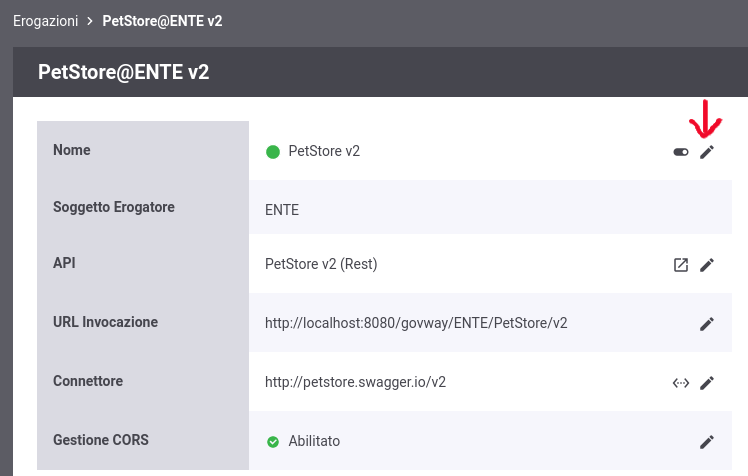
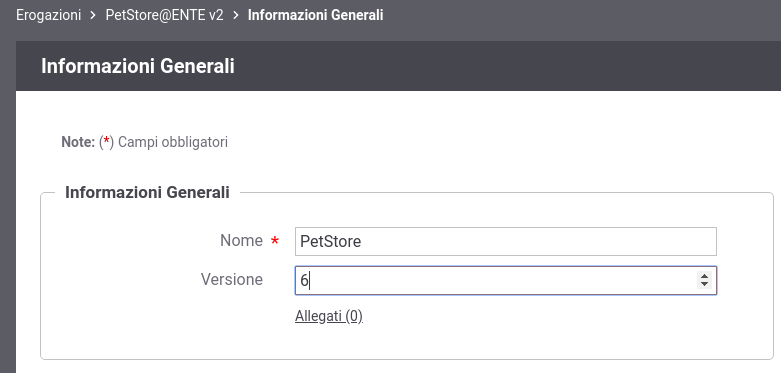
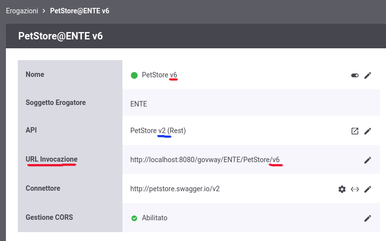

.. _versionamentoAPI_advanced:

Versionamento delle API e delle Erogazioni/Fruizioni
-----------------------------------------------------

Su GovWay vi è una gestione del versionamento effettuato su due componenti:

- API
- Erogazione o Fruizione dell'API

Come descritto nella sezione :ref:`versionamentoAPI`, sulla singola erogazione/fruizione è possibile modificare la versione dell'API implementata solamente se ne esiste più di una versione. Questa modifica si riflette automaticamente anche sulla versione dell'erogazione/fruizione, e sull'url di invocazione, se non esiste già una erogazione/fruizione con la nuova versione.

Utilizzando la console in modalità avanzata (:ref:`modalitaAvanzata`) è invece possibile modificare puntualmente la versione dell'erogazione/fruizione e di conseguenza l'url di invocazione tramite il bottone 'modifica' evidenziato nella figura :numref:`nuovaVersioneErogazione`. 

    Nuova Versione di una Erogazione

Accedendo alla modifica del nome dell'erogazione/fruizione con la console in modalità avanzata, è possibile modificare la versione (:numref:`modificaVersioneErogazione`).

    Scelta di una nuova versione per una Erogazione

Effettuata la modifica l'erogazione possiederà una versione indipendente dalla versione dell'API implementata. L'url di invocazione riflette la versione dell'erogazione come evidenziato nella figura :numref:`nuovaVersioneErogazioneDifferenteApi`. 

    Nuova versione dell'erogazione differente dalla versione dell'API

