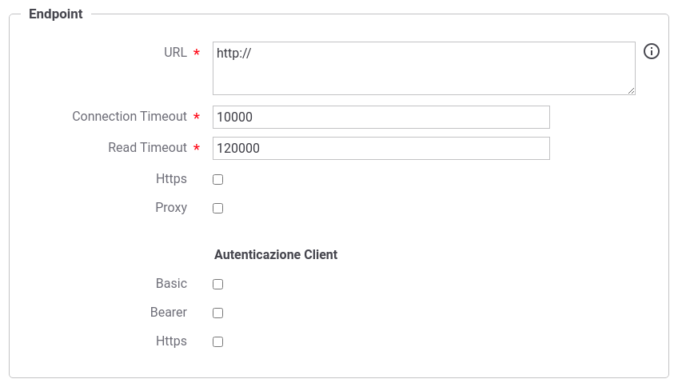

.. _aaEndpoint:

Endpoint di un Attribute Authority
----------------------------------

In questa sezione vengono descritti i parametri configurabili per indicare i criteri di connessione verso l'AA a cui devono essere richiesti gli attributi qualificati.

    Endpoint di un Attribute Authority

-  *URL*: endpoint dell'AA a cui è possibile inviare una richiesta di attributi. Il valore può essere definito come costante o contenere parti dinamiche risolte a runtime dal Gateway (per maggiori dettagli :ref:`valoriDinamici`).

-  *Connection Timeout*: Tempo massimo in millisecondi di attesa per
   stabilire una connessione con il server.

-  *Read Timeout*: Tempo massimo in millisecondi di attesa per la
   ricezione di una risposta dal server.

-  *Https*: Parametri di configurazione nel caso in cui l'AA richieda un accesso Https.

-  *Proxy*: Parametri di configurazione nel caso in cui l'AA richieda l'uso di un proxy per l'accesso.

Successivamente devono essere forniti i dati di configurazione specifici dell'autenticazione client se richiesto dall'AA:

-  *Autenticazione Http Basic*: flag da attivare nel caso in cui l'AA richieda autenticazione di tipo HTTP-BASIC. In questo caso dovranno essere forniti Username e Passwornd nei campi successivi.

-  *Autenticazione Bearer*: flag da attivare nel caso in cui l'AA richieda autenticazione tramite un bearer token. Il token dovrà essere indicato nel campo successivo fornito.

-  *Autenticazione Https*: flag da attivare nel caso in cui l'AA richieda autenticazione di tipo Https. In questo caso dovranno essere forniti tutti i dati di configurazione nei campi presenti nella sezione 'https'.

Nel caso sia attivato il flag relativo ad un Proxy o una configurazione Https saranno presentate delle sezioni omonime dove poter inserire i dati di configurazione richiesti.
