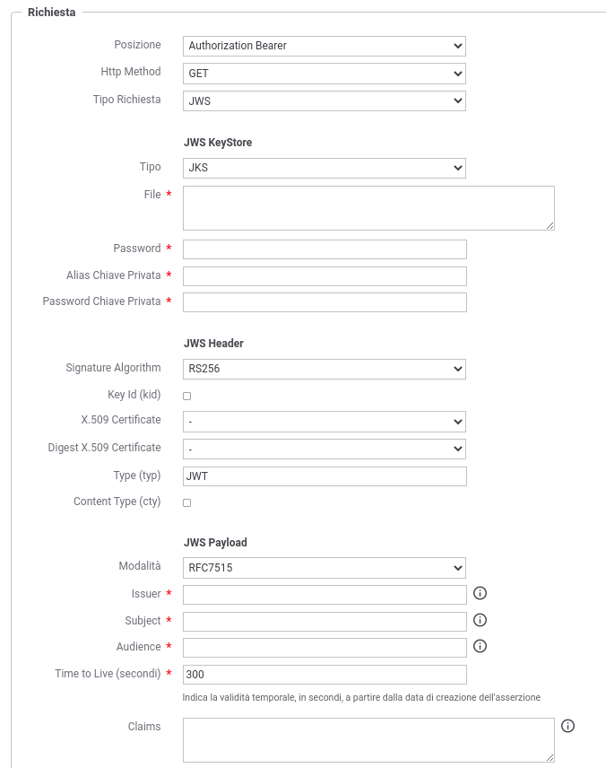
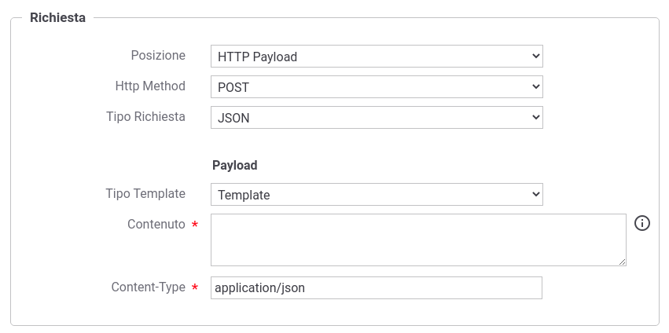

.. _aaRichiesta:

Richiesta di Attributi
----------------------------------

Ogni singola AA definisce nella propria interfaccia quali siano gli elementi obbligatori che devono essere presenti nelle richieste, tra cui l'informazione necessaria ad identificare il soggetto a cui si riferiscono gli attributi richiesti.

La sezione seguente consente di definire come GovWay debba formare la richiesta che verrà inoltrata all'endpoint configurato nella sezione :ref:`aaEndpoint`.

-  *Posizione*: indica dove risiede la richiesta di attributi nella comunicazione HTTP:

	-  *Authorization Bearer*: richiesta inserita nell'header HTTP 'Authorization' con prefisso 'Bearer';
	-  *HTTP Payload*: richiesta veicolata come payload http;
	-  *Header HTTP*: richiesta inserita in un header HTTP il cui nome viene definito nel campo successivo fornito;
	-  *Parametro URL*: richiesta inserita come parametro della url il cui nome viene definito nel campo successivo fornito.

-  *Http Method*: consente di selezionare il tipo di richiesta HTTP da utilizzare tra quelle compatibili con la *Posizione* della richiesta di attributi.

-  *Tipo Richiesta*: indica il formato della richiesta:

	-  *JWS*: token JWT firmato (https://datatracker.ietf.org/doc/html/rfc7515);
	-  *JSON*: consente di definire la richiesta di attributi tramite la definizione di un template;
	-  *Personalizzata*: simile alla precedente opzione, consente inoltre di impostare il Content-Type associato alla richiesta.

**Richiesta nel formato JWT**

Nel caso di richiesta di tipo *JWS* si devono fornire le informazioni necessarie a produrre il JWT firmato così suddivise:

-  *JWS KeyStore*: dati di accesso al keystore contenente la chiave privata ed il certificato da utilizzare per firmare il JWT.

-  *JWS Header*: consente di indicare quali dati debbano essere inseriti nella parte header (non firmati) del JWT; tra i parametri impostabili vi sono l'algoritmo di firma e l'indicazione se deve essere inserito il certificato utilizzato per la firma nell'header (x5c).

-  *JWS Payload*: consente di impostare i valori dei claim presenti nella parte body (firmata) del JWT. Vengono fornite differenti modalità con le quali poter definire il payload:

	-  *RFC7515*: consente di definire i claims standard ('iss','sub' e 'aud') e la validità temporale del JWT. Inoltre è possibile definire ulteriori claims da inserire nel body indicandoli per riga (nome=valore) nel campo 'Claims'. I claim 'iss', 'sub', 'aud' e gli eventuali claims aggiuntivi possono essere definiti tramite costanti o possono contenere parti dinamiche risolte a runtime dal Gateway (per maggiori dettagli :ref:`valoriDinamici`).

	-  *Template*: il payload viene definito tramite un template che può contenere parti dinamiche risolte a runtime definite tramite una sintassi proprietaria di GovWay.

	-  *Freemarker Template*: il payload viene definito utilizzando il template "Freemarker" (https://freemarker.apache.org/).

	-  *Velocity Template*: il payload viene definito utilizzando il template "Velocity" (http://velocity.apache.org/).

    Richiesta di Attributi nel formato JWS con modalità 'RFC7515'

**Richiesta in altri formati**

Nel caso di richiesta di tipo *Json* o *Personalizzata* si deve fornire un template che definisce la richiesta di attributi. Il tipo di template utilizzabile è selezionabile tra i seguenti:

-  *Template*: il contenuto della richiesta viene definito tramite un template che può contenere parti dinamiche risolte a runtime definite tramite una sintassi proprietaria di GovWay;

-  *Freemarker Template*: il contenuto della richiesta viene definito utilizzando il template "Freemarker" (https://freemarker.apache.org/);

-  *Velocity Template*: il contenuto della richiesta viene definito utilizzando il template "Velocity" (http://velocity.apache.org/).

    Richiesta di Attributi nel formato JSON

**Valori dinamici utilizzabili nei Template**

I costrutti utilizzabili nei template sono gli stessi utilizzabili per la funzionalità di trasformazione, come descritti nella sezione ':ref:`valoriDinamici`', arricchiti di un'ulteriore istruzione che consente di individuare gli attributi da richiedere, così come configurati sulla specifica fruizione o erogazione di API nella quale è stata riferita l'AA :

- *requiredAttributes:METHOD* : il valore 'METHOD' fornito deve rappresentare un metodo valido all'interno della classe 'org.openspcoop2.pdd.core.token.attribute_authority.RequiredAttributes'

	- Se la richiesta è definita tramite un template con la sintassi specifica di GovWay, gli attributi saranno direttamente accessibili utilizzando il formato '${requiredAttributes:METHOD}'; ad es. per ottenere la lista degli attributi in un formato utilizzabile all'interno di un array json usare ${requiredAttributes:jsonList()} oppure ${requiredAttributes:formatList(",")}.
	- Se la richiesta è definita tramite template Freemarker o Velocity, l'oggetto contenente gli attributi da richiedere è presente nel contesto con chiave di accesso 'aa'.

Di seguito un esempio di template GovWay che definisce una richiesta JSON in cui l'identità della persona fisica per cui si richiedono gli attributi viene prelevata dal token OAuth e gli attributi richiesti sono quelli configurati nell'erogazione di API:

   ::

       {
		"attributes": [${requiredAttributes:jsonList()}],
		"fiscalCode": "${tokenInfo:username}"
       }
