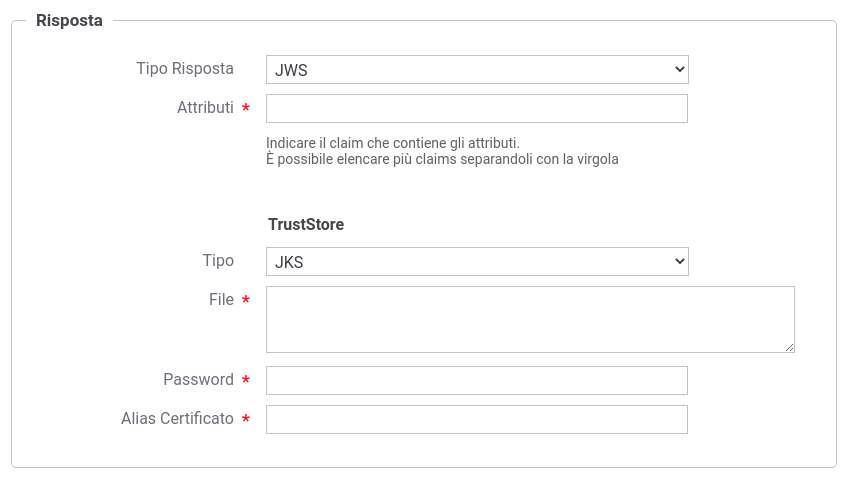
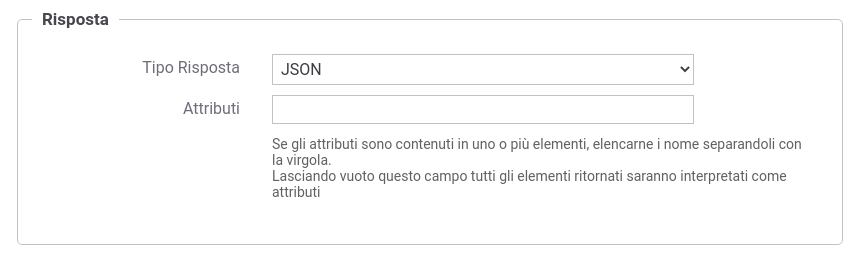
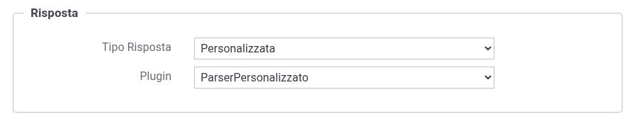

.. _aaRisposta:

Risposta della Attribute Authority
----------------------------------

Ogni singola AA utilizza un proprio formato per la descrizione degli attributi nella risposta fornita. Il tipo della risposta deve essere definito nel campo '*Tipo Risposta*'. 
Di seguito vengono descritte le opzioni richieste per ogni tipo.

-  *JWS*: la risposta viene gestita come token JWT firmato (https://datatracker.ietf.org/doc/html/rfc7515) presente nel payload http. Deve essere indicato il claim che contiene gli attributi richiesti ed è possibile elencare più claim separandoli tramite virgola. Nella sezione '*TrustStore*' devono essere indicati i dati che consentono di accedere al truststore da utilizzare per validare il token jws.

    Risposta di Attributi nel formato JWS

-  *JSON*: la risposta viene processata come messaggio JSON. Se gli attributi sono contenuti in uno o più elementi devono esserne elencati i nomi separandoli tramite virgola. Invece lasciando vuoto il campo '*Attributi*' tutti gli elementi presenti saranno interpretati come attributi.

    Risposta di Attributi nel formato JSON

-  *Personalizzata*: la risposta viene processata tramite la classe indicata nel campo '*ClassName*'. La classe fornita deve implementare l'interfaccia 'org.openspcoop2.pdd.core.token.attribute_authority.IRetrieveAttributeAuthorityResponseParser'.

    Risposta di Attributi in un formato personalizzato
