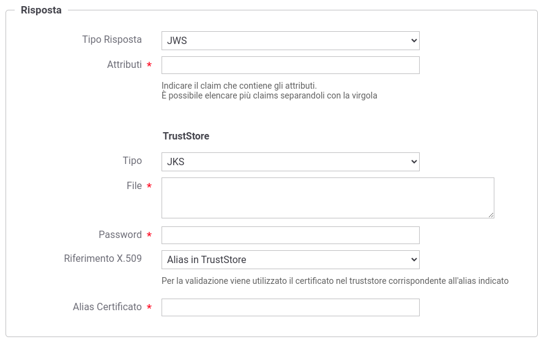

.. _aaRisposta:

Risposta di Attributi
----------------------------------

Ogni singola AA ha il suo proprio formato con cui restituisce gli attributi nella risposta. Il tipo della risposta deve essere definito nel campo '*Tipo Risposta*'. 
Di seguito vengono descritte le opzioni richieste per ogni tipo.

-  *JWS*: la risposta viene attesa come token JWT firmato (https://datatracker.ietf.org/doc/html/rfc7515) portato nel payload http. Deve essere indicato il claim che contiene gli attributi richiesti ed è possibile elencare più claims separandoli con la virgola. Nella sezione '*TrustStore*' devono essere indicati i dati che consentono di accedere al truststore da utilizzare per validare il token jws.

    Risposta di Attributi nel formato JWS

-  *JSON*: la risposta viene processata come un messaggio JSON. Se gli attributi sono contenuti in uno o più elementi devono esserne elencati i nome separandoli con la virgola. Invece lasciando vuoto il campo '*Attributi*' tutti gli elementi ritornati saranno interpretati come attributi.

    Risposta di Attributi nel formato JSON

-  *Personalizzata*: la riposta viene processata tramite la class indicata nel campo '*ClassName*'. La classe fornita deve implementare l'interfaccia 'org.openspcoop2.pdd.core.token.attribute_authority.IRetrieveAttributeAuthorityResponseParser'.

.. figure:: ../../_figure_console/AA-risposta-custom.png
    :scale: 100%
    :align: center
    :name: aaRispostaCustomFig

    Risposta di Attributi in un formato personalizzato
