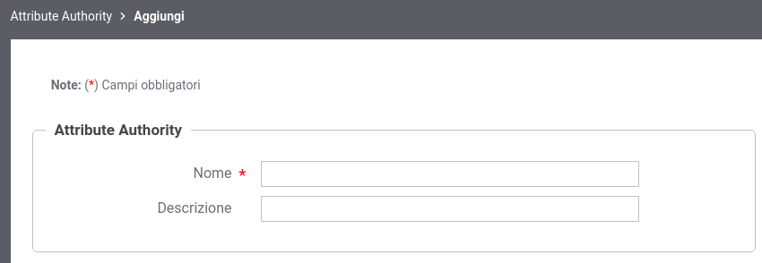

.. _aa:

Attribute Authority
-------------------

Le Attribute Authority (AA) sono regolate dalle "Linee guida dei
gestori di attributi qualificati" rilasciate da AGID ed operano erogando API che
gestiscono gli attributi qualificati di persone fisiche o giuridiche.

Un attributo qualificato descrive una proprietà di un’identità e si
definisce qualificato perché è attestato da un soggetto (Attribute
Authority) cui la legge conferisce tale potere.  La descrizione e il
formato di ogni attributo è specifico dell'Attribute Authority alla
quale è possibile richiedere attributi solo mediante la stipula di una
convenzione.  Inoltre le singole AA definiscono nelle proprie
specifiche di integrazione quali siano gli elementi obbligatori che
devono essere presenti nelle richieste tra cui l'informazione
necessaria ad identificare il soggetto per cui si stanno richiedendo
gli attributi.

GovWay supporta l'interazione con le Attribute Authority nella fase di
verifica dell'autorizzazione all'accesso ad una API, permettendo di utilizzare
gli attributi ottenuti dalle AA nelle politiche di accesso alle API.

.. note::
   Gli attributi che possono essere richiesti ad una AA si suddividono tra quelli senza necessità di consenso dell'utente e quelli che ne richiedono un consenso. Le AA configurabili su GovWay consentiranno di richiedere attributi che non necessitano di consenso dell'utente.

Per poter definire politiche di controllo degli accessi basate sugli
attributi è necessario registrare una o più AA. Queste potranno poi
essere riferite nella configurazione delle singole API.

La gestione delle AA si effettua dalla sezione *Configurazione > Attribute Authority* della govwayConsole. Per registrarne una nuova si utilizza il pulsante *Aggiungi*. Il form di creazione appare inizialmente come quello
illustrato in :numref:`aaFig`.

    Registrazione di una Attribute Authority

Inizialmente si inseriscono i dati identificativi:

-  *Nome*: nome univoco da assegnare all'AA

-  *Descrizione*: testo di descrizione generale

Le sezioni successive dettagliano i criteri con cui si compone una richiesta di attributi e l'endpoint a cui deve essere spedita. Infine deve essere istruito GovWay su come interpretare la risposta di attributi ricevuta dall'AA.

.. toctree::
        :maxdepth: 3

	aaEndpoint
	aaRichiesta
	aaRisposta
