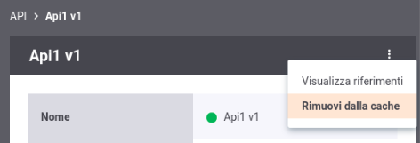

.. _configCacheIntro:

Cache
--------

Accedendo alla console di gestione in modalità avanzata (:ref:`modalitaAvanzata`) nella sezione '*Configurazione > Cache* ' (:numref:`cacheConfigIntroEsempio`) è possibile configurare i parametri di ogni cache utilizzata da GovWay. Maggiori dettagli vengono forniti nella sezione :ref:`govWayCaches` della guida di installazione.

.. figure:: ../_figure_console/govwayConsole_cache.png
    :scale: 100%
    :align: center
    :name: cacheConfigIntroEsempio
  
    GovWay Cache

Accedendo alla sezione '*Strumenti > Runtime*' (:ref:`strumenti_runtime`), tramite la voce *Svuota tutte le Cache* è possibile effettuare il reset contemporaneo di tutte le cache utilizzate dal gateway.

L'operazione precedente impatterà su tutte le configurazioni indistintamente. Se si volesse invece eliminare dalle cache le informazioni puntuali di una specifica configurazione si può utilizzare il menù presente sia nell'elenco che nel dettaglio di ogni entità principale di GovWay (API, Erogazione, Soggetto, Applicativo, Ruolo ...) come mostrato nelle figura :numref:`cacheConfigSvuotaPuntuale` e :numref:`cacheConfigSvuotaPuntualeDettaglio`.

  
    GovWay Cache: eliminazione puntuale di una configurazione scelta dall'elenco

  
    GovWay Cache: eliminazione puntuale di una configurazione 
