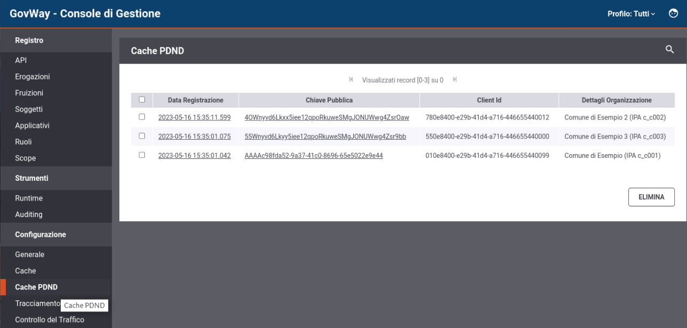
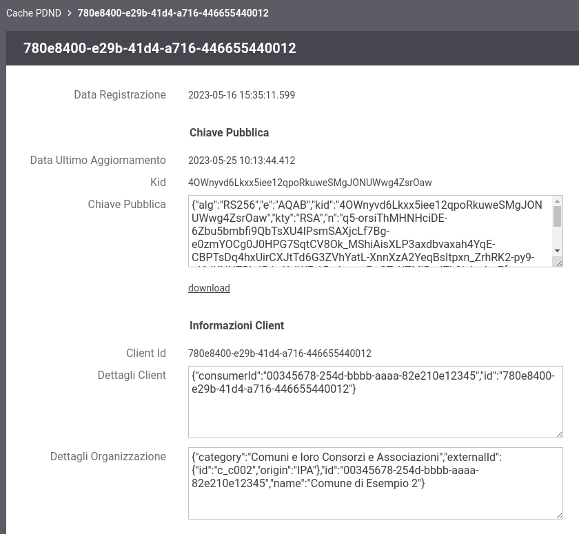

.. _configCachePDNDIntro:

Cache PDND
-----------

Accedendo alla console di gestione in modalità avanzata (:ref:`modalitaAvanzata`) nella sezione '*Configurazione > Cache PDND* ' (:numref:`cachePDNDConfigIntroEsempio`) è possibile consultare i dati presenti nella cache locale contenente le chiavi pubbliche (JWK) e le informazioni sui client raccolte tramite le :ref:`modipa_passiPreliminari_api_pdnd`.

  
    GovWay Cache PDND

È possibile eliminare una o più chiavi dalla cache attraverso la selezione puntuale e l'utilizzo del pulsante *Elimina*.

Cliccando sul link che riporta il kid di una chiave sarà possibile effettuarne il download.

Infine cliccando sull'ora di registrazione si possono esaminare i dettagli sia riguardanti la chiave pubblica scaricata dalla PDND che le informazioni ottenute relative all'organizzazione afferente del client id (:numref:`cachePDNDDettagliEntry`).

  
    GovWay Cache: dettagli di una chiave
