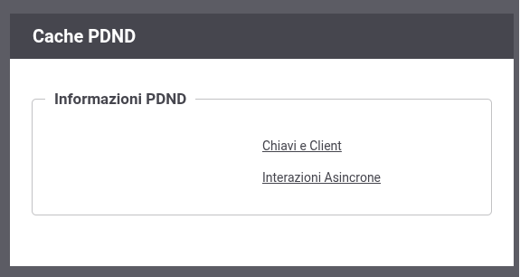

.. _configCachePDNDIntro:

Cache PDND
-----------

Accedendo alla console di gestione in modalità avanzata (:ref:`modalitaAvanzata`) nella sezione '*Configurazione > Cache PDND*' è possibile consultare le informazioni ottenute dalla PDND e mantenute localmente da GovWay (:numref:`cachePDNDInformazioni`):

- *Chiavi e Client*: la cache locale contenente le chiavi pubbliche (JWK) e le informazioni sui client raccolte tramite le :ref:`modipa_passiPreliminari_api_pdnd`; maggiori dettagli vengono forniti nella sezione :ref:`configCachePDNDChiaviClient`.

- *Interazioni Asincrone*: le interazioni relative agli scambi di dati asincroni PDND (:ref:`modipa_scambiAsincroni`) registrate da GovWay; maggiori dettagli vengono forniti nella sezione :ref:`configCachePDNDInterazioniAsincrone`.

    GovWay Cache PDND: informazioni disponibili

.. toctree::
    :maxdepth: 2

    chiaviClient
    interazioniAsincrone
