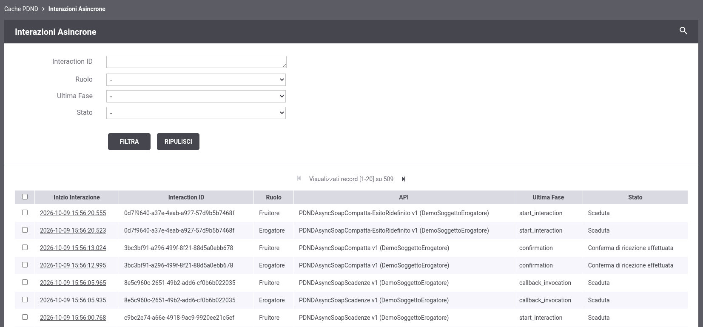
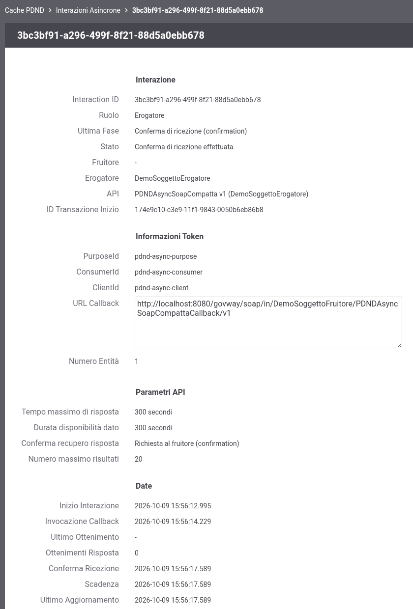

.. _configCachePDNDInterazioniAsincrone:

Interazioni Asincrone
---------------------

Selezionando il link '*Interazioni Asincrone*' nella sezione '*Configurazione > Cache PDND*' è possibile consultare le interazioni relative agli scambi di dati asincroni PDND registrate da GovWay (:ref:`modipa_scambiAsincroni`), sia come fruitore che come erogatore (:numref:`cachePDNDInterazioniAsincroneLista`, nella quale sono visibili anche i filtri di ricerca).

    GovWay Cache PDND: interazioni asincrone

Per ogni interazione l'elenco riporta:

- *Inizio Interazione*: data in cui l'interazione è stata avviata;
- *Interaction ID*: identificativo dell'interazione generato dalla PDND, corrispondente all'identificativo di conversazione di GovWay;
- *Ruolo*: 'Fruitore' se l'interazione è stata registrata dalla fruizione dell'e-service, 'Erogatore' se registrata dall'erogazione;
- *API*: l'API con ruolo 'Erogazione dati' a cui l'interazione si riferisce; il soggetto fruitore viene riportato nel tooltip;
- *Ultima Fase*: l'ultima fase dello scambio completata con successo (start_interaction, callback_invocation, get_resource o confirmation);
- *Stato*: 'In attesa della callback', 'Risposta disponibile', 'Conferma di ricezione effettuata' o 'Scaduta'; la data di scadenza viene riportata nel tooltip.

È possibile eliminare una o più interazioni attraverso la selezione puntuale e l'utilizzo del pulsante *Elimina*. Un'interazione eliminata non è più utilizzabile: le successive richieste che la riferiscono vengono rifiutate come interazione non trovata (:ref:`errori_400_AsyncInteractionNotFound`). Le interazioni scadute vengono comunque eliminate dallo svecchiamento periodico effettuato da GovWay (:ref:`modipa_scambiAsincroni_properties`).

Espandendo la sezione dei filtri di ricerca è possibile ricercare le interazioni per *Interaction ID*, *Ruolo*, *Ultima Fase* e *Stato* ('Non scadute' o 'Scadute'). Se sono configurate più basi dati runtime, il filtro *Sorgente Dati* consente di selezionare quella da consultare.

Cliccando sulla data di inizio di un'interazione se ne possono esaminare i dettagli (:numref:`cachePDNDInterazioniAsincroneDettaglio`), suddivisi nelle sezioni:

- *Interazione*: identificativo, ruolo, ultima fase, stato, soggetti fruitore ed erogatore, API ed eventuale API di callback, identificativo della transazione che ha avviato l'interazione (*ID Transazione Inizio*); lato erogatore il soggetto fruitore non viene riportato se il consumer PDND non è registrato come soggetto su GovWay, e l'interazione resta associata al 'ConsumerId' del voucher;
- *Informazioni Token*: 'PurposeId', 'ConsumerId' e 'ClientId' del voucher, URL di callback e numero di entità dichiarato nella callback;
- *Parametri API*: i parametri dello scambio definiti nell'API al momento dell'avvio dell'interazione (*Tempo massimo di risposta*, *Durata disponibilità dato*, *Conferma recupero risposta*, *Numero massimo risultati*);
- *Date*: inizio dell'interazione, invocazione della callback, ultimo ottenimento della risposta e numero di ottenimenti effettuati, conferma di ricezione, scadenza e ultimo aggiornamento.

    GovWay Cache PDND: dettaglio di un'interazione asincrona
