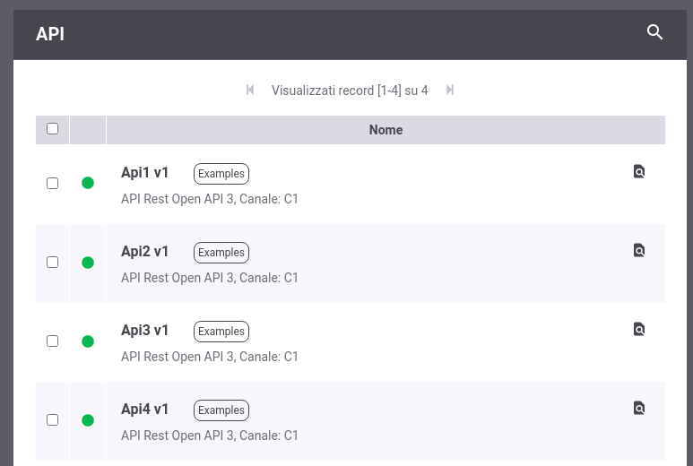
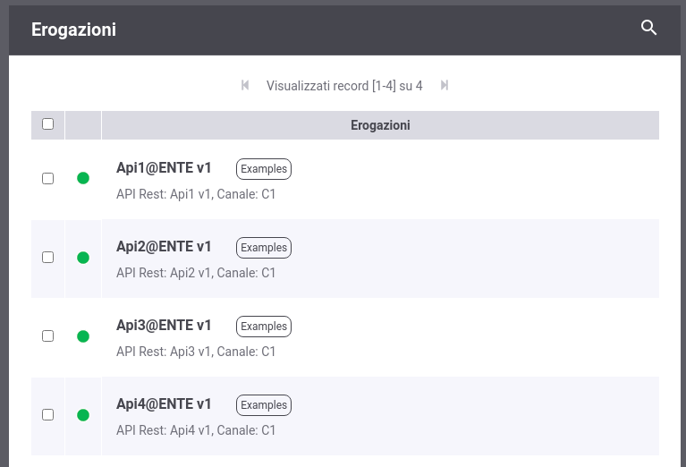
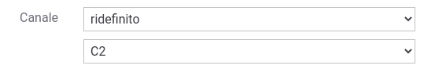
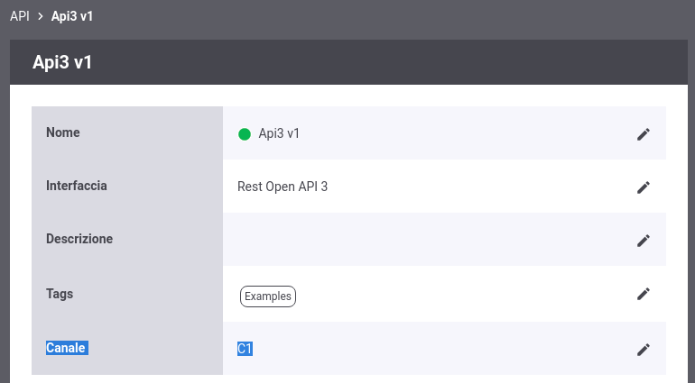
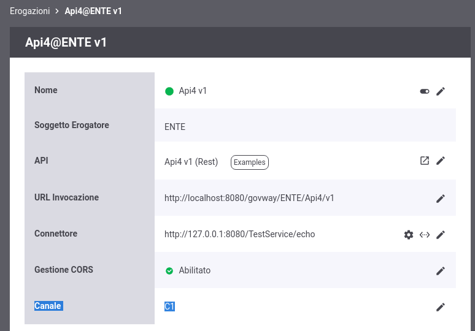

.. _console_canali_api:

Canale associato all'API 
~~~~~~~~~~~~~~~~~~~~~~~~~

Una volta abilitata la modalità 'Canali' accedendo all'elenco delle API (:numref:`canaliApi`) o delle Erogazioni/Fruizioni (:numref:`canaliErogazioni`) verrà visualizzata l'informazione sul canale associato. Tutte le erogazioni/fruizioni esistenti in cui non è stato associato un canale specifico ereditano il canale di default.

 Elenco API visualizza l'informazione sul Canale

 Elenco Erogazioni visualizza l'informazione sul Canale

Un canale, differente da quello di default, può essere associato ad una erogazione o fruizione in due modi:

- definendo un canale nel'API: tutte le erogazioni o fruizioni che implementano l'API ereditano il canale
- associando il canale alla specifica erogazione o fruizione

Sia durante la registrazione di una nuova API che durante l'attivazione di una nuova erogazione o fruizione verrà richiesto all'utente se desidera specificare un canale differente da quello di default (:numref:`ridefinizioneCanale`).

 Associazione di un canale

È possibile modificare il canale associato ad una API esistente accedendo alla maschera di dettaglio dell'API (:numref:`modificaCanaleApi`) e cliccando sulla voce 'Modifica Canale' si accede ad una maschera identica a quella proposta in fase di creazione (vedi :numref:`ridefinizioneCanale`).

 Modifica del canale associato ad un'API

In ugual modo è possibile associare un canale ad una specifica erogazione o fruizione accedendo alla sua maschera di dettaglio (:numref:`modificaCanaleErogazione`) e cliccando sulla voce 'Modifica Canale'.

 Modifica del canale associato ad una erogazione

