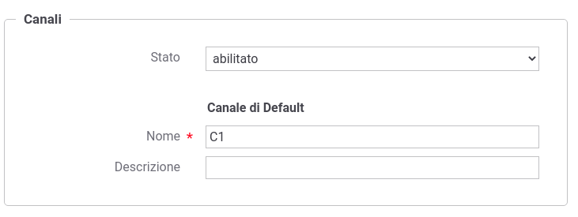
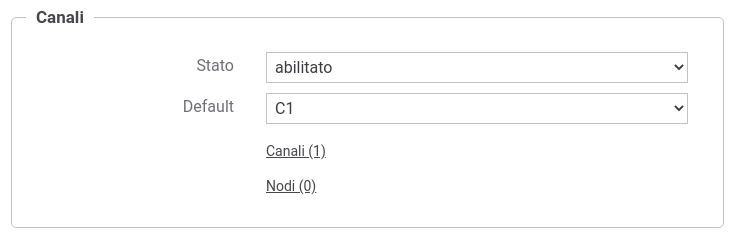
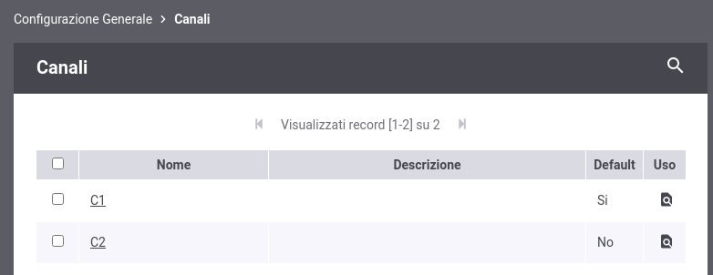
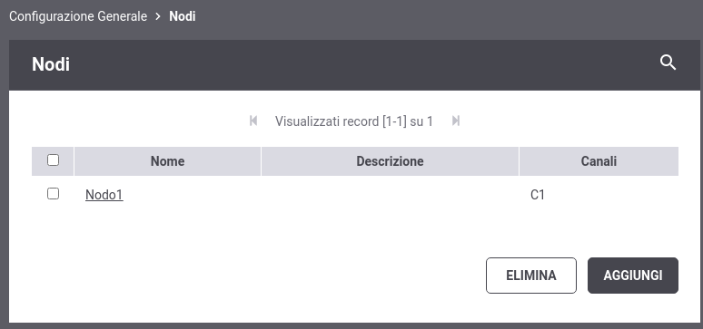
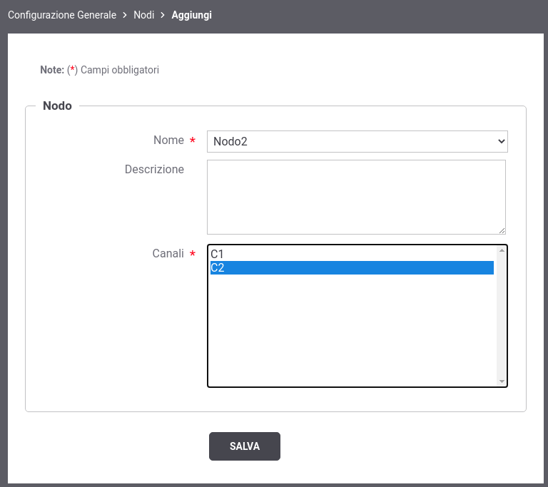

.. _console_canali_config:

Configurazione dei Canali
~~~~~~~~~~~~~~~~~~~~~~~~~~

Abilitando la modalità 'Canali' sarà possibile assegnare uno o più canali ad ogni nodo che compone il cluster ed un canale ad ogni API.

La prima volta che viene abilitata la funzionalità, la console richiede di configurare un canale di default che verrà associato:

- a tutte le erogazioni o fruizioni di API esistenti alle quali non è stato associato un canale
- a tutti i nodi non registrati

La configurazione richiede (:numref:`abilitazioneGestioneCanali`):

-  *Stato*: indicazione se la gestione è abilitata o meno;

-  *Nome*: identificativo univoco del canale di default;

-  *Descrizione*: descrizione generica del canale di default.

 Maschera di abilitazione delle gestione dei canali

Attivata la gestione e definito il canale di default sarà possibile registrare nuovi canali, modificare il canale di default e registrare i nodi che compongono il cluster (:numref:`gestioneCanali`).

 Maschera di gestione dei canali

Dall'elenco dei canali è possibile aggiungere, modificare o eliminare un canale (:numref:`elencoCanali`). La registrazione di un nuovo canale richiede che venga definito un identificativo univoco e opzionalmente una descrizione da associare al canale.

 Elenco dei canali configurati

Dall'elenco dei nodi è possibile registrare, modificare o eliminare un nodo del cluster (:numref:`elencoCanali`).

 Elenco dei nodi configurati

La registrazione o la modifica di un nodo richiede (:numref:`registrazioneNuovoNodo`):

-  *Nome*: identificativo univoco del nodo;

-  *Descrizione*: descrizione generica del nodo;

-  *Canali*: selezione dei canali associati al nodo.

