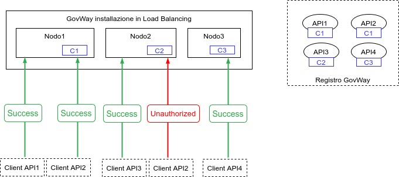

.. _console_canali:

Canali
~~~~~~

In GovWay è possibile attivare, in una installazione composta da più nodi in Load Balancing, una suddivisione delle API tra i vari nodi utilizzando il concetto di canale, al fine di suddividere il carico tra i nodi. Per maggiori dettagli sull'installazione in Load Balancing si faccia riferimento alla sezione :ref:`cluster` della Guida di Installazione.

Abilitando la modalità 'Canali' sarà possibile assegnare uno o più canali ad ogni nodo che compone il cluster ed un canale ad ogni API.
Su ogni nodo saranno autorizzate ad essere invocate solamente le API che possiedono un canale corrispondente alla configurazione del nodo.

 Suddivisione delle API in Canali

Nelle prossime sezioni verranno descritte:

- :ref:`console_canali_config`: vengono fornite le indicazioni su come abilitare la funzionalità e su come censire i canali ed associarli ai nodi che compongono il cluster.
- :ref:`console_canali_api`: vengono fornite le indicazioni su come associare ad una erogazione o fruizione di API un canale differente da quello di default.
- :ref:`console_canali_url`: viene descritto come personalizzare le url di invocazione visualizzate dalla console per ogni erogazione o fruizione al fine di indirizzare il nodo corretto corrispondente al canale associato all'API.

.. toctree::
        :maxdepth: 2

	configurazione
	api
	regole
