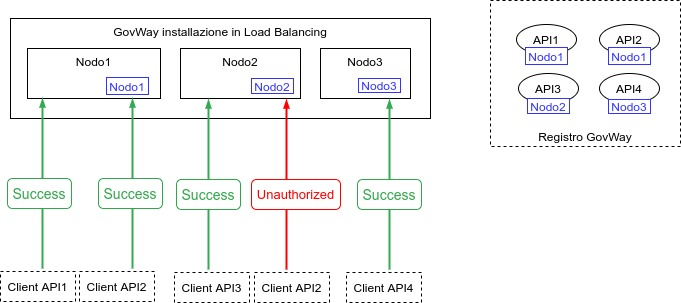
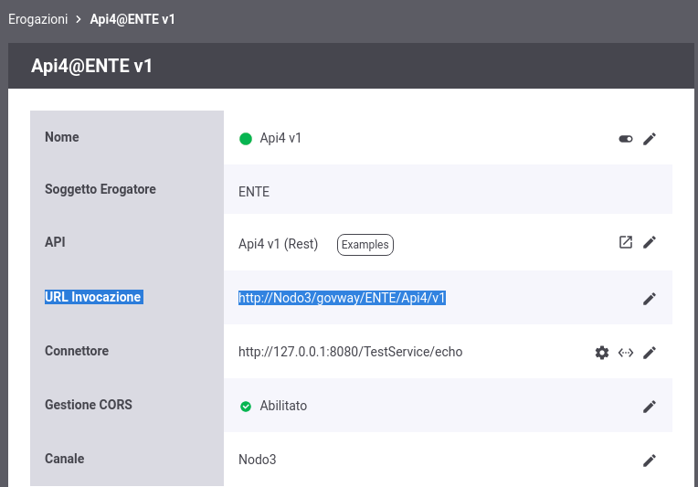
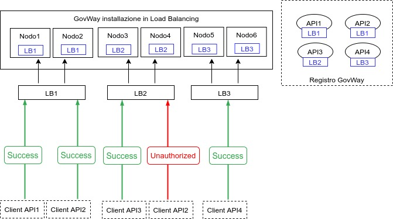
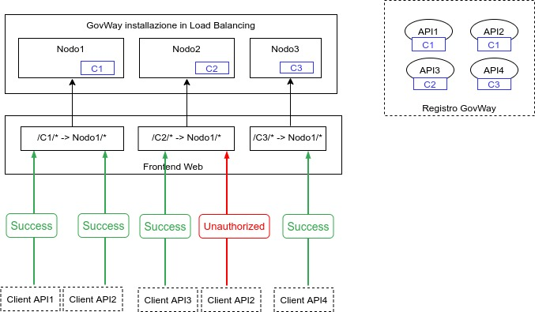
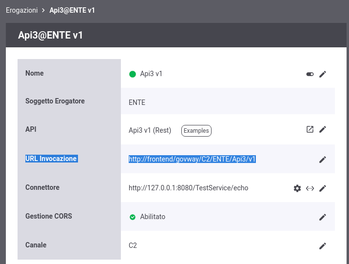

.. _console_canali_url:

Url di Invocazione e Canali
~~~~~~~~~~~~~~~~~~~~~~~~~~~~~

Su ogni nodo saranno autorizzate ad essere invocate solamente le API che possiedono un canale corrispondente alla configurazione del nodo come raffigurato in :numref:`architetturaCanali2`.

.. figure:: ../../../_figure_console/ArchitetturaCanali.jpg
 :scale: 100%
 :align: center
 :name: architetturaCanali2

 Suddivisione delle API in Canali

È possibile utilizzare le regole di proxy pass descritte nella sezione :ref:`configGenerale_urlInvocazione` al fine di far visualizzare una url di invocazione nel dettaglio di una erogazione o fruizione che indirizzi il nodo corretto.
La definizione corretta delle regole di proxy pass dipendono dall'architettura reale dei nodi in Load Balancing. Di seguito vengono forniti alcuni esempi al fine di esemplificare la funzionalità.

**Ipotesi1: Nome del Canale corrisponde all'hostname di un nodo**

In questo primo scenario ogni API sarà invocabile solamente su uno dei nodi che compongono il cluster (:numref:`architetturaCanaliIpotesi1`).
Lo scenario prevede che gli identificativi dei canali corrispondo all'hostname di un nodo.

 Suddivisione delle API in Canali, scenario 1

Creando una regola di proxy pass (vedi :ref:`configGenerale_urlInvocazione`) con i seguenti criteri di Applicabilità:

- Espressione Regolare: true
- Regola: (.+)
- Profilo: API Gateway
- Soggetto: Qualsiasi
- Ruolo: Erogazione
- Tipo API: Qualsiasi

Nuova URL di Invocazione

- Base URL: http://${canale}/govway
- Contesto: ${0}

L'url di invocazione visualizzata per ogni erogazione indirizzerà il corretto host corrispondente al canale (:numref:`urlInvocazioneIpotesi1`):

- http://Nodo3/govway/ENTE/Api4/v1

 Url di Invocazione, scenario 1

**Ipotesi2: Nome del Canale corrisponde all'hostname di un load balancer**

In questo scenario l'architettura è composta da 3 canali ognuno dei quali è gestito da due nodi GovWay bilanciati da un load balancer (:numref:`architetturaCanaliIpotesi2`).
Lo scenario prevede che gli identificativi dei canali corrispondo all'hostname dei load balancer.

 Suddivisione delle API in Canali, scenario 2

La configurazione da utilizzare nelle regole di proxy pass è identica a quelle descritta nella Ipotesi 1

**Ipotesi3: Nome del Canale corrisponde ad un contesto gestito da un FrontendWeb**

In questo scenario ogni nodo in Load Balancing viene acceduto tramite un Frontend Web. Le richieste vengono redirette al corretto nodo in base ad una informazione di contesto presente nella url.
Lo scenario prevede che gli identificativi dei canali corrispondo all'informazione di contesto utilizzato dal Frontend Web per inoltrare le richieste al corretto nodo.

 Suddivisione delle API in Canali, scenario 3

Creando una regola di proxy pass (vedi :ref:`configGenerale_urlInvocazione`) con i seguenti criteri di Applicabilità:

- Espressione Regolare: true
- Regola: (.+)
- Profilo: API Gateway
- Soggetto: Qualsiasi
- Ruolo: Erogazione
- Tipo API: Qualsiasi

Nuova URL di Invocazione

- Base URL: http://frontend/govway
- Contesto: ${canale}${0}

L'url di invocazione visualizzata per ogni erogazione conterrà la corretta informazione di contesto che verrà utilizzata dal Frontend Web per smistare le richieste (:numref:`urlInvocazioneIpotesi3`):

- http://frontend/govway/C2/ENTE/Api3/v1

 Url di Invocazione, scenario 3

