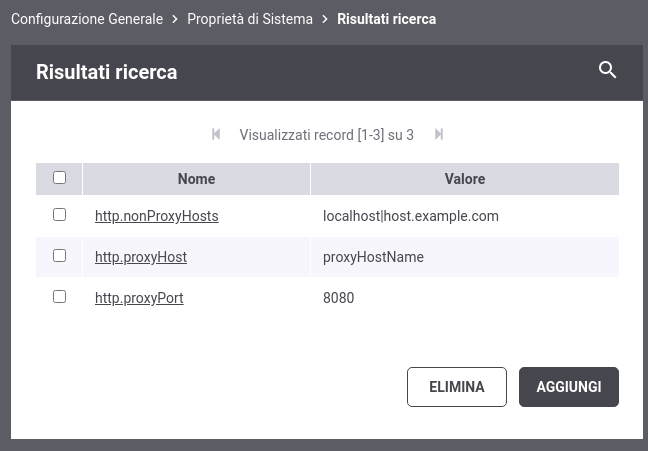

.. _configGeneraleProprieta:

Proprietà
~~~~~~~~~

La funzionalità consente di registrare una serie di proprietà che saranno aggiunte tra le proprietà java nel sistema tramite l'invocazione del metodo:

   ::

      java.lang.System.setProperty(nome, valore);

 Elenco di proprietà di una configurazione

La funzionalità è utilizzabile sia per impostare proprietà utilizzate direttamente da java, come ad es. le proprietà che riguardano il networking, sia per configurare altre funzionalità di GovWay, come ad es. :ref:`avanzate_govway_proxy`.
