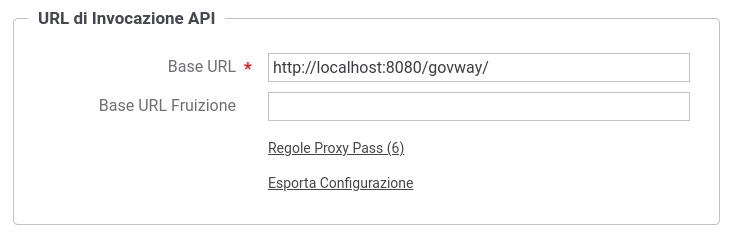

.. _configGenerale_urlInvocazione:

URL di Invocazione API
~~~~~~~~~~~~~~~~~~~~~~~

Nella sezione 'URL di Invocazione API' descritta nella figura :numref:`configUrlInvocazione` è possibile configurare i seguenti aspetti:

-  *Base URL*: Indica il prefisso utilizzato per visualizzare le URL di Invocazione delle API.

-  *Base URL Fruizione*: permette di differenziare il prefisso utilizzato per visualizzare le URL di Invocazione delle fruizioni dalle erogazioni.

-  *Regole Proxy Pass*: tramite questa voce è possibile ridefinire le URL di Invocazioni, per specifiche fruizioni e/o erogazioni, allineandole a regole configurate su un revere proxy che media le comunicazioni http con GovWay (maggiori dettagli disponibili nella sezione :ref:`configGenerale_urlInvocazione_proxyPass`).

- *Esporta Configurazione*: consente di esportare per intero la configurazione relativa all'url di invocazione, comprensiva di eventuali regole di proxy pass.

    Configurazione URL di Invocazione API

L'url di invocazione di una API su GovWay, al netto di eventuali ridefinizioni definite tramite :ref:`configGenerale_urlInvocazione_proxyPass`, segue una convenzione di naming che varia tra fruizione ed erogazione e in base al profilo di interoperabilità, come descritto nella sezione :ref:`configGenerale_urlInvocazione_urlInterna`. 

.. toctree::
        :maxdepth: 2

	urlInterna
	proxyPass
