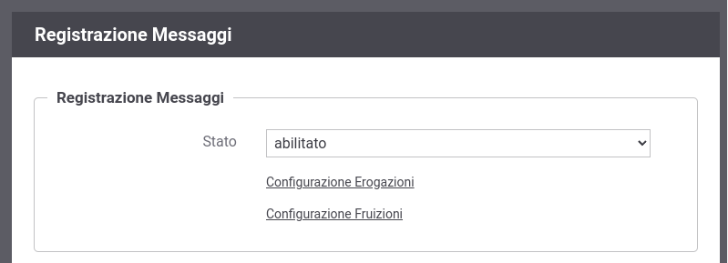
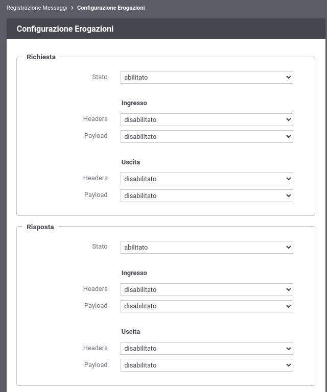

.. _registrazioneMessaggiConfigurazione:

Registrazione Messaggi
----------------------

Accedendo la sezione *Configurazione > Registrazione Messaggi* si può abilitare il salvataggio dei contenuti dei messaggi della richiesta e della risposta transitati su GovWay.

In :numref:`registrazioneMessaggiConfigurazioneFig` viene mostrata la pagina di configurazione.

    Configurazione della funzionalità di Registrazione Messaggi

La configurazione consente di abilitare e configurare la registrazione dei messaggi in transito sul gateway; una volta abilitata l'opzione si possono configurare i dettagli della funzionalità differenziandone il comportamento tra erogazioni e fruizioni rispettivamente tramite i link *Configurazione Erogazioni* e *Configurazione Fruizioni* (es. :numref:`registrazioneMessaggiConfigurazioneErogazioniFig`).

    Configurazione della funzionalità di Registrazione Messaggi per le erogazioni

Dalla sottosezione di configurazione è possibile definire un criterio di registrazione dei messaggi differenziando tra Richiesta e Risposta e abilitando/disabilitando solo la comunicazione desiderata tra:

-  *Ingresso*: il messaggio di richiesta o risposta nel momento in cui giunge sul gateway e quindi prima che venga sottoposto al processo di elaborazione previsto.

-  *Uscita*: il messaggio di richiesta o risposta nel momento in cui esce dal gateway, per raggiungere il nodo successivo del flusso, e quindi dopo che è stato sottoposto al processo di elaborazione previsto.

Per ciascuno dei messaggi, su cui è stata abilitata la registrazione, è possibile scegliere gli elementi da registrare tra:

-  *Headers*: vengono salvati gli header di trasporto (HTTP Headers) associati al messaggio;

-  *Payload*: viene salvato il corpo del messaggio (HTTP Payload).

.. note::
    Le configurazioni effettuate in questa sezione della console hanno
    valenza globale e quindi rappresentano il comportamento di default
    adottato dal gateway nella gestione dei diversi flussi di
    comunicazione. Tale comportamento può essere ridefinito puntualmente
    su ogni singola erogazione/fruizione agendo sulla voce di
    configurazione *Registrazione Messaggi*.
