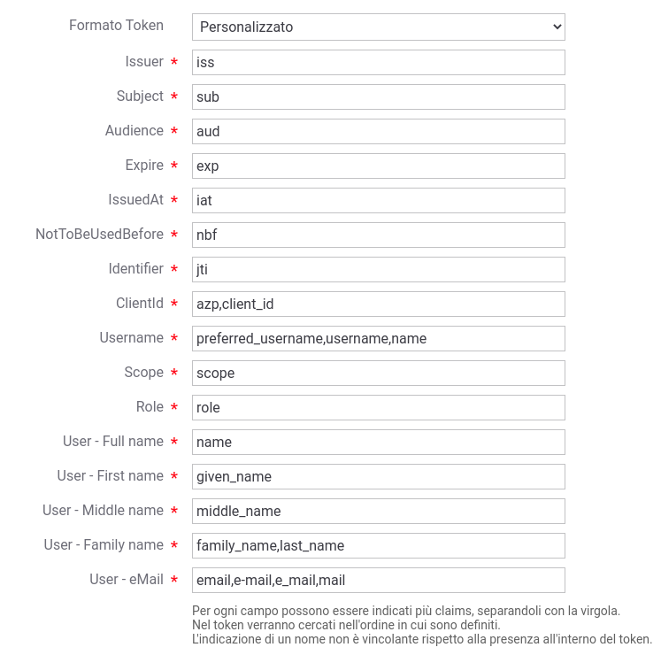

.. _configMappingToken:

Formati dei token
-----------------------------------------

Nella funzionalità ':ref:`tokenValidazionePolicy`' viene attuato un parsing del token ricevuto nel caso sia abilitata la ':ref:`tokenPolicy_validazioneJWT`' per estrarre le informazioni principali che vengono registrate da GovWay e possono essere inoltrate al backend sotto forma di header di integrazione (':ref:`tokenPolicy_tokenForward`').
Un parsing delle informazione avviene inoltre anche se risulta attivata la funzionalità ':ref:`tokenPolicy_introspection`' e/o ':ref:`tokenPolicy_userInfo`'. 
Ogni funzionalità precedentemente indicata richiede che venga indicato il formato del token per poter interpretare correttamente le informazioni presenti.
Di seguito viene fornita una tabella di mapping tra le informazioni che GovWay cerca di estrarre dal token e i nomi dei claims rispetto al formato impostabile nelle funzionalità suddette.

.. table:: Mapping informazione-claim per ogni formato di token
   :widths: 30 30 40
   :name: mappingClaimsGwTab

   =================   ==============================   =========================   =========================   ==========================   ==================
   Informazione        RFC 9068 - OAuth2 Access Token   RFC 7519 - JSON Web Token   RFC 7662 - Introspection    OpenID Connect - ID Token    Google - ID Token
   =================   ==============================   =========================   =========================   ==========================   ==================
   Issuer              iss                              iss                         iss                         iss                          iss
   Subject             sub                              sub                         sub                         sub                          sub
   Audience            aud                              aud                         aud                         aud                          aud
   Expire              exp                              exp                         exp                         exp                          exp
   IssuedAt            iat                              iat                         iat                         iat                          iat
   NotToBeUsedBefore   nbf                              nbf                         nbf                         non supportato               non supportato
   Identifier          jti                              jti                         jti                         non supportato               non supportato
   Scope               scope                            scope                       scope                       scope                        scope
   ClientId            client\_id                       non supportato              client\_id                  azp                          azp
   Username            non supportato                   non supportato              username                    preferred\_username o name   name               
   User Full name      non supportato                   non supportato              non supportato              name                         name
   User First name     non supportato                   non supportato              non supportato              given\_name                  given\_name
   User Middle name    non supportato                   non supportato              non supportato              middle\_name                 middle\_name
   User Family name    non supportato                   non supportato              non supportato              family\_name o last\_name    family\_name
   User eMail          non supportato                   non supportato              non supportato              email                        email
   =================   ==============================   =========================   =========================   ==========================   ==================

All'interno di ogni funzionalità presente in ':ref:`tokenPolicy_validazioneJWT`' è anche inoltre possibile indicare un formato personalizzato che consente di definire un mapping puntuale tra il nome di un claim e l'informazione che GovWay cerca di estrarre dal token. Per ogni campo possono essere indicati più claims, separandoli con la virgola, ed in tal caso nel token verranno cercati nell'ordine in cui sono definiti. L'indicazione di un claim per ogni informazione non è vincolante rispetto alla presenza di tale claim all'interno del token.

 Personalizzazione del formato del token

