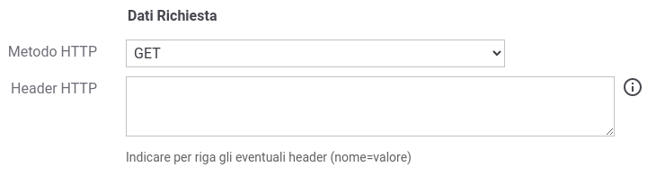
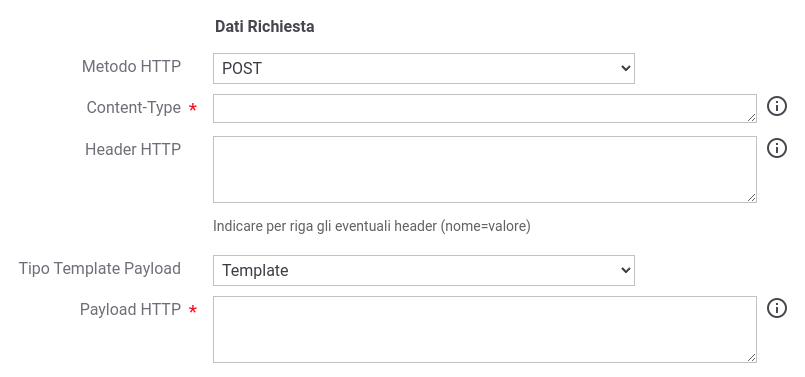
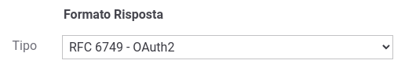
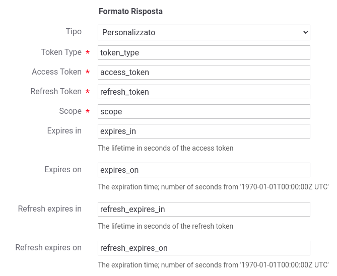
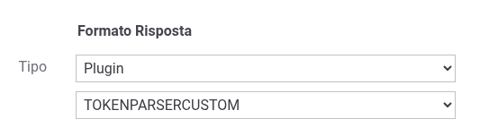

.. _tokenNegoziazionePolicy_custom:

Personalizzazione richiesta http di negoziazione
-------------------------------------------------

La modalità di negoziazione con tipo 'Personalizzato' consente di definire la richiesta http inoltrata all'endpoint di negoziazione token e il parsing della risposta ottenuta.

Nella sezione 'Dati Richiesta' vengono definiti i parametri della richiesta HTTP. I dati presenti possono essere definiti tramite costanti o possono contenere parti dinamiche risolte a runtime dal Gateway (per maggiori dettagli :ref:`valoriDinamici`). 

-  *Metodo HTTP*: tipo di richiesta (es. GET, POST, ...);

-  *Content-Type*: presente solamente per tipi di richieste che prevedono l'invio di un payload, ne definisce il tipo di messaggio inviato;

-  *Header HTTP*: consente di indicare per riga eventuali header HTTP (nome=valore) da inserire nella richiesta;

-  *Tipo Template Payload*: definisce la modalità con la quale viene successivamente fornito il payload http:

	-  *Template*: il payload viene definito tramite un template che può contenere parti dinamiche risolte a runtime definite tramite una sintassi proprietaria di GovWay (per maggiori dettagli :ref:`valoriDinamici`);

	-  *Freemarker Template*: il payload viene definito utilizzando il template "Freemarker" (https://freemarker.apache.org/);

	-  *Velocity Template*: il payload viene definito utilizzando il template "Velocity" (http://velocity.apache.org/);

- *Payload HTTP*: payload http inviato nella richiesta.

Nelle figure :numref:`tokenNegoziazionePolicyCustomGET` e :numref:`tokenNegoziazionePolicyCustomPOST` vengono rispettivamente mostrati un esempio di configurazione di una richiesta http definita tramite un metodo che non prevede l'invio di un payload e un altro esempio che lo prevede. 

    Dati Richiesta http 'GET' in una negoziazione token personalizzata

    Dati Richiesta http 'POST' in una negoziazione token personalizzata

Dal token endpoint si attende un formato della risposta che sia conforme al json definito nello standard RFC 6749. Il parser utilizzato per default dalla configurazione, mostrato nella figura :numref:`tokenNegoziazionePolicyCustomParserDefault`, è quello che consente di processare i claims definiti nel RFC e riportati nella tabella seguente.

.. table:: Mapping informazione-claim per il processamento della risposta ottenuta dall'endpoint token di negoziazione
   :widths: 30 30
   :name: mappingClaimsNegoziazioneGwTab

   ==================   ========================================================================================================================
   Informazione         RFC 6749 - OAuth2
   ==================   ========================================================================================================================
   Token Type           token\_type
   Access Token         access\_token  
   Refresh Token        refresh\_token
   Scope                scope
   Expires in           expires\_in
   Expires on           expires\_on (\*\*)
   Refresh expires in   refresh\_expires\_in (\*\*)
   Refresh expires on   refresh\_expires\_on (\*\*)

   Nota:
   \*_in                i claim '\*_in' devono indicare un tempo di vita in secondi
   \*_on                i claim '\*_on' devono riportare la data di scadenza come numero di secondi a partire da '1970-01-01T00:00:00Z UTC'
   \*\*                 claim aggiuntivi generati da implementazioni di authorization server e non direttamente definiti nel RFC 6749
   ==================   ========================================================================================================================

    Formato Risposta di default: RFC 6749 OAuth

È possibile in alternativa definire un mapping puntuale tra il nome di un claim e l’informazione che GovWay cerca di estrarre dal token. Come mostrato nella figura :numref:`tokenNegoziazionePolicyCustomParserMapping` il mapping viene richiesto per ogni claim definito nella tabella descritta precedentemente.

    Personalizzazione del formato della risposta

Infine è possibile indicare il nome di una classe che implementa una logica di parsing personalizzata. La classe deve implementare l’interfaccia "org.openspcoop2.pdd.core.token.parser.INegoziazioneTokenParser" (:numref:`tokenNegoziazionePolicyCustomParserPlugin`).

    Personalizzazione del formato della risposta tramite un plugin
