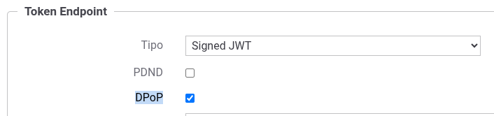
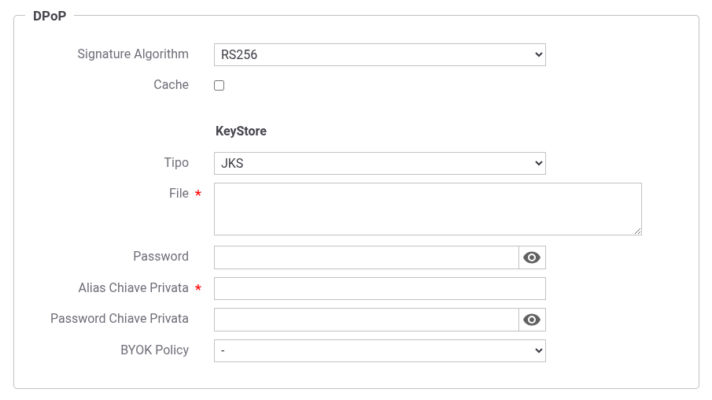
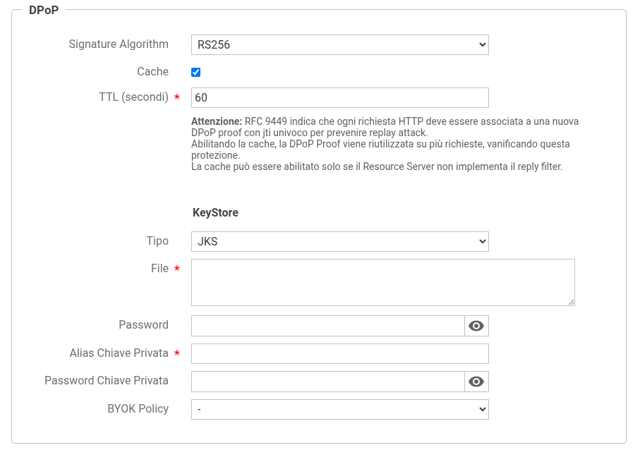
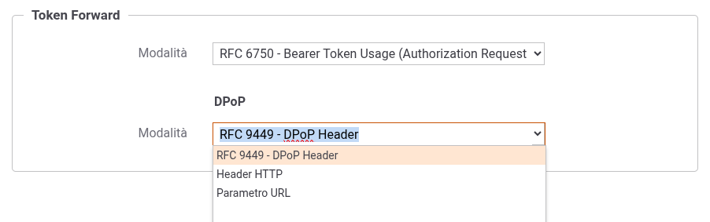

.. _tokenNegoziazionePolicy_dpop:

DPoP (Demonstrating Proof-of-Possession)
----------------------------------------

Il supporto DPoP (RFC 9449 - https://datatracker.ietf.org/doc/html/rfc9449) consente di vincolare un access token ad una specifica coppia di chiavi crittografiche del client, prevenendo l'utilizzo del token da parte di soggetti non autorizzati che potrebbero averlo intercettato.

Quando la funzionalità DPoP viene abilitata (:numref:`tokenNegoziazioneDPoPFig`), durante la fase di negoziazione del token verrà generata una DPoP proof (un JWT firmato) che sarà inviata all'authorization server tramite l'header HTTP 'DPoP'. L'authorization server, dopo aver verificato la proof, emetterà un access token di tipo 'DPoP' che risulta vincolato alla chiave pubblica del client.

    Abilitazione della funzionalità DPoP

Nella sezione 'DPoP' (:numref:`tokenNegoziazioneDPoPConfigFig`) si configurano i parametri per la generazione della DPoP proof:

-  *Signature Algorithm*: algoritmo utilizzato per firmare la DPoP proof (es. RS256, ES256).

-  *Cache*: se abilitata, la DPoP proof generata viene riutilizzata per più richieste entro il TTL configurato.

   .. warning::
      Il RFC 9449 indica che ogni richiesta HTTP deve essere associata a una nuova DPoP proof con identificativo univoco (jti) per prevenire replay attack. Abilitando la cache, la DPoP proof viene riutilizzata su più richieste, vanificando questa protezione. La cache può essere abilitata solo se il Resource Server non implementa il replay filter.

-  *TTL*: tempo di vita in secondi della DPoP proof in cache (visibile solo se la cache è abilitata; :numref:`tokenNegoziazioneDPoPConfigCacheFig`).

    Configurazione della sezione DPoP
    

    Configurazione della sezione DPoP (cache)    

Nella sottosezione 'KeyStore' si configurano i parametri di accesso al keystore contenente la chiave privata utilizzata per firmare la DPoP proof.

.. note::
   Quando il tipo di negoziazione è 'Signed JWT' o 'Signed JWT with Client Secret', è consigliato utilizzare per la firma della DPoP proof una chiave diversa da quella utilizzata per firmare l'asserzione JWT, come indicato dal RFC 9449 che raccomanda l'uso di una coppia di chiavi dedicata esclusivamente alla generazione delle DPoP proof.

I tipi di keystore supportati sono:

-  *JKS* o *PKCS12*: viene richiesta l'indicazione del path assoluto del keystore nel campo *File*, la definizione della password per l'accesso al keystore nel campo *Password*, l'alias con cui è riferita la chiave privata nel keystore nel campo *Alias Chiave Privata* e la password della chiave privata nel campo *Password Chiave Privata*;

-  *JWK Set*: deve essere definito il path su filesystem dove risiede l'archivio json nel formato 'JWK Set' e l'identificativo 'kid' (alias) con cui è riferita la chiave privata nel campo *Alias Chiave Privata*;

-  *Key Pair*: deve essere definito il path su filesystem dove risiedono la chiave privata e pubblica in formato PEM o DER (sono supportati sia i formati pkcs1 che pkcs8) e la password della chiave privata se cifrata nel campo *Password Chiave Privata*;

-  Tipi PKCS11: i tipi disponibili sono quelli corrispondenti ai tipi di keystore PKCS11 registrati (':ref:`pkcs11`');

-  *Applicativo ModI* o *Fruizione ModI* (disponibili solo con tipo di negoziazione 'Signed JWT'): consentono di riutilizzare il keystore già configurato nell'applicativo o nella fruizione ModI.

È inoltre possibile selezionare una *BYOK Policy* per la decodifica di keystore cifrati (per maggiori dettagli si rimanda alla sezione ':ref:`console_informazioni_confidenziali_keystore`').

**Token Forward DPoP**

Quando la funzionalità DPoP è abilitata, nella sezione 'Token Forward' compare una sottosezione 'DPoP' (:numref:`tokenNegoziazioneDPoPForwardFig`) per configurare la modalità di inoltro della DPoP proof verso il Resource Server:

-  *RFC 9449 - DPoP Header*: la DPoP proof viene inoltrata utilizzando l'header HTTP 'DPoP' come definito nel RFC 9449;

-  *Header HTTP*: la DPoP proof viene inoltrata utilizzando un header HTTP personalizzato il cui nome deve essere specificato nel campo seguente;

-  *Parametro URL*: la DPoP proof viene inoltrata come parametro della Query String il cui nome deve essere specificato nel campo seguente.

    Configurazione dell'inoltro della DPoP proof
