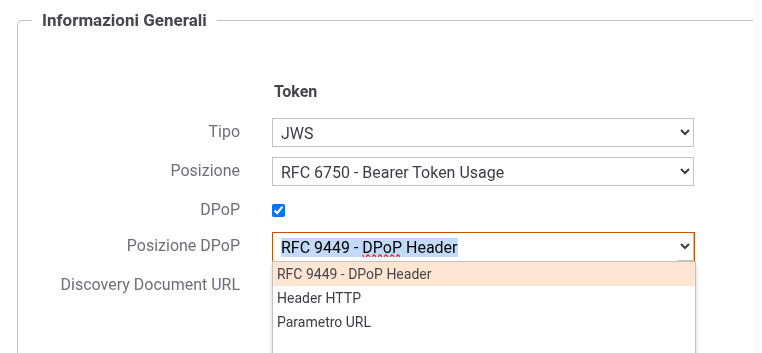
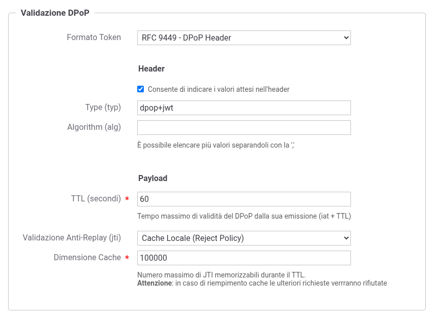
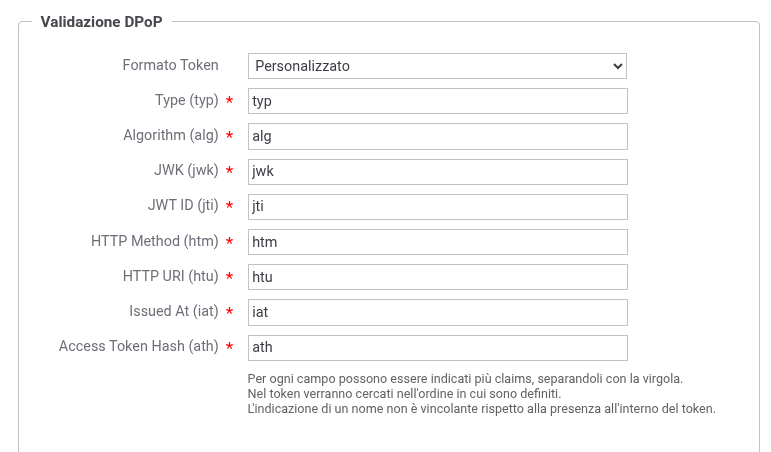
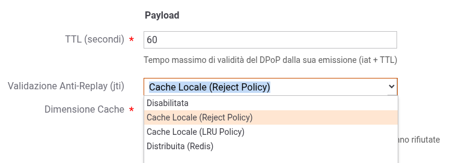
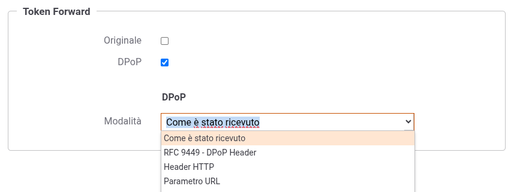

.. _tokenValidazionePolicy_dpop:

Validazione DPoP
~~~~~~~~~~~~~~~~

La sezione 'Validazione DPoP' (:numref:`tokenValidazioneDPoPEnabledFig`) è disponibile quando nella sezione 'Token' è stato selezionato il tipo *JWS* ed è stata abilitata l'opzione *DPoP*. Questa sezione consente di configurare la validazione della DPoP proof ricevuta insieme all'access token (:numref:`tokenValidazioneDPoPFig`), verificando che il token sia correttamente vincolato alla chiave pubblica del client come previsto dal RFC 9449.

    Abilitazione della validazione DPoP

    Configurazione della validazione DPoP

**Formato Token**

Il campo *Formato Token* indica il parser da utilizzare per estrarre le informazioni dalla DPoP proof:

-  *RFC 9449 - DPoP Header*: parser predefinito che estrae i claims standard definiti nel RFC 9449;

-  *Personalizzato*: consente di definire un mapping puntuale tra il nome di un claim e l'informazione che GovWay cerca di estrarre dalla DPoP proof (:numref:`tokenValidazioneDPoPMappingFig`). I claims configurabili sono:

   - Header claims: *Type (typ)*, *Algorithm (alg)*, *JWK (jwk)*
   - Payload claims: *JWT ID (jti)*, *HTTP Method (htm)*, *HTTP URI (htu)*, *Issued At (iat)*, *Access Token Hash (ath)*

-  *Plugin*: consente di selezionare un plugin che implementi una logica di parsing personalizzata (deve implementare l'interfaccia "org.openspcoop2.pdd.core.token.parser.IDPoPTokenParser"). Per dettagli si rimanda alla sezione :ref:`configAvanzataPlugins`.

    Configurazione personalizzata del mapping dei claims DPoP

**Header**

La sottosezione *Header* consente di specificare i valori attesi nell'header della DPoP proof:

-  *Type (typ)*: valore atteso per il claim 'typ' (default: "dpop+jwt");

-  *Algorithm (alg)*: elenco degli algoritmi di firma accettati (è possibile indicare più valori separandoli con la virgola).

**Payload**

La sottosezione *Payload* (:numref:`tokenValidazioneDPoPPayloadFig`) consente di configurare la validazione del payload della DPoP proof:

-  *TTL (secondi)*: tempo massimo di validità della DPoP proof dalla sua emissione. La validazione verifica che la data corrente sia compresa tra il valore del claim 'iat' (Issued At) e 'iat + TTL';

-  *Validazione Anti-Replay (jti)*: modalità di validazione dell'identificativo univoco della DPoP proof per prevenire attacchi di tipo replay. Le opzioni disponibili sono:

   -  *Disabilitata*: nessuna validazione anti-replay;

   -  *Cache Locale (Reject Policy)*: i 'jti' vengono memorizzati in una cache locale. In caso di riempimento della cache, le ulteriori richieste vengono rifiutate;

   -  *Cache Locale (LRU Policy)*: i 'jti' vengono memorizzati in una cache locale. In caso di riempimento della cache, vengono rimosse le entry meno recenti (esponendo potenzialmente a replay attack);

   -  *Distribuita (Redis)*: i 'jti' vengono memorizzati in una cache distribuita Redis, utile in ambienti cluster.

   .. warning::
      Il RFC 9449 indica che ogni richiesta HTTP deve essere associata a una nuova DPoP proof con identificativo univoco (jti) per prevenire replay attack. Le modalità di validazione basate su cache locale operano esclusivamente sul singolo nodo: in presenza di un'architettura a più nodi (cluster), per garantire una protezione anti-replay efficace è necessario utilizzare la modalità *Distribuita (Redis)*.

-  *Dimensione Cache*: numero massimo di 'jti' memorizzabili durante il TTL (visibile solo per le modalità Cache Locale).

    Configurazione della validazione del payload DPoP

**Token Forward DPoP**

Quando la validazione DPoP è abilitata, nella sezione 'Token Forward' compare un'opzione *DPoP* che consente di abilitare l'inoltro della DPoP proof al backend. Se abilitata, compare una sottosezione 'DPoP' (:numref:`tokenValidazioneDPoPForwardFig`) con le seguenti opzioni di inoltro:

-  *Come è stato ricevuto*: la DPoP proof viene inoltrata utilizzando lo stesso metodo con cui è stata ricevuta dal gateway;

-  *RFC 9449 - DPoP Header*: la DPoP proof viene inoltrata nell'header HTTP 'DPoP' come definito nel RFC 9449;

-  *Header HTTP*: la DPoP proof viene inoltrata in un header HTTP personalizzato il cui nome deve essere specificato nel campo seguente;

-  *Parametro URL*: la DPoP proof viene inoltrata come parametro della Query String il cui nome deve essere specificato nel campo seguente.

    Configurazione dell'inoltro della DPoP proof

**Opzioni Avanzate**

È possibile personalizzare il comportamento della validazione del claim 'htu' (HTTP URI) presente nella DPoP proof, configurando le seguenti proprietà a livello di erogazione o fruizione, come descritto nella sezione :ref:`configProprieta`:

- *tokenValidation.dpop.htu.prefixUrl*: consente di definire uno o più prefissi (separati da virgola) da utilizzare al posto della *Base URL* configurata nella sezione ':ref:`configGenerale_urlInvocazione`' durante il confronto con il valore del claim 'htu' presente nella DPoP proof;

- *tokenValidation.dpop.htu.baseUrl*: consente di definire una o più URL di base (separate da virgola) che sostituiranno completamente l'URL della richiesta ricevuta (Base URL + contesto + identificativo API) durante il confronto con il valore del claim 'htu' presente nella DPoP proof.

Durante la validazione viene prima verificata la corrispondenza con l'URL di default (calcolata dalla configurazione standard); se non corrisponde, vengono provati in sequenza tutti i valori definiti nelle proprietà sopra indicate fino a trovare un match o esaurire la lista.

Queste proprietà sono utili in scenari dove l'URL con cui il client genera la DPoP proof differisce dall'URL effettivamente ricevuta dal gateway (ad esempio in presenza di reverse proxy o load balancer che modificano l'URL della richiesta).
