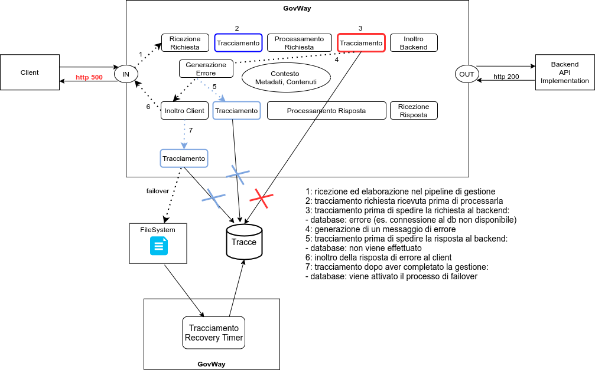

.. _tracciamentoTransazioniDB:

Tracciamento su Database
--------------------------------

Ogni richiesta ricevuta dal gateway viene gestita tramite un processo riassumibile nella figura :numref:`transazioniDBFasiDefaultFig` in cui il tracciamento, nella configurazione di default, avviene in fondo al processo dopo aver consegnato la risposta al client. Nel caso non fosse possibile attuare il tracciamento richiesto (es. connessione al database non disponibile) l'anomalia viene registrata nei log di GovWay e si attiva il *processo di failover* in cui la traccia verrà serializzata su filesystem per poi essere riversata nella base dati in un successivo momento da un timer dedicato al recupero.

    Fasi di tracciamento su database: configurazione di default

Nel caso siano state attivate ulteriori fasi di tracciamento descritte nella sezione :ref:`tracciamentoTransazioniFasi`, il *processo di failover* si attiva solamente in caso di problematiche di tracciamento durante l'ultima fase dopo che la risposta al client è già stata consegnata (figura :numref:`transazioniDBFasiCustomFig`). Se invece avvengono problematiche (es. connessione al database non disponibile) nelle prime tre fase, la transazione può terminare con errore e restituire un fault al client se la fase è configurata come '*bloccante*' (figura :numref:`transazioniDBFasiErrorFig`). 

    Fasi di tracciamento su database: configurazione personalizzata

    Fasi di tracciamento su database: configurazione personalizzata con errore durante il tracciamento con fasi bloccanti

La figura :numref:`transazioniDBFasiErrorFailOverFig` mostra uno scenario in cui il tracciamento su database non va a buon fine già nelle prime fasi che però essendo configurate come '*non bloccanti*' fanno terminare correttamente la richiesta. Durante il tracciamento nell'ultima fase si attiva il *processo di failover*.

    Fasi di tracciamento su database: configurazione personalizzata con errore durante il tracciamento con fasi non bloccanti

La configurazione del *processo di failover* è personalizzabile a livello di configurazione locale in '/etc/govway/govway_local.properties' (assumendo sia /etc/govway la directory di configurazione indicata in fase di installazione). 

Di seguito un esempio di configurazione effettuabile in cui vengono riportate tutte le opzioni presenti con i valori di default del prodotto.

   ::

      # ================================================
      # Directory dove vengono serializzate le transazioni non registrate
      org.openspcoop2.pdd.resources.fileSystemRecovery.repository=/var/govway/resources

      # Indica se è abilitato il livello di debug durante la gestione
      org.openspcoop2.pdd.resources.fileSystemRecovery.debug=false

      # Indicazione se il timer dedicato al riversamento delle tracce serializzate su db è attivo o meno
      org.openspcoop2.pdd.resources.fileSystemRecovery.enabled=true

      # Parametri del timer
      # - il timeout indica una unità di misura in secondi
      # - dopo il numero di tentativi indicati in maAttempts la traccia verrà spostata in una directory 'dlq'
      org.openspcoop2.pdd.resources.fileSystemRecovery.timeout=300
      org.openspcoop2.pdd.resources.fileSystemRecovery.maxAttempts=10
      # ================================================

