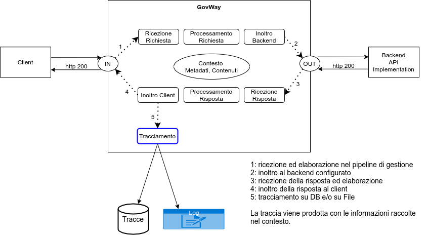
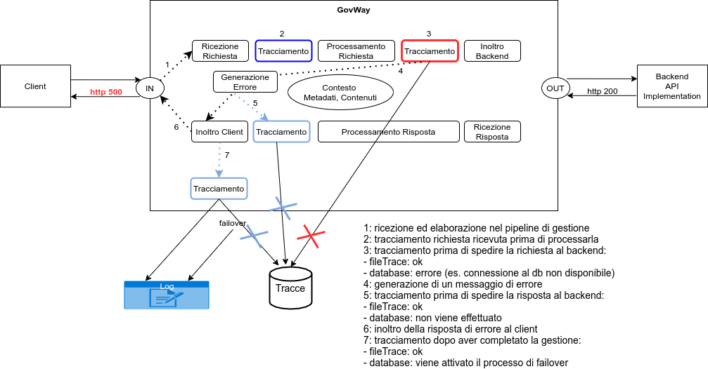

.. _tracciamentoTransazioniFasi:

Fasi di Tracciamento
--------------------------------

Ogni richiesta ricevuta dal gateway viene gestita tramite un processo riassumibile nella figura :numref:`transazioniFasiDefaultFig` in cui il tracciamento, nella configurazione di default, avviene in fondo al processo dopo aver consegnato la risposta al client.

    Fasi di tracciamento: configurazione di default

GovWay è configurabile per attuare il tracciamento anche su altri punti all'interno del processo di gestione di una richiesta personalizzando le fasi di tracciamento come indicato nella figura :numref:`transazioniModeCustom2Fig` e nella sezione :ref:`tracciamentoTransazioni`.

.. figure:: ../../_figure_console/TracciamentoCustomMode.png
    :scale: 70%
    :align: center
    :name: transazioniModeCustom2Fig

    Configurazione personalizzata del tipo di tracciamento

Le fasi in cui è possibile attivare il tracciamento sono le seguenti (raffigurate nella figura :numref:`transazioniFasiCustomFig`):

- *Richiesta ricevuta*: una volta individuata l'erogazione o la fruizione di API richiesta verrà effettuato il tracciamento prima di iniziare il normale processamento;

- *Richiesta in consegna*: terminato il processamento della richiesta e prima di inoltrarla al backend;

- *Risposta in consegna*: terminato il processamento della risposta e prima di inoltrarla al client;

- *Risposta consegnata*: dopo aver inoltrato la risposta al client.

    Fasi di tracciamento: configurazione personalizzata

**Tracciamento Fallito**

Nelle prime tre fasi (richiesta ricevuta, richiesta in consegna e risposta in consegna) è possibile abilitare il tracciamento con due modalità differenti:

- '*abilitato (bloccante)*': la transazione terminerà con un errore ritornato al client se non è possibile effettuare il tracciamento richiesto (es. connessione al database non disponibile);
- '*abilitato (non bloccante)*': l'anomalia avvenuta durante il tracciamento verrà registrata nei log di GovWay e il processamento della richiesta potrà continuare senza errori.

Nell'ultima fase non è invece possibile attuare la distinzione visto che una risposta è già stata consegnata al client. Un'eventuale errore di tracciamento verrà registrato nei log di GovWay e in caso di tracciamento su database la traccia verrà riversata nella base dati in un successivo momento, come descritto nella sezione :ref:`tracciamentoTransazioniDB`, grazie al *processo di failover*.

Nella figura :numref:`transazioniFasiCustomErrorFig` viene raffigurato uno scenario in cui avvengono problematiche (es. connessione al database non disponibile) nella seconda fase di tracciamento al database e tale fase è stata configurata per terminare con errore. 

    Fasi di tracciamento: configurazione personalizzata con errore bloccante durante il tracciamento

Invece nella figura :numref:`transazioniFasiCustomErrorNonBloccanteFig` viene raffigurato uno scenario in cui avvengono problematiche (es. connessione al database non disponibile) ma le fase di tracciamento al database sono state configurate come *non bloccanti* e il tracciamento tramite FileTrace può proseguire correttamente. L'ultima fase di tracciamento su database avvierà un *processo di failover*, descritto nella sezione :ref:`tracciamentoTransazioniDB`, che consentirà di recuperare la traccia in un secondo momento.

    Fasi di tracciamento: configurazione personalizzata con errore bloccante durante il tracciamento

**Tracciamento filtrato per Esiti**

Come descritto nella sezione :ref:`tracciamentoTransazioniFiltroEsiti` è possibile indicare quali transazioni tracciare rispetto all'esito rilevato in fase di elaborazione. Tale funzionalità non risulta più utilizzabile se vengono abilitate le seguenti fasi di tracciamento:

- *Richiesta ricevuta*: l'opzione '*Filtra per Esiti*' non sarà attivabile poichè una transazione è già stata emessa prima di poter comprenderne l'esito.

- *Richiesta in consegna* e *Risposta in consegna*: l'opzione '*Filtra per Esiti*' sarà attivabile però non consentirà di filtrare esiti rispettivamente per errori di consegna o di processamento della risposta.

