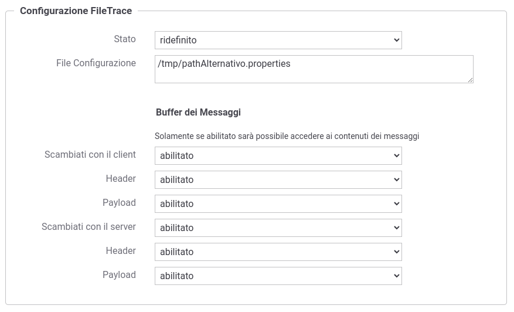
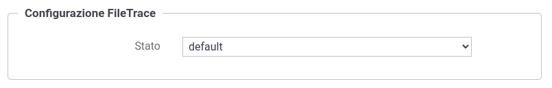

.. _avanzate_fileTrace:

Configurazione della Tracciatura su File
-----------------------------------------

Nella sezione :ref:`avanzate_fileTrace_format` viene descritto il formato del file di configurazione che definisce i log emessi su file. Il path al file di configurazione deve essere indicato nella sezione 'Configurazione FileTrace' presente nella maschera di configurazione del tracciamento descritta nella sezione :ref:`tracciamentoTransazioni`, ridefinendo il comportamento di default come mostrato in figura :numref:`tracciamentoFileTraceConfigurazioneParametriFig`.

    Configurazione personalizzata del tracciamento su file di log

Oltre a consentire l'indicazione di un path su file system dove risiede la configurazione della tracciatura su file è possibile configurare il *buffer dei messaggi* che se abilitato consentirà di accedere ai contenuti delle richieste e delle risposte come descritto nella sezione :ref:`avanzate_fileTrace_info`.

Nel caso invece non vengano ridefiniti gli aspetti di configurazione di FileTrace nella maschera del tracciamento (:numref:`tracciamentoFileTraceConfigurazioneDefaulFig`) una volta attivato il tracciamento su file, come descritto nella sezione :ref:`tracciamentoTransazioniFileTrace`, la configurazione dei topic deve essere definita all'interno del file indicato nella proprietà 'org.openspcoop2.pdd.transazioni.fileTrace.config' della configurazione locale '/etc/govway/govway_local.properties' (assumendo sia /etc/govway la directory di configurazione indicata in fase di installazione).

    Configurazione di default del tracciamento su file di log

Anche nella configurazione di default su file locale '/etc/govway/govway_local.properties' è possibile configurare il *buffer dei messaggi* che se abilitato consentirà di accedere ai contenuti delle richieste e delle risposte come descritto nella sezione :ref:`avanzate_fileTrace_info`.

Di seguito un estratto della configurazione.

   ::

      # ================================================
      # FileTrace
      ...
      #
      # File di Configurazione
      # Il file può essere indicato con un path assoluto o relativo rispetto alla directory di configurazione
      org.openspcoop2.pdd.transazioni.fileTrace.config=govway.fileTrace.properties
      ...
      ...
      # Indicazione se nella funzionalità è consentito l'accesso ai contenuti
      # -- Fruizioni --
      # inRequest/outResponse
      org.openspcoop2.pdd.transazioni.fileTrace.dumpBinarioPD.enabled=true
      #org.openspcoop2.pdd.transazioni.fileTrace.dumpBinarioPD.payload.enabled=true
      #org.openspcoop2.pdd.transazioni.fileTrace.dumpBinarioPD.headers.enabled=true
      # outRequest/inResponse
      org.openspcoop2.pdd.transazioni.fileTrace.dumpBinarioPD.connettore.enabled=true
      #org.openspcoop2.pdd.transazioni.fileTrace.dumpBinarioPD.connettore.payload.enabled=true
      #org.openspcoop2.pdd.transazioni.fileTrace.dumpBinarioPD.connettore.headers.enabled=true
      # -- Erogazioni --
      # inRequest/outResponse
      org.openspcoop2.pdd.transazioni.fileTrace.dumpBinarioPA.enabled=true
      #org.openspcoop2.pdd.transazioni.fileTrace.dumpBinarioPA.payload.enabled=true
      #org.openspcoop2.pdd.transazioni.fileTrace.dumpBinarioPA.headers.enabled=true
      # outRequest/inResponse
      org.openspcoop2.pdd.transazioni.fileTrace.dumpBinarioPA.connettore.enabled=true
      #org.openspcoop2.pdd.transazioni.fileTrace.dumpBinarioPA.connettore.payload.enabled=true
      #org.openspcoop2.pdd.transazioni.fileTrace.dumpBinarioPA.connettore.headers.enabled=true
      ...
      # ================================================

Nel caso non siano ridefiniti gli aspetti di configurazione di FileTrace nella maschera del tracciamento (:numref:`tracciamentoFileTraceConfigurazioneDefaulFig`), la configurazione di default indicata nel file '/etc/govway/govway_local.properties' è ridefinibile sulla singola erogazione o fruizione di API attraverso le seguenti :ref:`configProprieta`:

- *fileTrace.config* : consente di indicare il path su file system dove risiede la configurazione della tracciatura su file; il file indicato può essere un path assoluto o relativo rispetto alla directory di configurazione (per il formato fare riferimento alla sezione :ref:`avanzate_fileTrace_format`);
- *fileTrace.dumpBinario.enabled*: consente di attivare o disattivare la registrazione dei messaggi scambiati con il client: richiesta ingresso e risposta uscita (i valori associabili alla proprietà sono 'true' o 'false');
- *fileTrace.dumpBinario.payload.enabled* e *fileTrace.dumpBinario.headers.enabled*: sovrascrivono la proprietà '*fileTrace.dumpBinario.enabled*' fornendo la possibilità di configurare puntualmente il tipo di informazione scambiata con il client (payload o headers) che sarà resa disponibile per la tracciatura (per default entrambi);
- *fileTrace.dumpBinario.connettore.enabled*: consente di attivare o disattivare la registrazione dei messaggi scambiato con l'implementazione di backend dell'API: richiesta uscita e risposta ingresso (i valori associabili alla proprietà sono 'true' o 'false');
- *fileTrace.dumpBinario.connettore.payload.enabled* e *fileTrace.dumpBinario.connettore.headers.enabled*: sovrascrivono la proprietà '*fileTrace.dumpBinario.connettore.enabled*' fornendo la possibilità di configurare puntualmente il tipo di informazione scambiata con il backend (payload o headers) che sarà resa disponibile per la tracciatura (per default entrambi).

   .. note::
      Solamente se il *buffer dei messaggi* (*fileTrace.dumpBinario.enabled* e/o *fileTrace.dumpBinario.connettore.enabled*) è abilitato sarà possibile accedere ai contenuti dei messaggi come descritto nella sezione :ref:`avanzate_fileTrace_info`.
        
Nella sezione :ref:`avanzate_fileTrace_format` viene descritto il formato del file di configurazione, mentre nella sezione :ref:`avanzate_fileTrace_info` sono riportate tutte le informazioni disponibili.
