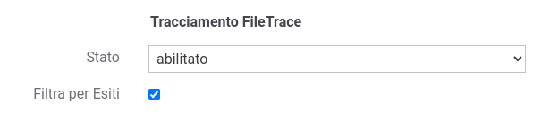
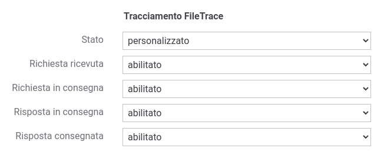
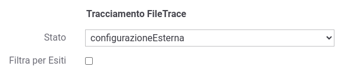

.. _tracciamentoTransazioniFileTrace:

Tracciamento su File
--------------------------------

Le informazioni inerenti le comunicazioni gestite dal gateway vengono registrate su una base dati di tracciamento (:ref:`tracciamentoTransazioniDB`) e sono consultabili tramite una console di monitoraggio (:ref:`mon_intro`). 

È possibile estendere o sostituire il normale tracciamento su database, attivando il tracciamento su file.

La nuova funzionalità consente il tracciamento su file di tutte le informazioni relative alle comunicazioni gestite da GovWay e un successivo processamento del file da strumenti esterni (es. FileBeat) permette così una facile integrazione con sistemi di tracciamento esterni (es. Logstash, Kafka, ...).

La funzionalità consente una completa personalizzazione delle informazioni da riportare su file di log, permettendo anche di definirne
il formato e l'ordine in cui vengono salvate. È inoltre possibile suddividere le informazioni in più file di log in modo da facilitare l'invio di informazioni selezionate a destinazioni diverse.

Le informazioni possono essere riversate in uno o più topic, dove ad ogni topic corrisponde tipicamente un file di log. Di seguito un esempio di file prodotto:

   ::

      "req"|"b6cdd758-342c-4599-ae95-33a781730b3f"|"govway"|"2020-06-26 12:46:50:629"|"+0200"|"192.168.1.2"|"HTTP/1.1"|"POST"|"https://server:8446/example"|"application/soap+xml; charset=UTF-8; action=\"test/\""|"10490"|"200"
      "req"|"2a9dc253-9dd5-458b-8689-edee7c9ba139"|"govway"|"2020-06-26 12:47:50:561"|"+0200"|"192.168.1.2"|"HTTP/1.1"|"POST"|"https://server:8446/app2"|"application/soap+xml; charset=UTF-8; action=\"test/\""|"1090"|"503"
      "req"|"eeedb92b-66b5-451e-8266-ade2cf1f34ce"|"govway"|"2020-06-26 12:47:53:291"|"+0200"|"192.168.1.19"|"HTTP/1.1"|"POST"|"https://server:8446/example"|"application/soap+xml; charset=UTF-8; action=\"test/\""|"11230"|"200"
      "req"|"b4355a45-71cc-4293-b3b7-a4622af8ea84"|"govway"|"2020-06-26 12:48:00:102"|"+0200"|"192.168.1.22"|"HTTP/1.1"|"POST"|"https://server:8446/example"|"application/soap+xml; charset=UTF-8; action=\"test/\""|"17999"|"200"

Maggiori dettagli sul formato dei log vengono forniti nella sezione (:ref:`avanzate_fileTrace`).

Nella sezione :ref:`avanzate_fileTrace_format` viene descritto il formato del file di configurazione, mentre nella sezione :ref:`avanzate_fileTrace_info` sono riportate tutte le informazioni disponibili.

Per abilitare il tracciamento su file è possibile agire nella configurazione dedicata descritta nella sezione :ref:`tracciamentoTransazioni` e riportata nella figura :numref:`tracciamentoFileTraceAbilitatoFig`.

    Configurazione del tracciamento su file di log

La configurazione consente inoltre di abilitare la produzione dei log su file:

- rispetto agli esiti di una transazione come descritto nella sezione :ref:`tracciamentoTransazioniFiltroEsiti`;

- rispetto alle varie fasi di tracciamento descritte nella sezione :ref:`tracciamentoTransazioniFasi` (:numref:`tracciamentoFileTraceCustomFig`).

    Configurazione delle fasi di tracciamento su file di log

È inoltre possibile configurare un ulteriore stato 'configurazioneEsterna' (:numref:`tracciamentoFileTraceExternalFig`) che serve ad indicare che lo stato del tracciamento deve essere compreso esaminando la proprietà "org.openspcoop2.pdd.transazioni.fileTrace.enabled" del file di configurazione locale "/etc/govway/govway_local.properties". In questo caso è inoltre utilizzabile per attivare la funzionalità di FileTrace su una singola API la :ref:`configProprieta` '*fileTrace.enabled*' definibile sulla singola erogazione o sulla fruizione attraverso la sua valorizzazione con i valori 'true' o 'false' rispettivamente per attivare o disattivare la funzionalità.

    Configurazione del tracciamento su file di log tramite govway_local.properties

Maggiori dettagli sulla configurazione e sul formato dei log vengono forniti nella sezione (:ref:`avanzate_fileTrace`).

.. toctree::
        :maxdepth: 2
        
	config
        formato
	info
