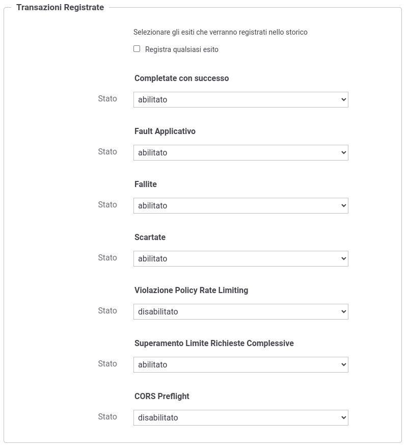
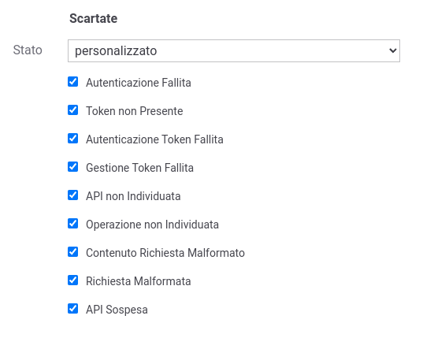
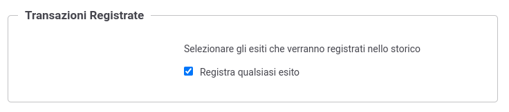

.. _tracciamentoTransazioniFiltroEsiti:

Tracciamento filtrato per Esiti
--------------------------------

Ad ogni transazione viene associato un esito di elaborazione come descritto nella sezione :ref:`mon_esito_transazione`.

Tramite la configurazione :numref:`tracciamentoFiltroEsitiFig` è possibile indicare quali transazioni tracciare rispetto all'esito rilevato in fase di elaborazione. 

Gli esiti sono suddivisi nei seguenti gruppi: 

- Completate con successo: richieste che sono state gestite correttamente;
- Fault applicativo: richieste gestite correttamente in cui il backend ha restituito un fault applicativo, un SOAP Fault su API SOAP o un Problem Detail su API REST;
- Scartate: richieste che sono state scartate dal gateway immediatamente per differenti motivi:

     - richiedenti una API o un'operazione inesistente ;
     - contenevano una richiesta malformata nel contenuto;
     - credenziali richieste non presenti o non valide (es. cert mTLS o token);
     - API sospese.

- Violazione Policy Rate Limiting: richieste che violano una policy di rate limiting;
- Superamento Limite Richieste Complessive: il numero di richieste complessive supera il limite globale;
- Fallite: richieste che sono state processate con errore e non rientrano nei casi di richieste scartate;
- CORS Preflight: richieste di tipo 'CORS Preflight'.

Per ciascun esito è possibile abilitare o disabilitare la registrazione. 

    Tracciamento filtrato per Esiti

È possibile inoltre, scegliendo l'opzione *personalizzato*, specificare puntualmente quali esiti di dettaglio includere (:numref:`tracciamentoFiltroEsitiPersonalizzatoFig`).

    Tracciamento filtrato per Esiti personalizzato

È infine possibile specificare l'indicazione di registrare qualsiasi esito (:numref:`tracciamentoFiltroEsitiAllFig`).

    Tracciamento senza filtri per Esiti
