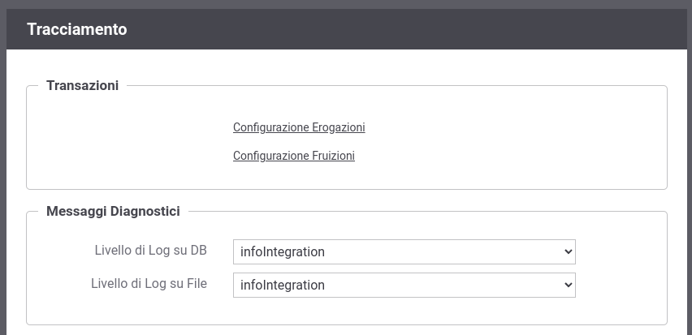

.. _tracciamento:

Tracciamento
------------

Accedendo la sezione *Configurazione > Tracciamento* si può
configurare quali informazioni, relative alle comunicazioni in transito sul gateway
dei servizi erogati o fruiti, verranno registrate (:numref:`tracciamentoFig`):

-  *Transazioni*: questa sezione consente di configurare il tipo di tracciamento attuato dal gateway differenziandone il comportamento tra erogazioni e fruizioni rispettivamente tramite i link *Configurazione Erogazioni* e *Configurazione Fruizioni*. Maggiori dettagli vengono forniti nella sezione :ref:`tracciamentoTransazioni`.

-  *Messaggi Diagnostici*: questa sezione consente di specificare il
   livello di verbosità della diagnostica emessa dal gateway utile a comprendere la fase di elaborazione delle richieste e indagare sulle anomalie occorse . Si può
   distinguere il livello di verbosità per il salvataggio su *Database*
   e su *File*.

    Configurazione del servizio di tracciamento

.. note::
    Le configurazioni effettuate in questa sezione della console hanno
    valenza globale e quindi rappresentano il comportamento di default
    adottato dal gateway nella gestione dei diversi flussi di
    comunicazione. Tale comportamento può essere ridefinito puntualmente
    su ogni singola erogazione/fruizione agendo sulla voce di
    configurazione *Tracciamento*.

.. toctree::
    :maxdepth: 2

    tracciamento
    filtroEsiti
    fasi
    database
    fileTrace/index
