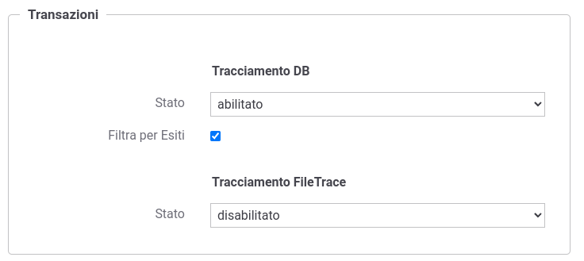
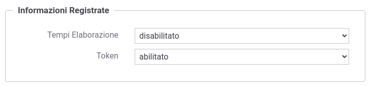

.. _tracciamentoTransazioni:

Registrazione della Transazione
--------------------------------

Il tracciamento è la funzionalità del gateway che comporta la
registrazione dei dati relativi alle comunicazioni in transito
riguardanti i servizi erogati e fruiti. Nella logica del gateway, tutte
le informazioni che riguardano una singola interlocuzione, a partire
dalla richiesta pervenuta fino alla conclusione con l'invio
dell'eventuale risposta, sono riconducibili ad un'unica entità
denominata *Transazione*.

Una transazione registrata dal gateway ha la seguente struttura:

-  *Dati di Identificazione Generale*. Sono le informazioni che
   identificano la comunicazione specifica in termini dei soggetti
   coinvolti e del servizio richiesto: Soggetto Erogatore, Servizio, Azione, Esito, tempi di risposta ...

-  *Dati Mittente*. Sono le informazioni che
   identificano il richiedente: Soggetto
   Fruitore, Applicativo, Token, IndirizzoIP, ...

-  *Dati della Richiesta*. Sono le informazioni di dettaglio relative
   alla richiesta: Identificativo del Messaggio, Timestamp di ingresso,
   Timestamp di uscita, dimensioni del messaggio, ...

-  *Dati della Risposta*. Sono le medesime informazioni già citate al
   punto precedente, ma relative alla comunicazione di risposta.

-  *Tracce*. Eventuale traccia di richiesta o di risposta conforme ai profili di interoperabilità che lo richiedono.

-  *Messaggi Diagnostici*. La sequenza dei messaggi diagnostici,
   ordinati cronlogicamente, emessi dal gateway nel corso
   dell'elaborazione dell'intera transazione.

-  *Messaggi*. Se abilitata la funzionalità di Registrazione Messaggi saranno presenti i contenuti del payload e degli header HTTP della richiesta e della risposta transitati su GovWay.

-  *Fault*. Viene registrato come *Fault di Ingresso*
   l'eventuale messaggio di errore ricevuto dal gateway durante
   l'invocazione di un servizio (interno o esterno al dominio gestito) e come *Fault di Uscita* l'eventuale
   messaggio di errore inoltrato dal gateway al mittente della richiesta
   (interno o esterno al dominio gestito).

Tutte le informazioni di una transazione sono salvabili da GovWay tramite due modalità:

- database: i dati vengono salvati nella base dati di tracciamento come descritto nella sezione :ref:`tracciamentoTransazioniDB` e saranno consultabili tramite la Console di Monitoraggio descritta nella sezione :ref:`mon_intro` ;

- file: i dati vengono salvati su file di log come descritto nella sezione :ref:`tracciamentoTransazioniFileTrace`.

La configurazione :numref:`transazioniModeFig` consente di personalizzare il tracciamento attuato dal gateway per entrambe le modalità tramite le seguenti opzioni:

- *Stato*: permette di abilitare o disabilitare il tracciamento oltre a consentirne una personalizzazione nelle sue varie fasi come descritto nella sezione :ref:`tracciamentoTransazioniFasi`;

- *Filtra per Esiti*: consente di specificare quali transazioni memorizzare nell'archivio di monitoraggio in base all'esito rilevato in fase di elaborazione come descritto nella sezione :ref:`tracciamentoTransazioniFiltroEsiti`.

    Configurazione del tipo di tracciamento

.. note::
    La funzionalità di tracciamento su file (FileTrace) possiede un ulteriore stato 'configurazioneEsterna' che serve ad indicare che lo stato del tracciamento deve essere compreso esaminando la proprietà "org.openspcoop2.pdd.transazioni.fileTrace.enabled" del file di configurazione locale "/etc/govway/govway_local.properties".

La figura :numref:`transazioniModeCustomFig` fornisce un esempio di personalizzazione della fasi di tracciamento descritta nella sezione :ref:`tracciamentoTransazioniFasi`.

.. figure:: ../../_figure_console/TracciamentoCustomMode.png
    :scale: 70%
    :align: center
    :name: transazioniModeCustomFig

    Configurazione personalizzata del tipo di tracciamento

Infine utilizzando la console in modalità *avanzata* (sezione :ref:`modalitaAvanzata`) è possibile configurare il tracciamento anche rispetto alle seguenti opzioni (:numref:`transazioniConfAvanzataFig`):

- *Tempi Elaborazione*: vengono salvati tutti i tempi di inizio e fine di una fase di processamento della richiesta (es. autorizzazione, validazione, message-security ...);

- *Token*: vengono salvate le informazioni relative ai token negoziati in una fruizione o ricevuti in una erogazione (senza la parte di 'signature' dei token in modo che non siano riutilizzabili come token di autenticazione).

    Configurazione avanzata delle informazioni salvate in una transazione

