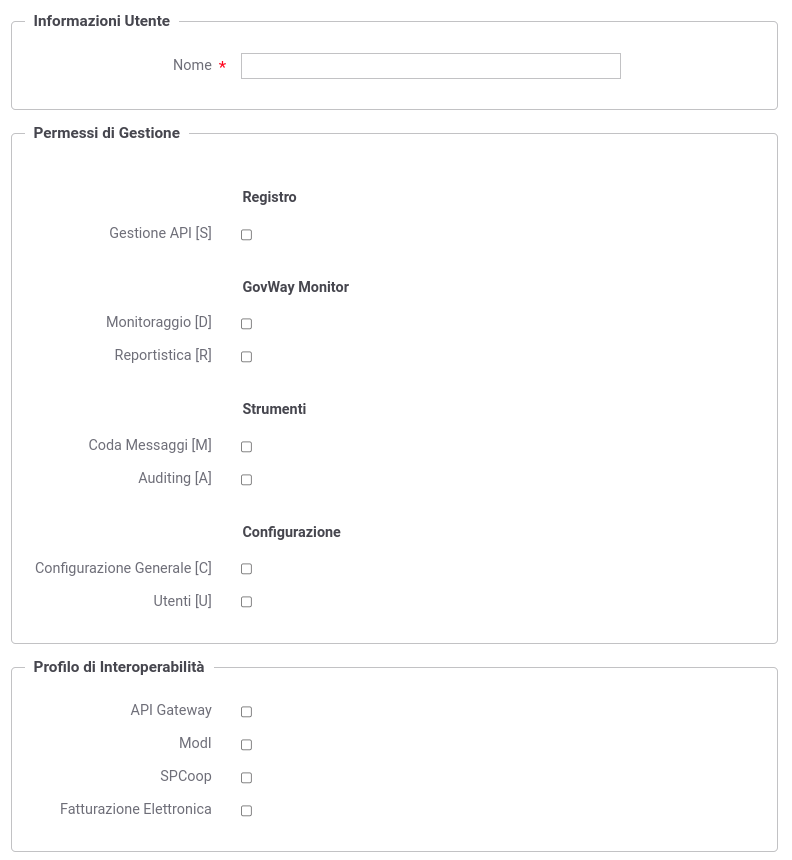

.. _utenti:

Utenti
------

La sezione *Configurazione > Utenti* è dedicata alla gestione degli
utenti dei cruscotti grafici govwayConsole e govwayMonitor.

Prima di descrivere le funzionalità relative alla gestione utenti è
necessario fare una premessa sull'organizzazione dei permessi che sono
assegnabili ad un utente.

Le funzionalità delle console grafiche sono partizionate in gruppi cui
corrispondono puntuali permessi che possono essere concessi agli utenti
per limitarne l'operatività. Vediamo quali sono i gruppi funzionali, e
conseguentemente i permessi associabili a ciascun utente:

-  *Registro*

   -  *Gestione API [S]* - Gestione delle entità di configurazione dei
      servizi, quali: API, Erogazioni, Fruizioni, ecc.

-  *GovWay Monitor*

   -  *Monitoraggio [D]* - Accesso alle funzionalità di monitoraggio
      della console govwayMonitor.

   -  *Reportistica [R]* - Accesso alle funzionalità di reportistica
      della console govwayMonitor.

-  *Strumenti*

   -  *Auditing [A]* - Accesso alle funzionalità di consultazione delle
      tracce del servizio di Auditing.

-  *Configurazione*

   -  *[C]* - Accesso alle funzionalità di configurazione. Queste
      funzionalità sono quelle presenti nel menu di navigazione nel
      gruppo *Configurazione* e riguardano: tracciamento, controllo del
      traffico, import-export, ecc.

   -  *[U]* - Possibilità di gestire gli utenti delle console. Gli
      utenti con questo permesso, sono di fatto dei superutenti in
      quanto possono assumere l'identità di un qualunque utente del
      sistema.

L'applicazione, al termine dell'installazione, contiene una utenza
(credenziali indicate durante l'esecuzione dell'installer) che permette
di effettuare tutte le principali operazioni di gestione.

Gli utenti in possesso del permesso [U] possono creare dei nuovi utenti.

La maschera di creazione di un nuovo utente è quella mostrata in :numref:`utenteNew`.

    Creazione nuovo utente

Le informazioni da inserire sono:

-  *Informazioni Utente*

   -  *Nome*

-  *Permessi di Gestione*: sezione che consente di assegnare i permessi
   all'utente e quindi decidere quali funzionalità rendergli
   accessibili.

-  *Profilo di Interoperabilità*: sezione che consente di decidere
   quali, tra i profili disponibili, rendere accessibili all'utente.

-  *Visibilità dati tramite govwayMonitor*: questa sezione è visibile
   solo se è stato abilitato uno dei permessi "GovWay Monitor" (:numref:`utenteNewMonitor`). In
   questo contesto è possibile stabilire la visibilità dell'utente sulla
   console GovWay Monitor riguardo i seguenti:

   -  *Soggetti*: opzione visibile solo se attiva la modalità
      multi-tenant, consente di limitare la visibilità delle entità di
      monitoraggio ai soli soggetti interni indicati in una whitelist.
      Per configurare la whitelist è necessario salvare l'utente da
      creare e successivamente accedere in editing. In alternativa è
      possibile attivare il flag "Tutti" per non assegnare limitazioni.

   -  *API*: consente di limitare la visibilità delle entità di
      monitoraggio alle sole API indicate in una whitelist. Per
      configurare la whitelist è necessario salvare l'utente da creare e
      successivamente accedere in editing. In alternativa è possibile
      attivare il flag "Tutti" per non assegnare limitazioni.

  .. figure:: ../_figure_console/AggiungiUtenteMonitor.png
      :scale: 40%
      :align: center
      :name: utenteNewMonitor

      Creazione nuovo utente (Sezione govwayMonitor)

-  *Profilo Utente*: questa sezione è visibile solamente se è stato abilitato uno dei permessi "GovWay Monitor" (:numref:`utenteNewMonitor`) o *Registro* (:numref:`utenteNewGestione`) e consente di impostare alcuni criteri di default associati all'utenza durante l'utilizzo della console:

	- Modalità Interfaccia (solo per govwayConsole): consente di decidere quale modalità, tra standard e avanzata, è quella di default per l'utente;

	- Profilo Interoperabilità: consente di impostare un profilo di interoperabilità di default all'utente;

	- Soggetto Operativo: voce presente solamente se è stato selezionato un profilo di interoperabilità, consente di associare un soggetto operativo di default all'utente;

	- Home Page (solo per govwayMonitor): definisce la homepage visualizzata a login effettuato, consentendo di scegliere tra la pagina di ricerca delle transazioni o un report statistico;

	- Intervallo Temporale (solo per govwayMonitor): voce presente solo se è stato selezionato un report statistico per l'homepage della console di monitoraggio, consentendone di indicare l'intervallo temporale.

  .. figure:: ../_figure_console/AggiungiUtenteGestione.png
      :scale: 40%
      :align: center
      :name: utenteNewGestione

      Creazione nuovo utente (Sezione Profilo Utente)

-  *Password*: sezione per l'impostazione della password dell'utente.

.. note::
    I criteri minimi di sicurezza che una password deve soddisfare sono configurabili agendo sul file <directory-lavoro>/consolePassword.properties:

       ::

          # Abilitare l'opzione seguente per poter autenticare:
          # La password deve rispettare tutti i vincoli impostati

          # Deve soddisfare le seguenti espressioni regolari
          #passwordVerifier.regularExpression.EXP1=reg1
          #..
          #passwordVerifier.regularExpression.EXPN=regn

          # Non deve contenere il nome di login dell'utente
          passwordVerifier.notContainsLogin=true

          # Non deve corrispondere ad una delle seguenti parole riservate
          #passwordVerifier.restrictedWords=root, admin, administrator, amministratore

          # Deve essere composta almeno da x caratteri
          passwordVerifier.minLength=8

          # Non deve essere composta da più di x caratteri
          #passwordVerifier.maxLength=20

          # Deve contenere almeno una lettera minuscola (a - z)
          passwordVerifier.lowerCaseLetter=true

          # Deve contenere almeno una lettera maiuscola (A - Z)
          passwordVerifier.upperCaseLetter=true

          # Deve contenere almeno un numero (0 - 9)
          passwordVerifier.includeNumber=true

          # Deve contenere almeno un carattere non alfabetico (ad esempio, !, $, #, %, @)
          passwordVerifier.includeNotAlphanumericSymbol=true

          # Tutti i caratteri utilizzati devono essere differenti
          #passwordVerifier.allDistinctCharacters=true

          # La password dovrà essere aggiornata ogni 90 giorni
          # Impostare un valore <=0 per disabilitare la verifica
          #passwordVerifier.expireDays=90
          passwordVerifier.expireDays=-1

          # Abilita lo storico delle password non consentendo di aggiornare la password corrente con una precedentemente già impostata.
          passwordVerifier.history=true

La pagina indice della sezione Utenti visualizza gli utenti già presenti
nel sistema con i relativi permessi e i link per modificarli o assumerne
l'identità (:numref:`utenteList`)

   .. figure:: ../_figure_console/ElencoUtenti.png
    :scale: 90%
    :align: center
    :name: utenteList

    Lista degli utenti

.. note::
    La password generata e assegnata all'utente viene visualizzata solamente nell'avviso visualizzato in seguito alla creazione (:numref:`CreazioneUtenteCredenzialiBasic`) e successivamente non è più consultabile. 

    .. figure:: ../_figure_console/CreazioneUtenteCredenzialiBasic.png
     :scale: 100%
     :align: center
     :name: CreazioneUtenteCredenzialiBasic

     Avviso di copia delle credenziali dell'utente

    Nel caso di smarrimento della password è necessario procedere con la generazione di una nuova password (:numref:`AggiornamentoUtenteCredenzialiBasic`).

    .. figure:: ../_figure_console/AggiornamentoUtenteCredenzialiBasic.png
     :scale: 100%
     :align: center
     :name: AggiornamentoUtenteCredenzialiBasic

     Aggiornamento delle credenziali dell'utente
