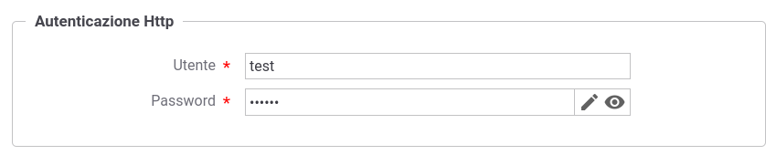
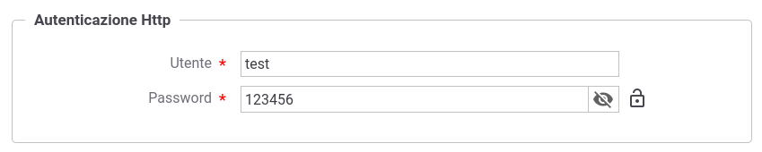

.. _console_informazioni_confidenziali_info:

Credenziali richieste per l'acceso ad entità terze
---------------------------------------------------

Rientrano in questa casistica:

- le password per l'accesso ai keystore e alle chiavi private utilizzate nei connettori https (:ref:`avanzate_connettori_https`), nei pattern di sicurezza ModI :ref:`modipa_sicurezzaMessaggio`) e nelle funzionalità di sicurezza messaggio (:ref:`sicurezzaLivelloMessaggio`);

- le credenziali utilizzate per la connessione verso un backend in una :ref:`avanzate_connettori_http` o una :ref:`avanzate_connettori_apikey`;

- la password per l'accesso ad un HTTP :ref:`avanzate_connettori_proxy`.

La gestione delle informazioni sopra descritte varia a seconda se viene attivata la modalità di cifratura delle informazioni confidenziali descritta nella sezione ':ref:`byokInstall`' della Guida di Installazione.

*Senza una cifratura delle informazioni*

La console visualizzerà l'informazione mascherandola come mostrato nella figura :numref:`infoConfidenzialiChiaroMascheraAttiva` e fornendo la possibilità di visualizzarla in chiaro come mostrato nella figura :numref:`infoConfidenzialiChiaroMascheraNonAttiva`. 

Un'informazione confidenziale, una volta salvata nella base dati, sarà sempre possibile modificarla cliccando sulla matita presente nella maschera di modifica come mostrato nella figura :numref:`infoConfidenzialiChiaroModifica`.

.. note::
       Le informazioni confidenziali, senza una cifratura attiva, verranno memorizzate in chiaro sulla base dati.

    Cifratura delle informazioni confidenziali non abilitata: mascheramento attivo
    

    Cifratura delle informazioni confidenziali non abilitata: mascheramento non attivo
    

    Cifratura delle informazioni confidenziali non abilitata: modifica di una informazione precedentemente salvata

*Abilitando una* :ref:`byokInstall`

In fase di creazione di un'entità, le maschere di gestione sono simili a quelle mostrate nelle figure :numref:`infoConfidenzialiChiaroMascheraAttiva` e :numref:`infoConfidenzialiChiaroMascheraNonAttiva`, con la differenza che comparirà un lucchetto aperto a indicare che l'informazione verrà salvata cifrata sulla base dati, come mostrato nella figura :numref:`infoConfidenzialiCifrataMascheraAttiva` e :numref:`infoConfidenzialiCifrataMascheraNonAttiva`.

Cliccando sul lucchetto o procedendo a salvare l'entità che si sta registrando, l'informazione confidenziale verrà cifrata sulla base dati e non sarà più possibile visualizzarla in chiaro tramite la console, come mostrato nella figura :numref:`infoConfidenzialiCifrataSalvata`, dove viene mostrato un lucchetto chiuso. 

Cliccando sulla matita sarà invece possibile impostare un nuovo valore.

    Cifratura delle informazioni confidenziali abilitata: mascheramento attivo durante la fase di registrazione
    

    Cifratura delle informazioni confidenziali abilitata: mascheramento non attivo durante la fase di registrazione
    

    Cifratura delle informazioni confidenziali abilitata: informazione salvata nella base dati non più visualizzabile in chiaro

.. note::
      Le informazioni confidenziali, con la cifratura attiva, verranno memorizzate cifrate nella base dati e non sarà più possibile visualizzarle in chiaro a meno che non venga abilitata tale possibilità agendo sulla configurazione avanzata della console, descritta nella sezione :ref:`configAvanzataInfoConfidenziali`.
