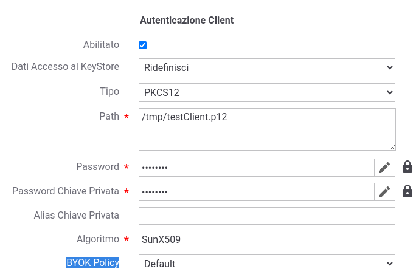

.. _console_informazioni_confidenziali_keystore:

Keystore su filesystem
---------------------------

Rientrano in questa casistica i keystore riferiti tramite path su file-system indicati:

- nei connettori https (:ref:`avanzate_connettori_https`);

- nei pattern di sicurezza ModI (:ref:`modipa_sicurezzaMessaggio`);

- nelle funzionalità di sicurezza messaggio (:ref:`sicurezzaLivelloMessaggio`).

Se il keystore riferito è cifrato, deve essere indicato in fase di configurazione uno dei KMS di 'unwrap' disponibili per la sua decodifica, scegliendolo tra quelli registrati nella configurazione (:ref:`keystoreBYOKPolicy`).

La figura :numref:`keystoreBYOKPolicy` mostra un esempio di utilizzo di una policy BYOK necessaria per decodificare il keystore cifrato riferito, contenente la chiave e il certificato client da utilizzare in un connettore HTTPS.

    Decodifica di un keystore cifrato tramite una BYOK Policy
