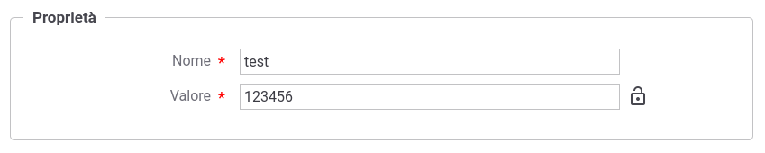
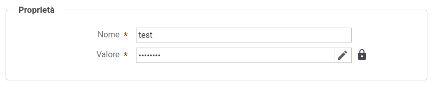

.. _console_informazioni_confidenziali_proprieta:

Proprietà censite nel registro di GovWay
----------------------------------------

Nel registro di GovWay è possibile registrare proprietà nome-valore per le seguenti entità di registro:

- API erogata o fruita (:ref:`configProprieta`)
- un soggetto
- un applicativo
- configurazione globale (:ref:`configGeneraleProprieta`)

Abilitando la :ref:`byokInstallSecurityGovWay`, anche la registrazione delle proprietà può prevedere il salvataggio di alcune proprietà contenenti informazioni confidenziali cifrandole.

Durante la fase di registrazione di una proprietà, nel campo indicante il valore, è presente un lucchetto aperto che consente, cliccandolo, di cifrare il contenuto inserito (:numref:`infoConfidenzialiCifrataProprietaRegistrazione`).

    Cifratura delle informazioni confidenziali abilitata: salvataggio di una proprietà
    
Cliccando sul lucchetto, l'informazione confidenziale verrà cifrata nella base dati e non sarà più possibile visualizzarla in chiaro tramite la console, come mostrato nella figura :numref:`infoConfidenzialiCifrataProprietaCifrata`, dove viene visualizzato un lucchetto chiuso.

Cliccando sulla matita sarà invece possibile impostare un nuovo valore.
    

    Cifratura delle informazioni confidenziali abilitata: proprietà cifrata
    
.. note::
      La visualizzazione di un valore cifrato non è consentita, a meno che non venga abilitata tale possibilità nella configurazione avanzata della console descritta nella sezione :ref:`configAvanzataInfoConfidenziali`.

