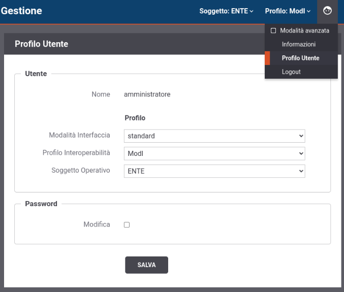

.. _console_utente_profilo:

Profilo Utente
----------------

Durante l'utilizzo della Console di Gestione è preferibile configurare il profilo dell'utenza più opportuno all'utilizzo che se ne intende fare rispetto ai parametri descritti di seguito.

    Profilo Utente della Console di Gestione

- Modalità Interfaccia: consente di decidere quale modalità, tra standard e avanzata, è quella di default per l'utenza. Le due modalità si differenziano come segue (per maggiori dettagli si rimanda alla sezione :ref:`modalitaAvanzata`):

	- la modalità standard prevede varie semplificazioni, sulle opzioni visualizzate nelle schermate, mirate al compimento delle operazioni di uso comune;

	- operando in modalità avanzata, in ciascuno dei contesti di configurazione descritti in questo manuale, compariranno opzioni aggiuntive per le quali sono previsti valori di default nel caso della modalità standard.

- Profilo Interoperabilità: consente di impostare un profilo di interoperabilità di default associato all'utente tra quelli descritti nella sezione :ref:`console_profiliInteroperabilita`;

- Soggetto Operativo: voce presente solamente se è stato selezionato un profilo di interoperabilità, consente di associare un soggetto operativo di default all'utente.

.. note::
    La modalità di utilizzo dell'interfaccia, il profilo di interoperabilità e il soggetto operativo sono modificabili anche una volta effettuato il login sulla console, agendo nelle voci presenti nel menù in alto a destra. Le modifiche attuate in questa modalità non sono persistenti e al successivo login verranno nuovamente presentate le scelte impostate come default nel profilo utente.

È infine possibile modificare la password associata all'utente.

