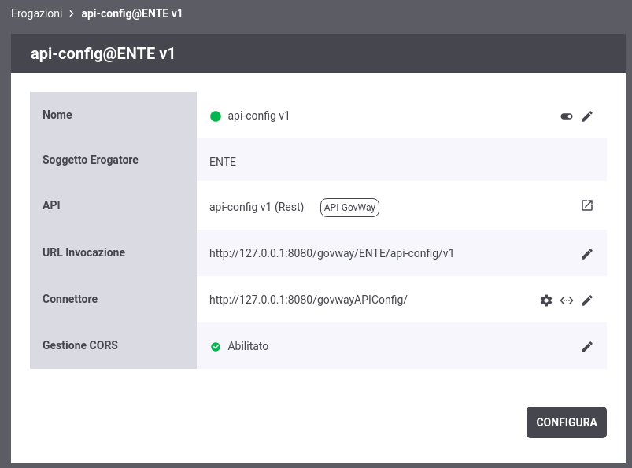

.. _configSpecifica:

Configurazione dell'API
------------------------

I passi di configurazione fin qui descritti, per la registrazione di
erogazioni e fruizioni, consentono di ottenere uno stato delle entità
del registro pronto all'utilizzo in numerose situazioni.

Cliccando sulla voce *Erogazioni* o *Fruizioni* nell'intestazione dell'elenco è possibile consultarne i dettagli selezionando l'API attivata di interesse. 

La pagina di dettaglio consente di accedere ai principali elementi di configurazione (:numref:`paginaDettaglioErogazione`):

- *Nome*: in assenza di configurazioni specifiche per risorsa/azione (sezione :ref:`configSpecificaRisorsa`), accanto al nome dell'erogazione o della fruizione è presente un'icona che permette di disattivare/riattivare l'API come descritto nella sezione :ref:`gwSospensioneApi`.
- *URL Invocazione*: se la console viene utilizzata in modalità avanzata (sezione :ref:`modalitaAvanzata`), accedendo alla modifica della URL di Invocazione è possibile configurare la modalità di identificazione dell'azione come descritto nella sezione :ref:`identificazioneAzione`.
- *Connettore*: endpoint del servizio acceduto dal gateway, cui verranno consegnate le richieste pervenute. In questa è presente sia l'icona a matita per aggiornare il valore del connettore che un'icona che consente di testare la raggiungibilità del servizio tramite il connettore fornito. Maggiori dettagli vengono forniti nella sezione :ref:`configSpecificaConnettore`.
- *Gestione CORS*: stato abilitazione della funzione CORS. L'icona a matita consente di modificare l'impostazione corrente come descritto nella sezione :ref:`configSpecificaCORS`.

    Dettaglio di una erogazione

Tramite il pulsante *Configura* è inoltre possibile aggiungere ulteriori elementi di
configurazione attraverso le ulteriori funzionalità messe a
disposizione da GovWay (:numref:`configurazioneSpecifica`).

.. figure:: ../_figure_console/ConfigurazioneSpecifica.png
    :scale: 70%
    :align: center
    :name: configurazioneSpecifica

    Configurazione di una erogazione

Le voci di configurazione che possono essere accedute sono:

- :ref:`apiGwControlloAccessi`
- :ref:`rateLimiting`
- :ref:`configSpecificaValidazione`
- :ref:`configSpecificaCachingRisposta`
- :ref:`sicurezzaLivelloMessaggio`
- :ref:`console_mtom`
- :ref:`trasformazioni`
- :ref:`tracciamentoErogazione`
- :ref:`configSpecificaRegistrazioneMessaggi`
- :ref:`configProprieta`
- :ref:`configOpzioniAvanzate`

Accanto a ciascuna delle voci in elenco è presente un'icona che in base al colore assume i seguenti significati:
    - Grigio: funzionalità non attiva
    - Rosso: funzionalità attivata ma configurata in maniera incompleta o errata, quindi non funzionante
    - Giallo: funzionalità attivata in modalità opzionale o "non bloccante" e quindi in sola notifica
    - Verde: funzionalità attiva

