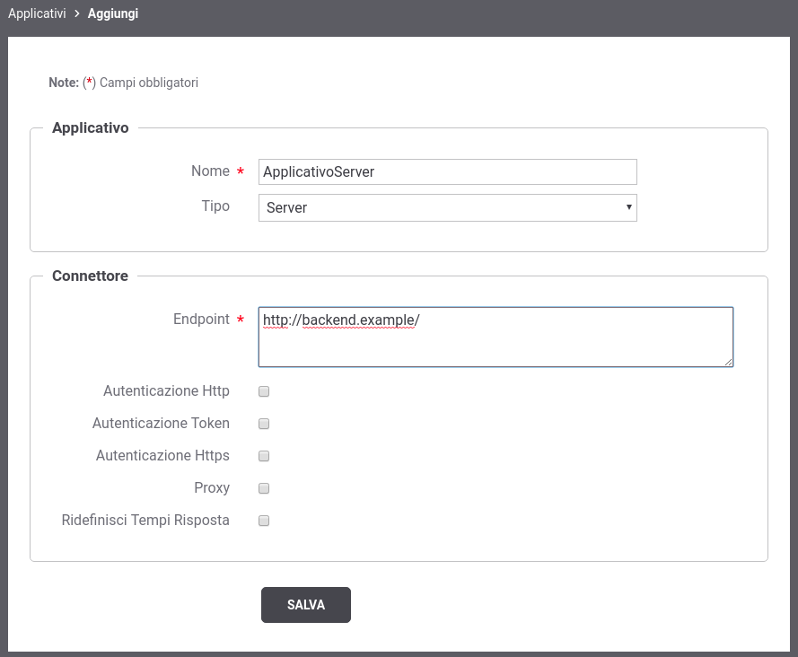
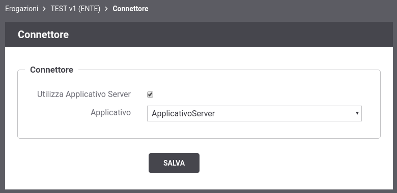

.. _applicativoServerConnettore:

Applicativi Server
~~~~~~~~~~~~~~~~~~

Un applicativo di tipo 'Server' consente di censire un'applicazione di backend alla quale associare quelle informazioni tipicamente indicate finora nella sezione “Connettore” dell’erogazione della API (endpoint, credenziali, …). In una erogazione è così possibile riferire un applicativo server già registrato come modalità alternativa a quella di indicare esplicitamente tutte le informazioni richieste.

    Creazione di un Applicativo Server

Per registrare l'applicativo posizionarsi nella sezione *Registro >
Applicativi*, quindi premere il pulsante *Aggiungi*. Compilare il form
come segue (:numref:`applicativoServerNew`):

-  *Profilo Interoperabilità*: Opzione visibile solo nel caso in cui non sia stata effettuata la relativa scelta sul menu della testata.

-  *Nome*: Assegnare un nome all'applicativo. È necessario che il nome
   indicato risulti univoco rispetto ai nomi già presenti per la
   modalità operativa selezionata (in questo caso API Gateway).

-  *Tipo*: Utilizzare il tipo 'Server' per censire un'applicativo di backend.

-  *Connettore*: Tramite la sezione *Connettore* è possibile fornire quelle informazioni tipicamente indicate sinora nella sezione “Connettore” dell’erogazione di una API.

Dopo averlo creato, l'applicativo è associabile ad una Erogazione accedendo alla sezione "Connettore" come evinziato nella figura :numref:`associazioneApplicativoErogazione`.

    Associazione di un Applicativo Server ad una Erogazione

