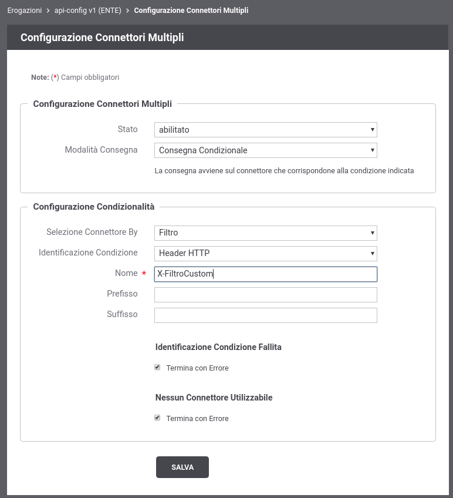
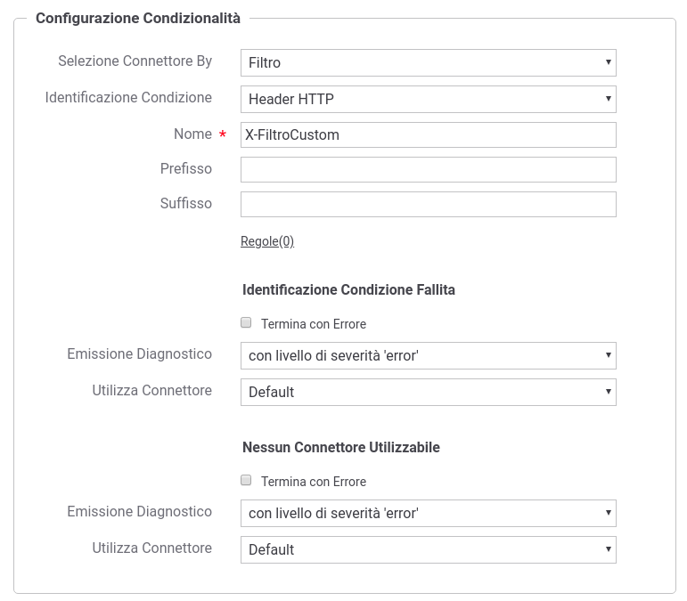

.. _consegnaCondizionaleConfigurazione:

Configurazione della Consegna Condizionale
~~~~~~~~~~~~~~~~~~~~~~~~~~~~~~~~~~~~~~~~~~~

Per abilitare la funzionalità di Consegna Condizionale accedere alla sezione di dettaglio di una erogazione di API e cliccare sul pulsante di configurazione dei connettori multipli (:numref:`pulsanteConfigurazioneConnettoriMultipliCC2`).

.. figure:: ../../../_figure_console/PulsanteConfigurazioneConnettoriMultipli.png
    :scale: 100%
    :align: center
    :name: pulsanteConfigurazioneConnettoriMultipliCC2

    Pulsante per la configurazione dei connettori multipli

Dopo aver premuto il pulsante si accede ad una schermata che consente di abilitare una funzionalità relativa ai connettori multipli. In questa sezione, in particolare, viene descritta la funzionalità *Consegna Condizionale* che dovrà essere selezionata una volta abilitato lo stato relativo alla configurazione dei connettori multipli (:numref:`ConsegnaCondizionaleAbilitata2`).

    Consegna Condizionale

Il connettore su cui verrà inoltrata la richiesta pervenuta sul Gateway, viene selezionato in base al suo nome o a un filtro associato al connettore stesso. La modalità di selezione desiderata deve essere indicata tramite la voce 'Selezione Connettore By'.
Il valore del filtro (utilizzato per identificare il connettore di consegna) o il nome del connettore stesso, viene individuato all'interno della richiesta attraverso una delle seguenti modalità:

- *Header HTTP*: nome di un header http;

- *Url di Invocazione*: espressione regolare applicata sulla url di invocazione;

- *Parametro della Url*: nome del parametro presente nella url di invocazione;

- *SOAPAction*: individua una operazione SOAP;

- *Contenuto*: espressione (xPath o jsonPath) utilizzata per estrarre un identificativo dal body della richiesta;

- *Client IP*: indirizzo IP del client;

- *X-Forwarded-For*: header http appartenente alla classe "Forwarded-For" o "Client-IP";

- *Template*: l'identificativo di sessione è il risultato dell'istanziazione del template fornito rispetto ai dati della richiesta;

- *Freemarker Template*: l'identificativo di sessione è ottenuto tramite il processamento di un Freemarker Template;

- *Velocity Template*: l'identificativo di sessione è ottenuto tramite il processamento di un Velocity Template;

I campi 'Prefisso' e 'Suffisso' permettono di anteporre al valore estratto dalla richiesta un prefisso e/o un suffisso prima di utilizzare tale valore per l'identificazione del connettore (sia tramite nome che tramite filtro).

Tramite le checkbox 'Termina con Errore' è infine possibile configurare l'erogazione per utilizzare uno specifico connettore di default, invece di terminare la transazione con errore, nel caso la condizione non sia presente nella richiesta o non permetta di identificare alcun connettore all'interno del pool. Nel caso non venga terminata la transazione con errore, è anche possibile impostare l'emissione o meno di un diagnostico che segnali la condizione fallita (esempio riportato nella figura :numref:`ConsegnaCondizionaleConnettoreDefault`).

    Consegna Condizionale con Connettore di Default

Le regole per la selezione del connettore sopra descritte possono essere ridefinite per singole o gruppi di operazioni attraverso la definizione di regole specifiche, accedendo al link 'regole' presente nella maschera di configurazione.

La creazione di una regola specifica deve innanzitutto identificare le operazioni dell'API a cui la regola è riferita tramite il campo 'Risorsa' o 'Azione'. È possibile specifica l'operazione in diverse modalità:

- nome dell'operazione
- metodoHTTP.nomeOperazione (solo per API REST)
- metodoHTTP.* (solo per API REST)
- espressioneRegolare

Nella figura :numref:`ConsegnaCondizionaleRegolaSpecifica` viene visualizzata la maschera di creazione di una regola specifica. Le modalità di identificazione del nome del connettore o del valore del filtro sono le medesime descritte in precedenza.

.. figure:: ../../../_figure_console/ConsegnaCondizionaleRegolaSpecifica.png
    :scale: 100%
    :align: center
    :name: ConsegnaCondizionaleRegolaSpecifica

    Regola di Consegna Condizionale per Operazione 

