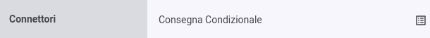
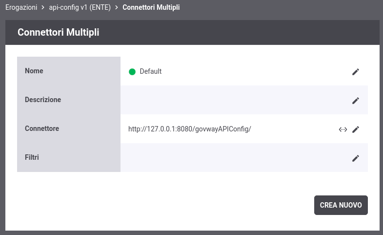
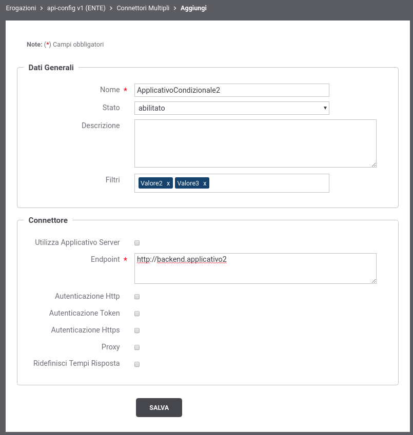
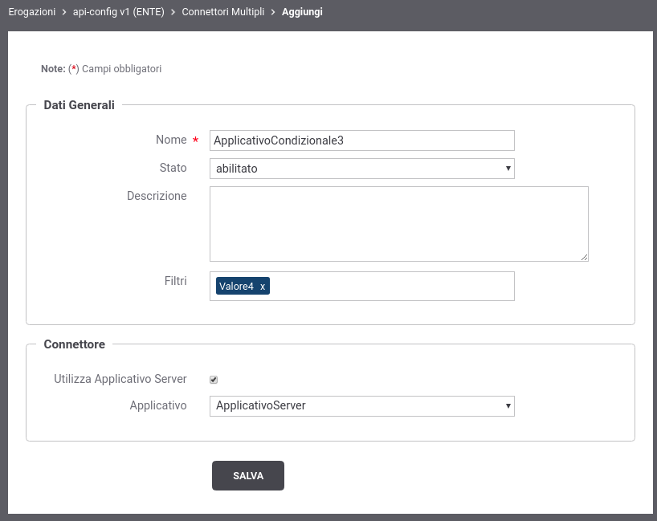
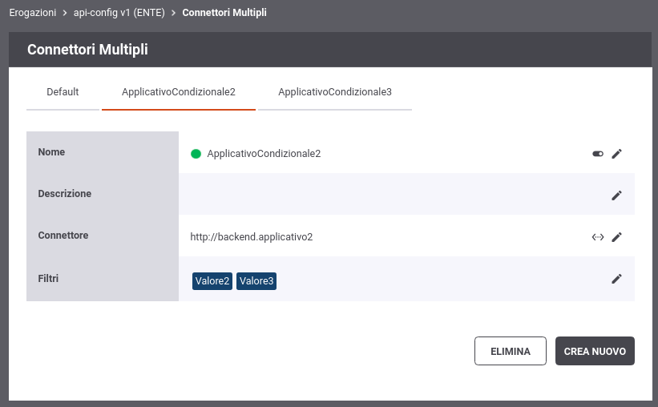

.. _consegnaCondizionaleElencoConnettori:

Elenco dei Connettori
~~~~~~~~~~~~~~~~~~~~~

Per le erogazioni di API è possibile definire connettori multipli con finalità di selezione condizionale del connettore a cui inoltrare le richieste in arrivo. 

Dopo aver attivato la funzione di Consegna Condizionale, nei contesti in cui l'interfaccia visualizzava l'endpoint di un connettore, viene adesso invece evidenziata la presenza della funzionalità attivata. In tale contesto è possibile definire i nuovi connettori accedendo all'elenco dei connettori registrati tramite il nuovo pulsante dedicato (:numref:`ConsegnaCondizionalePulsanteConnettori2`).

    Pulsante per accedere all'elenco dei connettori

Accedendo all'elenco la prima volta si troverà il solo connettore di default definito al momento della registrazione dell'API erogata (:numref:`ConsegnaCondizionaleElencoConnettori1`).

    Elenco dei connettori con presenza del solo connettore di default

Tramite il pulsante *Crea Nuovo* è possibile registrare un nuovo connettore. Compilare il form
come segue (:numref:`ConsegnaCondizionaleNuovoConnettore`):

-  *Nome*: Assegnare un nome al connettore. È necessario che il nome
   indicato risulti univoco all'interno del pool dei connettori definiti per l'API.

-  *Stato*: Indica lo stato del connettore. È possibile abilitare o disabilitare il singolo connettore anche dopo che è stato definito.

-  *Descrizione*: Permette di fornire una descrizione generica.

-  *Filtri*: Nel caso sia stata configurata una selezione del connettore basata sui filtri, questo campo permette di assegnare al connettore i valori con cui verrà selezionato dal Gateway.

-  *Connettore*: Tramite la sezione *Connettore* è possibile fornire quelle informazioni tipicamente indicate sinora nella sezione “Connettore” dell’erogazione di una API.

    Registrazione di un nuovo connettore per la consegna condizionale

All'interno della definizione dei dati di un connettore, è anche possibile riferire un Applicativo di tipo 'server' precedentemente registrato come descritto nella sezione :ref:`applicativoServerConnettore` (:numref:`ConsegnaCondizionaleNuovoConnettore2`).

    Registrazione di un nuovo connettore, per la consegna condizionale, che riferisce un Applicativo Server

I nuovi connettori creati sono accessibili nell'elenco dei connettori (:numref:`ConsegnaCondizionaleElencoConnettori2`). I tab presenti nell'elenco riportano i nomi dei connettori configurati, e selezionando quello di interesse è possibile visualizzare e/o modificare i dati del connettore oltre ad eliminarlo tramite il pulsante *Elimina*.

    Elenco dei connettori selezionabili per la consegna

Nel caso sia stata configurata una selezione del connettore basata sui filtri, si deve procedere ad assegnare anche al connettore di default uno o più valori nei filtri in modo che sia selezionabile dal Gateway. Tale operazione non è necessaria solamente se si desidera utilizzare il connettore di default solamente nei casi in cui la condizione non è identificata nella richiesta o non abbia consentito ad identificare un connettore. 
