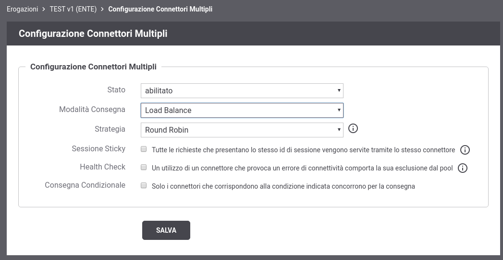
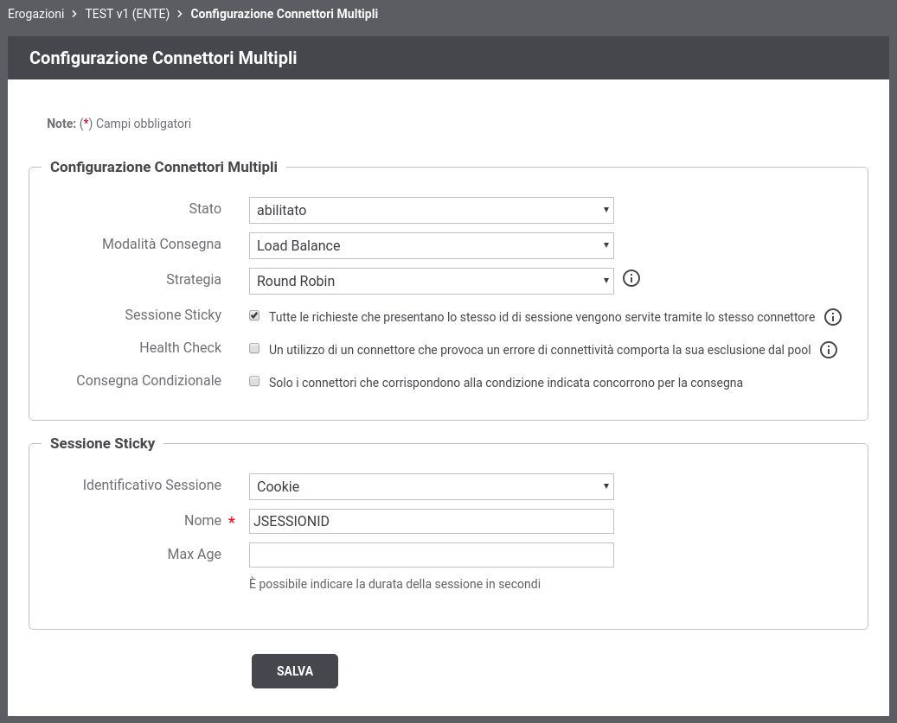
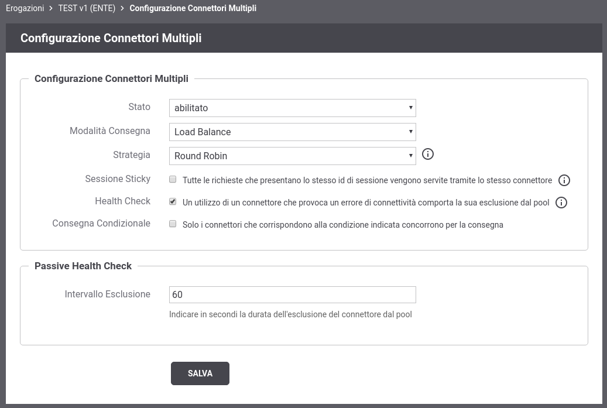
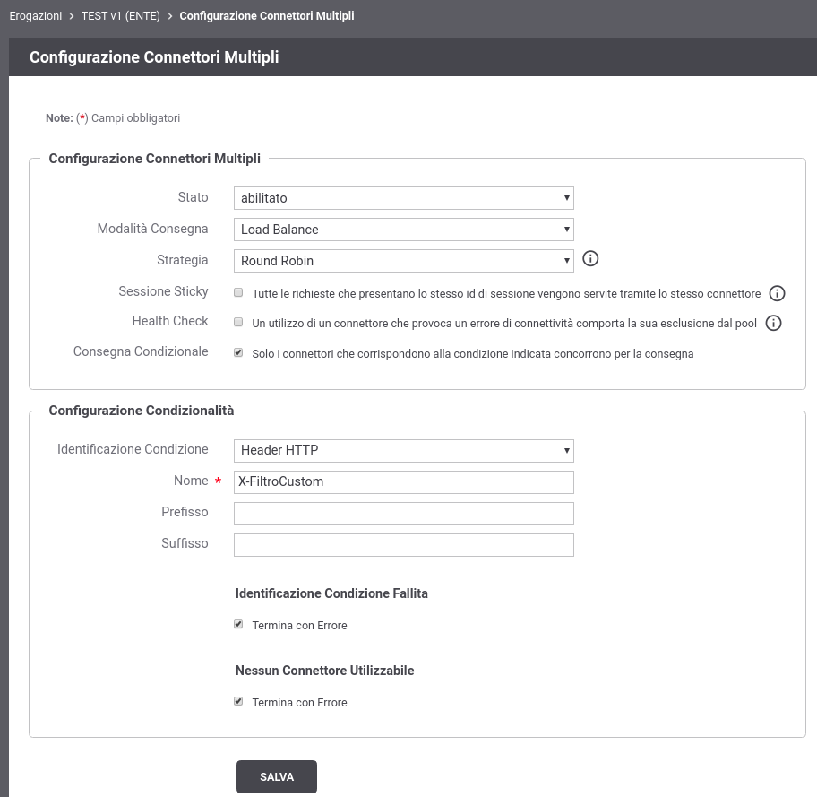

.. _loadBalancerConfigurazione:

Configurazione del Bilanciamento del Carico
~~~~~~~~~~~~~~~~~~~~~~~~~~~~~~~~~~~~~~~~~~~

Per abilitare la funzionalità di Load Balancer accedere alla sezione di dettaglio di una erogazione di API e cliccare sul pulsante di configurazione dei connettori multipli (:numref:`pulsanteConfigurazioneConnettoriMultipli2`).

    Pulsante per la configurazione dei connettori multipli

Dopo aver premuto il pulsante si accede ad una schermata che consente di abilitare una funzionalità relativa ai connettori multipli. In questa sezione, in particolare, viene descritta la funzionalità *Load Balance* che rappresenta la voce di default una volta abilitato lo stato relativo alla configurazione dei connettori multipli (:numref:`LoadBalancerAbilitato2`).

    Load Balancer

Vengono forniti differenti tipi di bilanciamento del carico:

- *Round Robin*: le richieste vengono distribuite in ordine tra i connettori registrati;

- *Weight Round Robin*: rispetto al Round Robin consente di riequilibrare eventuali server eterogenei tramite una distribuzione bilanciata rispetto al peso associato ad ogni connettore;

- *Random*: le richieste vengono distribuite casualmente tra i connettori registrati;

- *Weight Random*: rispetto al Random si ha una distribuzione casuale che considerà però il peso associato ad ogni connettore;

- *Source IP hash*: combina l'indirizzo IP del client e l'eventuale indirizzo IP portato in un header appartenente alla classe "Forwarded-For" o "Client-IP" per generare una chiave hash che viene designata per un connettore specifico;

- *Least Connections*: la richiesta viene indirizzata verso il connettore che ha il numero minimo di connessioni attive.

La configurazione permette anche di abilitare una sessione sticky in modo che tutte le richieste che presentano lo stesso id di sessione vengano servite tramite lo stesso connettore.  Se l'identificativo di
sessione si riferisce ad una nuova sessione, viene selezionato un connettore rispetto alla strategia indicata. 

    Load Balancer con Sessione Sticky

L'identificativo di sessione utilizzato è individuabile tramite una delle seguenti modalità (:numref:`LoadBalancerSticky`):

- *Cookie*: nome di un cookie;

- *Header HTTP*: nome di un header http;

- *Url di Invocazione*: espressione regolare applicata sulla url di invocazione;

- *Parametro della Url*: nome del parametro presente nella url di invocazione;

- *Contenuto*: espressione (xPath o jsonPath) utilizzata per estrarre un identificativo dal body della richiesta;

- *Client IP*: indirizzo IP del client;

- *X-Forwarded-For*: header http appartenente alla classe "Forwarded-For" o "Client-IP";

- *Template*: l'identificativo di sessione è il risultato dell'istanziazione del template fornito rispetto ai dati della richiesta;

- *Freemarker Template*: l'identificativo di sessione è ottenuto tramite il processamento di un Freemarker Template;

- *Velocity Template*: l'identificativo di sessione è ottenuto tramite il processamento di un Velocity Template;

È anche possibile attivare un 'Passive Health Check' che verifica la connettività verso i connettori configurati. Un utilizzo di un connettore che provoca un errore di connettività comporta la sua esclusione dal pool dei connettori utilizzabili per un intervallo di tempo configurabile (:numref:`LoadBalancerPassiveHealthCheck`).

    Load Balancer con Passive Health Check

È infine possibile attivare una funzione di selezione dei connettori che partecipano al bilanciamento delle richieste in funzione di parametri della richiesta stessa (:numref:`LoadBalancerSelezioneCondizionale`). Per ulteriori dettagli sulle modalità di selezione condizionale dei connettori si rimanda alla sezione :ref:`consegnaCondizionaleConnettore` poichè gli aspetti di questa configurazione sono identici a quelli descritti per la funzionalità di consegna condizionale.

    Selezione condizionale dei connettori che partecipano al bilanciamento

