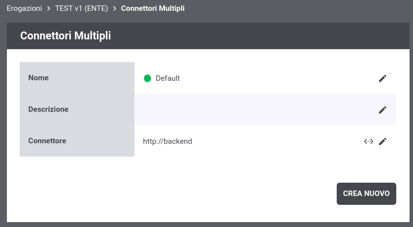
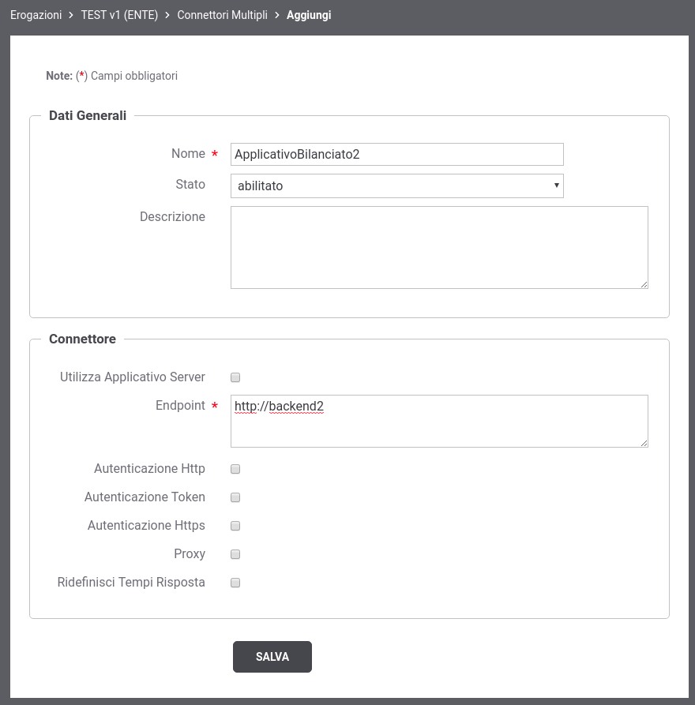
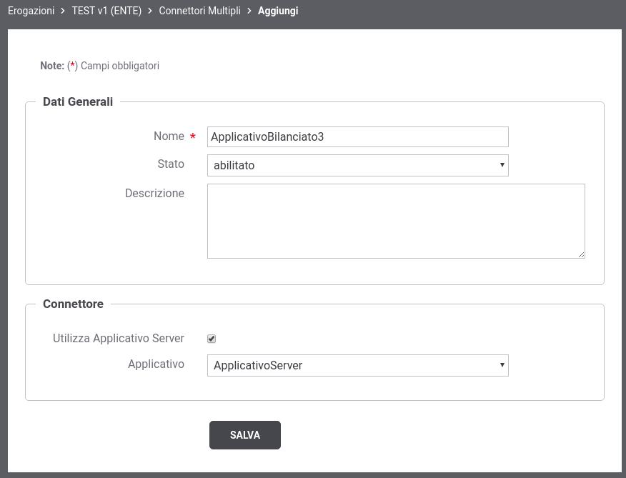
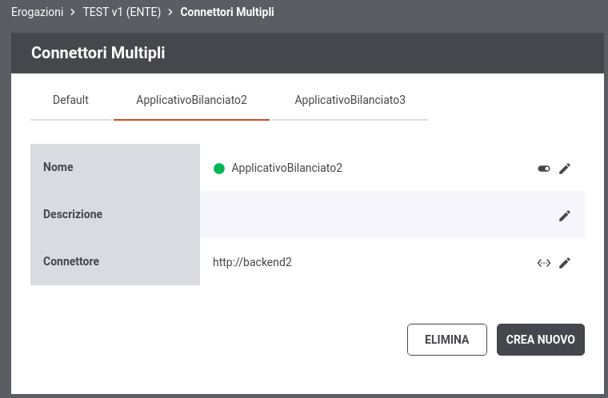
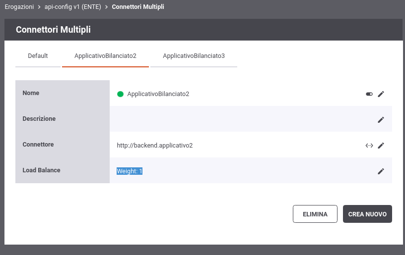

.. _loadBalancerElencoConnettori:

Elenco dei Connettori Bilanciati
~~~~~~~~~~~~~~~~~~~~~~~~~~~~~~~~

Per le erogazioni di API è possibile definire connettori multipli con finalità di bilanciamento delle richieste in arrivo. 

Dopo aver attivato la funzione di Load Balancer, nei contesti in cui l'interfaccia visualizzava l'endpoint di un connettore, viene adesso invece evidenziata la presenza della funzionalità di Load Balancer. In tale contesto è possibile definire i nuovi connettori accedendo all'elenco dei connettori registrati tramite il nuovo pulsante dedicato (:numref:`LoadBalancerPulsanteConnettori2`).

.. figure:: ../../../_figure_console/LoadBalancerPulsanteConnettori.png
    :scale: 100%
    :align: center
    :name: LoadBalancerPulsanteConnettori2

    Pulsante per accedere all'elenco dei connettori

Accedendo all'elenco la prima volta si troverà il solo connettore di default definito al momento della registrazione dell'API erogata (:numref:`LoadBalancerElencoConnettori1`).

    Elenco dei connettori bilanciati con presenza del solo connettore di default

Tramite il pulsante *Crea Nuovo* è possibile registrare un nuovo connettore. Compilare il form
come segue (:numref:`LoadBalancerNuovoConnettore`):

-  *Nome*: Assegnare un nome al connettore. È necessario che il nome
   indicato risulti univoco all'interno del pool dei connettori definiti per l'API.

-  *Stato*: Indica lo stato del connettore. È possibile abilitare o disabilitare il singolo connettore anche dopo che è stato definito.

-  *Descrizione*: Permette di fornire una descrizione generica.

-  *Connettore*: Tramite la sezione *Connettore* è possibile fornire quelle informazioni tipicamente indicate sinora nella sezione “Connettore” dell’erogazione di una API.

    Registrazione di un nuovo connettore per il bilanciamento del carico

All'interno della definizione dei dati di un connettore, è anche possibile riferire un Applicativo di tipo 'server' precedentemente registrato come descritto nella sezione :ref:`applicativoServerConnettore` (:numref:`LoadBalancerNuovoConnettore2`).

    Registrazione di un nuovo connettore, per il bilanciamento del carico, che riferisce un Applicativo Server

I nuovi connettori creati sono accessibili nell'elenco dei connettori (:numref:`LoadBalancerElencoConnettori2`). I tab presenti nell'elenco riportano i nomi dei connettori configurati, e selezionando quello di interesse è possibile visualizzare e/o modificare i dati del connettore oltre ad eliminarlo tramite il pulsante *Elimina*.

    Elenco dei connettori bilanciati

Nel caso sia stato selezionato un tipo di Load Balancer 'Weight' nell'elenco dei connettori sarà possibile anche associare un peso maggiore al singolo connettore (:numref:`LoadBalancerElencoConnettori3`).

    Elenco dei connettori bilanciati con opzione 'Weight'

